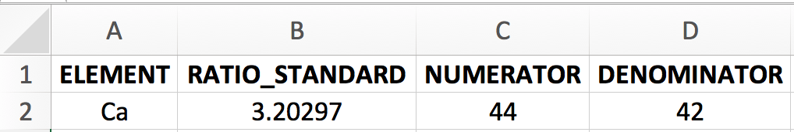
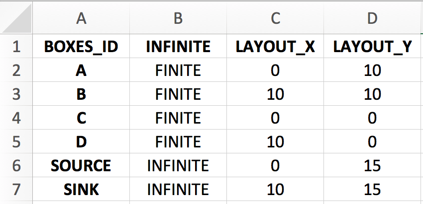
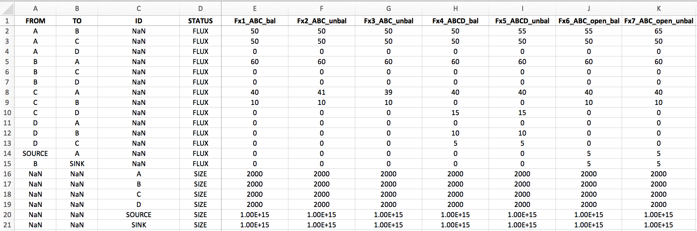
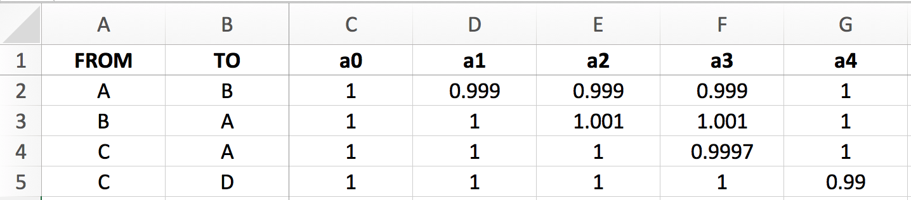
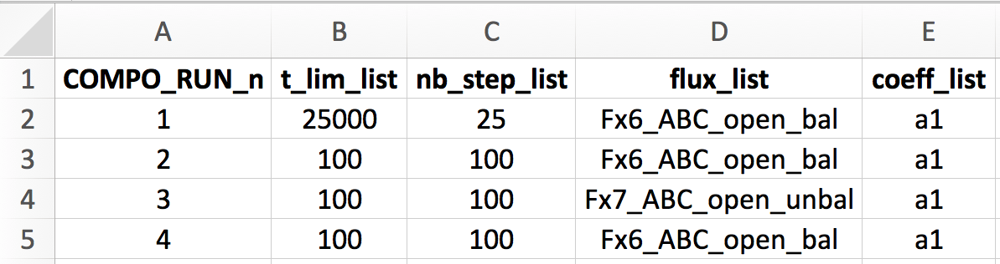
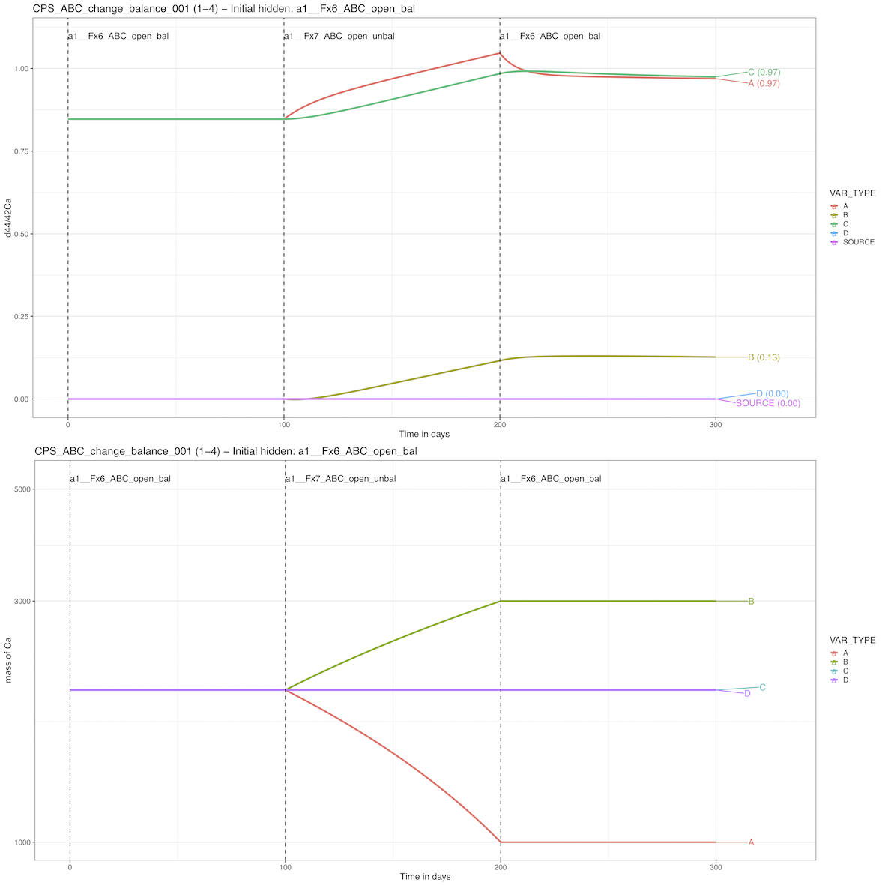
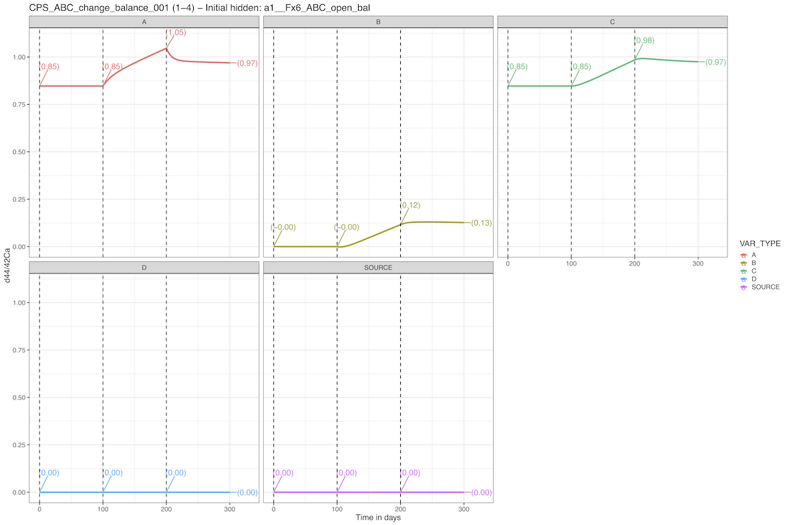
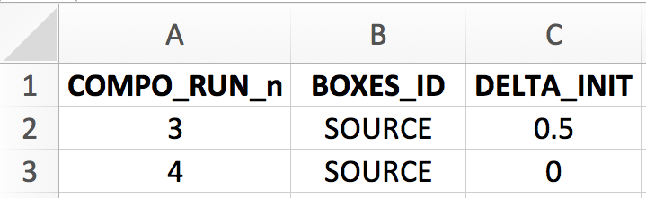
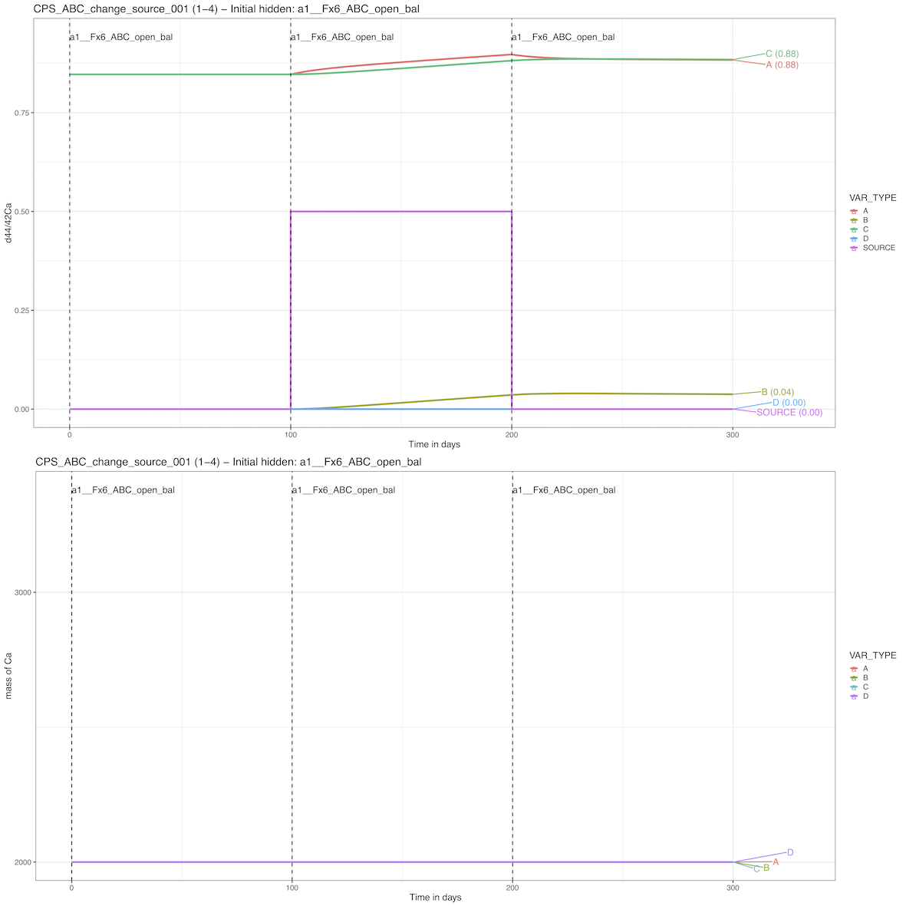

```{r, include = FALSE}
knitr::opts_chunk$set(
  collapse = TRUE,
  comment = "#>"
)
options(rmarkdown.html_vignette.check_title = FALSE)
```

----

This vignette is designed to be used as a **getting started demo 2** for the [isobxr](https://ttacail.github.io/isobxr/) package.

Please refer to the [general vignette](https://ttacail.github.io/isobxr/articles/isobxr_vignette.html) for a more exhaustive explanation of the package content and use.

----

# Prepare the demo

1. If not done yet, install the [isobxr](https://ttacail.github.io/isobxr/) package ([installation instructions](https://ttacail.github.io/isobxr/articles/isobxr_vignette.html#installation-1)).

2. Load isobxr in R:

```{r eval=FALSE}
library(isobxr)
```

3. [Download the ABCD demo zip file](https://ttacail.github.io/source/demos/1_ABCD.zip).

Note
:    Templates for all input and master excel files described in this vignette are available for 
     [download here](https://ttacail.github.io/source/demos/0_excel_templates.zip).

4. Unzip the ABCD demo file and place it in the working directory of your choice. It is strongly advised to avoid using a working directory linked to an online backup server (such as OneDrive) since it could cause some issues with adressing of output files. If done so, users are then advised to turn the backup server software offline during the use of isobxr functions.

5. Take note of the path to this folder, for instance:

```{r eval=FALSE}
workingdir <- "/Users/username/Documents/isobxr/demos/1_ABCD/"
```

or set it as a working directory, for instance:

```{r eval=FALSE}
setwd("/Users/username/Documents/isobxr/demos/1_ABCD")
```

Everything is now ready to run box models with **isobxr**.

----

# Systems and *isobxr master file*

If you just followed the **Getting started 1: single runs** demo, this part can be skipped as this demo uses the same *isobxr master file*.

We consider the demonstration *isobxr master file* (0_ISOBXR_MASTER.xlsx) stored in the working directory. In this demonstration example, the *isobxr master file* describes an imaginary model, designed for the calcium $^{44}Ca/^{42}Ca$ isotope ratios. 

```{r echo=FALSE, out.width='75%'}

```

The **BOXES** sheet describes 4 finite boxes (A, B, C, D) and 2 infinite boxes (SOURCE and SINK). 

The layout of the boxes in the diagram rendering aims at placing the finite boxes on the four corners of 10x10 units square, and the two infinite boxes on the higher end of the layout (y = 15), with SOURCE on the far left and SINK on the far right.

```{r echo=FALSE, out.width='50%'}

```
  
We assume that fluxes are expressed in mg of Ca per day, sizes in mg of Ca and run time units will be days.  

The **FLUXES** sheet describes 5 flux lists  

1. *Fx1_ABC_bal* describes a balanced closed system composed of 3 finite boxes A, B and C.   
1. *Fx2_ABC_unbal* describes an unbalanced closed system composed of 3 finite boxes A, B and C.  
1. *Fx3_ABC_unbal* describes an unbalanced closed system composed of 3 finite boxes A, B and C.   
1. *Fx4_ABCD_bal* describes a balanced closed system composed of 4 finite boxes A, B, C and D.     
1. *Fx5_ABCD_unbal*  describes an unbalanced closed system composed of 4 finite boxes A, B, C and D.  
1. *Fx6_ABC_open_bal*  describes a balanced open system composed of 4 finite boxes A, B, C and D and two infinite boxes SOURCE and SINK.
1. *Fx7_ABC_open_unbal*  describes an unbalanced open system composed of 4 finite boxes A, B, C and D and two infinite boxes SOURCE and SINK.

Sizes of all finite boxes are here set at 2000 mg, infinite boxes are set a 1e15 mg.  
  
```{r echo=FALSE, out.width='100%'}

```

The **COEFFS** sheet describes 5 lists of fractionation coefficients:  

* *a0* describes no isotope fractionation (all $\alpha_{i \to j}$ being equal to one)  
* *a1* describes a system with 1 fractionation coefficient being different from 1:   
    $\alpha_{A \to B} = 0.999$  
* *a2* describes a system with 2 fractionation coefficients being different from 1:  
    $\alpha_{A \to B} = 0.999$, $\alpha_{B \to A} = 1.001$  
* *a3* describes a system with 3 fractionation coefficients being different from 1:  
    $\alpha_{A \to B} = 0.999$, $\alpha_{B \to A} = 1.001$, $\alpha_{C \to A} = 0.9997$  
* *a4* describes a system with 1 fractionation coefficient being different from 1:  
    $\alpha_{C \to D} = 0.99$  
    
```{r echo=FALSE, out.width='100%'}

```

----


----

# Compose isobxr scenarios with `compose_isobxr`

## example #1: perturbating the fluxes  
We compose here the first scenario as described on the screenshot of the *composite master file* used for this run (0_COMPO_MASTER_balance_change.xlsx) and found in the directory.

```{r echo=FALSE, out.width='75%'}

```

Here, we start with a previous example from **Getting started 1: Single runs** demo: a set of 3 finite boxes (A, B, C) consituting an open system interacting with the environment (SOURCE and SINK boxes).

As defined in the **RUN_LIST** sheet of the *composite master file*,
1. We first let the system relax to its' steady-state in a balanced configuration using the *Fx6_ABC_open_bal* flux list for a total of 25000 days (70 years).  
1. We then let the system run with the exact same conditions for 100 days.   
1. We then provoke a disequilibrium by using an unbalanced *Fx7_ABC_open_unbal* flux list (A loses 10 mg of Ca per day, B accumulates 10 mg of Ca per day).  
1. We then let the system relax again with the previous balanced flux configuration (*Fx6_ABC_open_bal*) but with automatically inherited different initial conditions of delta and size values.  

All other sheets defining forcing parameters (**FORCING_RAYLEIGH**, **FORCING_SIZE**, **FORCING_DELTA**, **FORCING_ALPHA**) are left empty (with column headers as defined by template but empty lines).

We call the function as follows:

```{r eval=FALSE}
workdir <- "~/DEMO_ABCD" # isobxr and compo master file work. dir.
SERIES_ID <- "ABC_change_balance" # series ID of the set of compo runs
time_units <- c("days", "days") # time units for run (days) and for plots (years)
COMPO_MASTER <- "0_COMPO_MASTER_balance_change.xlsx" # compo master file name
plot_HIDE_BOXES_delta <- c("SINK") # boxes to hide from evD plot
plot_HIDE_BOXES_size <- c("SOURCE", "SINK") # boxes to hide from evS plot
  
compose_isobxr(workdir,
               SERIES_ID, 
               time_units,
               COMPO_MASTER, 
               plot_HIDE_BOXES_delta, 
               plot_HIDE_BOXES_size)
```

We obtain the following overviews of the evolution of delta values and box sizes over the run duration. 
By default the plotting functionnality of the `compose_isobxr` function hides initial run of the composite scenario 
because it is usually used as a run to let the system artificially relax to it's steady state.  
Nevertheless, all the data files edited by the function do include the initial run of the composite scenario.

Below is the plot evDS output of both delta and box sizes over time.
```{r echo=FALSE, out.width='100%'}

```

Below is the facetted plot evD output of delta values in each box over time.
```{r echo=FALSE, out.width='100%'}

```

Below is the facetted plot evS output of box sizes in each box over time.
```{r echo=FALSE, out.width='100%'}
knitr::include_graphics('./33_CPS_ABC_change_balance_001_pf_evS.png')
```


## example #2: changing the source isotope composition

We consider here the same model example of 3 balanced finite boxes in an open system.

In this case, we leave the same balanced flux configuration for the whole duration of the scenario. 
We also leave the run durations and resolutions unchanged.

```{r echo=FALSE, out.width='75%'}

```

We however force the delta values of the source box as shown below: 

```{r echo=FALSE, out.width='50%'}

```

1. At runs 1 and 2, we leave the source default delta value (0‰).
1. At run 3, we change the source default delta value from 0 to + 0.5 ‰. 
1. At run 4, we change the source delta value bcak to 0‰.

We call the function as follows:

```{r eval=FALSE}
workdir <- "~/DEMO_ABCD" # isobxr and compo master file work. dir.
SERIES_ID <- "ABC_change_source" # series ID of the set of compo runs
time_units <- c("days", "days") # time units for run (days) and for plots (years)
COMPO_MASTER <- "0_COMPO_MASTER_source_change.xlsx" # compo master file name
plot_HIDE_BOXES_delta <- c("SINK") # boxes to hide from evD plot
plot_HIDE_BOXES_size <- c("SOURCE", "SINK") # boxes to hide from evS plot
  
compose_isobxr(workdir,
               SERIES_ID, 
               time_units,
               COMPO_MASTER, 
               plot_HIDE_BOXES_delta, 
               plot_HIDE_BOXES_size)
```

And for instance, we obtain the following evDS pdf output where we see that the effect of the change in the source isotope composition slightly affects the delta values of A, B and C boxes. 

```{r echo=FALSE, out.width='100%'}

```

----

# Play time

The user is invited to explore the use of the **compose_isobxr** function by running box models with various settings and input values, from the function arguments but also by adding new entries to the **compose master file**, such as new steps in the composite scenario. 
