```{r, include = FALSE}
library(devtools)

knitr::opts_chunk$set(
  collapse = TRUE,
  comment = "#>"
)
```

----

The [isobxr](https://ttacail.github.io/isobxr/) package is a set of R tools designed to perform and explore stable isotope box
modeling of open or closed systems.
It provide a ready-to-use tool allowing users to 
develop and test isotopic box models of their system of interest. 
It allows the user to explore the behavior of these systems
in both static (*e.g.*, at steady state) or dynamic modes (*e.g.*, in reaction to a perturbation), build complex scenarios, 
as well as sweep the space of parameters in both static and dynamic modes.

----

# Installation


The **isobxr** is available as a source package from [GitHub](https://github.com/).

1. Download and install/update [R](https://cran.r-project.org/).

2. Download and install package **devtools**

```{r eval = FALSE}
install.packages("devtools")
```

3. Download and install **isobxr** source package.

```{r eval = FALSE}
devtools::install_github("ttacail/isobxr/isobxr", build_vignettes = TRUE) # FALSE if no pandoc/Rstudio 
```

The user is also invited to [download the reference templates](https://ttacail.github.io/source/demos/0_excel_templates.zip) for all input and master excel files described in this vignette, as well as [download input and master excel files](https://ttacail.github.io/source/demos/1_ABCD.zip) used for the demonstrations in this vignette and in the getting started vignette (see [Getting started 1](https://ttacail.github.io/isobxr/articles/Demo_ABCD.html) and [Getting started 2](https://ttacail.github.io/isobxr/articles/Demo_ABCD_composite.html)).

The **isobxr** package is working under R 3.5.2 to 4.0.3 versions.

It's portability has been proof checked for the following platforms: 

1. Mac OS 10.12.6 & 10.13.6

2. Linux (Ubuntu 20.04.1 LTS)

3. Windows 10

You can load the **isobxr** package as follows:
```{r eval = FALSE}
library(isobxr)
```

Here is the package description of the current version, where you can find the required minimal versions of dependencies:
```{r echo=TRUE, message=FALSE, warning=FALSE, paged.print=FALSE}
packageDescription("isobxr")
```

You can locally browse the vignette as follows:
```{r eval = FALSE}
browseVignettes("isobxr")
```

----
# Theory of box modeling and formalism
## Principles of stable isotopes box modeling

The theory and formalism shown in this section is derived from the chapter 7 (*Dynamic systems*) of

:    Albarède, F., 1995. Introduction to Geochemical Modeling. Cambridge University Press, Cambridge.    
     https://doi.org/10.1017/CBO9780511622960

We consider a system consisting of $n$ boxes $j$, exchanging an element **X** that has at least 
two stable isotopes $M$ and $N$. Any box $i$ is defined by: 

* $m^X_i$ the mass of element **X** in box $i$ - also refered to as **box size** thereafter
* $m^M_i$ and $m^N_i$ the masses of isotopes $M$ and $N$  in box $i$, respectively
* $J_{i \mapsto j}^X$ is the massic flux of **X** from $i$ to $j$ (homogeneous to a mass per time unit)

```{r echo=FALSE, out.width='100%'}

```

We call $R_i$ the $M/N$ isotope abundance ratio:
$$R_i = \left(\dfrac{n^M}{n^N}\right)_i = \left(\dfrac{m^M}{m^N}\right)_i \times \left(\dfrac{M^N}{M^M}\right) =   \left(\dfrac{m^M}{m^N}\right)_i A $$
where 

* $n^M_i$ and $n^N_i$ are the molar quantities of isotopes $M$ and $N$ in box $i$
* $M^M$ and $M^N$ are the molar masses of isotopes $M$ and $N$ in box $i$
* $A = \left(\frac{M^N}{M^M}\right)$ the ratio of the molar masses of $N$ and $M$.

Finally, we define $D_{i \mapsto j}^{M/N}$ the relative fractionation coefficient between M and N from $i$ to $j$: 

$$D_{i \mapsto j}^{M/N} = \dfrac{{J_{i \mapsto j}^M}/{J_{i \mapsto j}^N}}{m^M_i/m^N_i}$$

The principe of modeling the system consists now in predicting the evolution of **box sizes** ($m^X_i$) during time and the evolution of the **isotope ratios** ($R_i$), knowing the fluxes, initial box sizes and fractionation coefficients. 

## Mass conservation of element X

Considering **X** has **no radioactive nor radiogenic component**, mass conservation for element **X** reads :

$$\dfrac{dm^X_i}{dt} = - \sum \limits_{j\neq i} J_{i \mapsto j}^X + \sum \limits_{j\neq i} J_{j \mapsto i}^X$$

This equation can be integrated in its linear form considering constant fluxes as follows: 

$$m^X_i = \left(- \sum \limits_{j\neq i} J_{i \mapsto j}^X + \sum \limits_{j\neq i} J_{j \mapsto i}^X\right) \times t + m^X_{i, t_0}$$

where $m^X_{i, t_0}$ is the mass of element **X** in box $i$ at t = 0. 

## System of differential equations for stable isotope ratios


Considering $N$ and $M$ are stable and non radiogenic, mass conservation reads :

$$\dfrac{dm^N_i}{dt} = - \sum \limits_{j\neq i} J_{i \mapsto j}^N + \sum \limits_{j\neq i} J_{j \mapsto i}^N = - \sum \limits_{j\neq i} \dfrac{J_{i \mapsto j}^N}{m^N_i} m^N_i + \sum \limits_{j\neq i} \dfrac{J_{j \mapsto i}^N}{m^N_j} m^N_j$$

Likewise, 

$$\dfrac{dm^M_i}{dt} = - \sum \limits_{j\neq i} \dfrac{J_{i \mapsto j}^M}{m^M_i} m^M_i + \sum \limits_{j\neq i} \dfrac{J_{j \mapsto i}^M}{m^M_j} m^M_j$$

We can meanwhile derive the ratio $R_i$ as : 

$$\dfrac{dR_i}{dt} = \dfrac{d}{dt}\left(\dfrac{m^M}{m^N}\right)_i A  = \dfrac{A}{{m^N_i}^2} \left(m^N_i\dfrac{dm^M_i}{dt} - m^M_i \dfrac{dm^N_i}{dt}\right) = \dfrac{A}{m^N_i} \left(\dfrac{dm^M_i}{dt} - \dfrac{R_i}{A} \dfrac{dm^N_i}{dt}\right)$$

We can insert mass conservation deriative into previous relationship:

$$\dfrac{dR_i}{dt} = \dfrac{A}{m^N_i} \left(- \sum \limits_{j\neq i} \dfrac{J_{i \mapsto j}^M}{m^M_i} m^M_i + \sum \limits_{j\neq i} \dfrac{J_{j \mapsto i}^M}{m^M_j} m^M_j + \dfrac{R_i}{A}  \sum \limits_{j\neq i} \dfrac{J_{i \mapsto j}^N}{m^N_i} m^N_i - \dfrac{R_i}{A}  \sum \limits_{j\neq i} \dfrac{J_{j \mapsto i}^N}{m^N_j} m^N_j   \right)$$

Modified as such :

$$\dfrac{dR_i}{dt} = A \left(- \sum \limits_{j\neq i} \dfrac{J_{i \mapsto j}^M}{m^M_i} \dfrac{m^M_i}{m^N_i} + \sum \limits_{j\neq i} \dfrac{J_{j \mapsto i}^M}{m^M_j} \dfrac{m^M_j}{m^N_j} \dfrac{m^N_j}{m^N_i} + \dfrac{R_i}{A} \sum \limits_{j\neq i} \dfrac{J_{i \mapsto j}^N}{m^N_i} - \dfrac{R_i}{A} \sum \limits_{j\neq i} \dfrac{J_{j \mapsto i}^N}{m^N_j} \dfrac{m^N_j}{m^N_i}   \right)$$

$$\dfrac{dR_i}{dt} = A \left(- \sum \limits_{j\neq i} \dfrac{J_{i \mapsto j}^M}{m^M_i} \dfrac{R_i}{A} + \sum \limits_{j\neq i} \dfrac{J_{j \mapsto i}^M}{m^M_j} \dfrac{R_j}{A} \dfrac{m^N_j}{m^N_i} + \dfrac{R_i}{A} \sum \limits_{j\neq i} \dfrac{J_{i \mapsto j}^N}{m^N_i} - \dfrac{R_i}{A} \sum \limits_{j\neq i} \dfrac{J_{j \mapsto i}^N}{m^N_j} \dfrac{m^N_j}{m^N_i}   \right)$$

$$\dfrac{dR_i}{dt}  = R_i \sum \limits_{j \neq i} \left(\dfrac{J^N_{i \mapsto j}}{m^N_i} - \dfrac{J^M_{i \mapsto j}}{m^M_i} \right) +  \sum \limits_{j \neq i} \dfrac{J^M_{j \mapsto i}}{m^M_j} \dfrac{m^N_j}{m^N_i} R_j - \sum \limits_{j \neq i}  \dfrac{J^N_{j \mapsto i}}{m^N_j} \dfrac{m^N_j}{m^N_i} R_i$$

$$\dfrac{dR_i}{dt} = R_i \sum \limits_{j \neq i} \left(\dfrac{J^N_{i \mapsto j}}{m^N_i} - \dfrac{J^M_{i \mapsto j}}{m^M_i} \right) +  
\sum \limits_{j \neq i} \left( \dfrac{J^M_{j \mapsto i}}{m^M_j} R_j - \dfrac{J^N_{j \mapsto i}}{m^N_j} R_i \right) \dfrac{m^N_j}{m^N_i}$$

$$\dfrac{dR_i}{dt} = 
R_i \sum \limits_{j \neq i} \dfrac{J_{i \mapsto j}^N}{m^N_i} \left(1- \dfrac{{J_{i \mapsto j}^M}/{J_{i \mapsto j}^N}}{{m^M_i}/{m^N_i}}\right) + \sum \limits_{j \neq i} \dfrac{J_{j \mapsto i}^N}{m^N_j} \left(\dfrac{{J_{j \mapsto i}^M}/{J_{j \mapsto i}^N}}{m^M_j / m^N_j} R_j - R_i \right) \dfrac{m^N_j}{m^N_i}$$


Resulting in : 


$$\dfrac{dR_i}{dt} = 
R_i \sum \limits_{j \neq i} \dfrac{J_{i \mapsto j}^N}{m^N_i} \left(1- D_{i \mapsto j}^{M/N} \right) + \sum \limits_{j \neq i} \dfrac{J_{j \mapsto i}^N}{m^N_j} \left(D_{j \mapsto i}^{M/N} R_j - R_i \right) \dfrac{m^N_j}{m^N_i}$$


In order to solve this equation, we assume that:

$$\begin{array}{ccccc}
\dfrac{J_{i \mapsto j}^N}{m^N_i} \simeq \dfrac{J_{i \mapsto j}^X}{m^X_i} & , &
\dfrac{J_{j \mapsto i}^N}{m^N_j} \simeq \dfrac{J_{j \mapsto i}^X}{m^X_j} & , &
\dfrac{m^N_j}{m^N_i} \simeq \dfrac{m^X_j}{m^X_i}
\end{array}$$

These assumptions are valid for amplitude of stable isotope fractionations of the order of tens of ‰.
This assumption finds its limitation in the case of ample stable isotope fractionations of isotopic systems of light elements (such as D/H), 
In these cases, the differences in reactivities can be too great and amplitudes of stable isotope fractionations too marked for the assumptions to be applicable.

We thus have the following system of first order differential equations used thereafter: 

$$
\dfrac{dR_i}{dt} = 
R_i \sum \limits_{j \neq i} \dfrac{J_{i \mapsto j}^X}{m^X_i} \left(1- D_{i \mapsto j}^{M/N} \right) + \sum \limits_{j \neq i} \dfrac{J_{j \mapsto i}^X}{m^X_j} \left(D_{j \mapsto i}^{M/N} R_j - R_i \right) \dfrac{m^X_j}{m^X_i}
$$


This system can be solved in order to reconstruct the evolution of stable isotope ratios $R_i(t)$ in each box over time. 
Two main situations can be distinguished here. 

1. The inward and outward fluxes of element **X** for any given box are **balanced** (*i.e.* ${dm^X_i}/{dt} = 0$ for all boxes).
    All box sizes ($m^X_i$) are thus constants.
    
1. The inward and outward fluxes of element **X** for at least one box is **unbalanced** (*i.e.* ${dm^X_i}/{dt} \neq 0$ for at least one box).
    Thus, at least one box displays a varying mass of element **X** with time ($m^X_i(t)$).


In the first case, the reconstruction of $R_i(t)$ only requires the solving of the system of ordinary first order differential equations. This can be done analytically *via* the algebric inversion of the equation system matrix. This is what the `ana_slvr` core functions does.

In the second case, the reconstruction of $R_i(t)$ requires the simultaneous solving of the system of ordinary first order differential equations describing $R_i(t)$ and of the derivative of $m^X_i(t)$ (with a linear solution). This is performed numerically *via* an incremental integration as done by the `num_slvr` core function. 

All $R_i(t)$ stable isotope ratios can be also expressed as $\delta_i(t)$ values expressed in the ‰ unit, defined as follows and where $R_{std}$ is the stable isotope ratio of the standard or reference material: 

$$\delta^{M/N}X_i(t) = \left(\dfrac{R_i(t)}{R_{std}} - 1\right) \times 1000 $$

****************************************************************
# The isobxr solvers of stable isotope box models

The **isobxr** package uses two core solver functions to solve the system of differential equations: **num_slvr** and **ana_slvr**.
These functions are called within broader functions and are not designed to be directly used by users themselves, although this remains possible.
Nonetheless, because these functions are the actual solvers of the stable isotope box model equation systems, 
you will find here a description of their functionning as well as their inputs and outputs.

You can also refer to the documentation for these two functions by typing the following code into your R console: 
```{r, include = TRUE, echo=TRUE, results = "hide"}
?ana_slvr
?num_slvr
```

## Structure and format required for the *input files*

The *input file* is the (xlsx) document containing all input data allowing both `ana_slvr` and `num_slvr` to run. Its format and name are standardized and should not be altered. Its direct modification by user is not required because *input files* are edited by the broader and user-friendly `run_isobxr` function, described in another section of this vignette.

#### **Input file name**

* The *input file* is an xlsx file.  
* The *input file* name needs to end with the following: [ _INPUT.xlsx ].  
* The *input file* name structure is [ RUN name + _INPUT.xlsx ].  
* *Example*: [ TEST_RUN_INPUT.xlsx ]

#### **Input file structure**

The *input file* contains at least the 4 following sheet strictly named as follows: 

1. **CONSTS**: Sheet documenting the constants  
1. **INITIAL**: Sheet documenting the initial conditions of all box sizes (even empty ones) and all initial delta values.
1. **FLUXES**: Sheet documenting the massic fluxes of element X between all boxes (structured as a matrix)
1. **COEFFS**: Sheet documenting the isotopic fractionation coefficients between all boxes (structured as a matrix)

#### **CONSTS** sheet

```{r echo=FALSE, out.width='40%'}
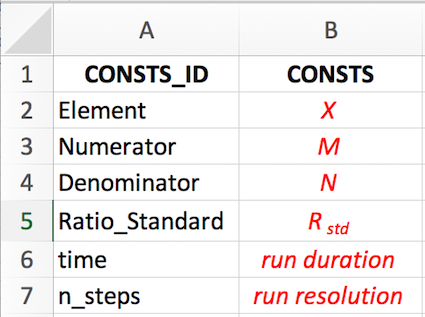
```

The **CONSTS** sheet should be strictly structured as shown here.

All *text in black* has to be strictly the same as shown.  

All *italicized and red text* corresponds to numerical or litteral variables set by the user:  

* **X** is the element of interest. Example: Ca  
* **M** is the numerator isotope. Example: 44  
* **N** is the denominator isotope. Example: 42  
* **$R_{std}$** is the isotope ratio of a standard or reference material, used to express the delta value. Example: 3.20297  
* **time** is the **duration of the run**, expressed in the same time units as the fluxes (expressed in mass unit per time unit). Example: 365 (days in case fluxes are expressed in mass of element per day)
* **nb_steps** is the **run resolution**, *i.e.* the number of iterations to do within the run duration. Example: 365 (1 calculated state of the system per day)

#### **INITIAL** sheet

```{r echo=FALSE, out.width='40%'}
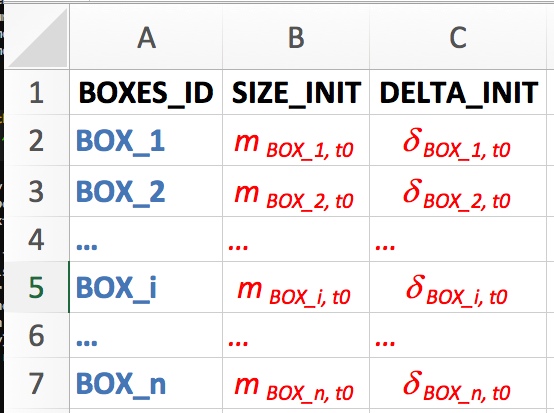
```

The **INITIAL** sheet should be strictly structured as shown here.

All *text in black* has to be strictly the same as shown.  

All *blue text* corresponds to litteral names of the *n* boxes defined by user.  

* These names should be coherent with all other references to box names (as in **FLUXES** or **COEFFS** sheet).  
* Two or more boxes can not have the exact same name.   
* The user should avoid the use of numerical values in the box names.  
* The user should avoid the use of spaces or special characters, with the exception of the underscore "_".  
* The user should chose abbvreviated names (preferabily 3 characters, for the sake of clarity in diagrams and plots).  

* Example of lists of box names:  
    + OCEAN, MTLE, C_CRUST, O_CRUST, RVR for ocean, mantle, continental crust, oceanic crust and river boxes respectively
    + DIET, MUSCLE, KDN, BONE, UR for diet, muscle, river, bone and urine boxes respectively

All *italicized and red text* corresponds to numerical variables set by the user:  

* In the column **SIZE_INIT** (box sizes at initial state): $m_{BOX\_i, t_0}$ corresponds to the mass of element **X** in box *i* at *t = 0*. 
These values are null or positive real numbers.
* In the column **DELTA_INIT** (box delta values at initial state): $\delta_{BOX\_i, t_0}$ corresponds to the delta value in box *i* at *t = 0*.
These values are real numbers.

#### **FLUXES** sheet

```{r echo=FALSE, out.width='75%'}
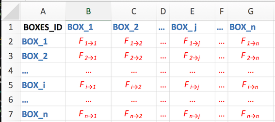
```

The **FLUXES** sheet should be strictly structured as shown here.

All *text in black* has to be strictly the same as shown (**BOXES_ID** here).

All *blue text* corresponds to exact same litteral names of the *n* boxes as defined by the user in **INITIAL** sheet, 
in the same vertical and horizontal order as in **INITIAL** sheet.

All *italicized and red text* corresponds to numerical variables set by the user:  

* $F_{i \to j}$ corresponds to flux of element **X** from box *i* to box *j*  
    (equivalent to $J_{i \mapsto j}^X$ in the system of differential equations as described above).  
    These values are null or positive real numbers.

#### **COEFFS** sheet

```{r echo=FALSE, out.width='75%'}
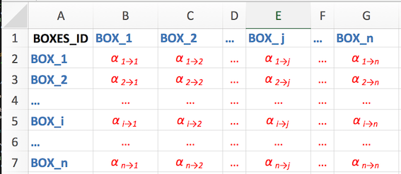
```

The **COEFFS** sheet should be strictly structured as shown here.

All *text in black* has to be strictly the same as shown (**BOXES_ID** here).

All *blue text* corresponds to exact same litteral names of the *n* boxes as defined by the user in **INITIAL** sheet, 
in the same vertical and horizontal order as in **INITIAL** sheet.

All *italicized and red text* corresponds to numerical variables set by the user:  

* $\alpha_{i \to j}$ corresponds to isotope fractionation coefficient from box *i* to box *j*   
    (equivalent to $D_{i \mapsto j}^X$ in the system of differential equations as described above).  
    These values are stricly positive real numbers.


## Numerical solver (`num_slvr`)

The numerical solver `num_slvr` iteratively integrates the derivatives of the box sizes ($\frac{dm^X_i}{dt}$) and isotope ratios ($\frac{dR_i}{dt}$) over the whole run duration. The `num_slvr` uses the `ode` ordinary differential equation integrating function from the **deSolve** package. 

#### Applicability

This function solves both the evolution of isotope ratios and box sizes in each box defined by user. 
The `num_slvr` function therefore can be used in two distinct sitation: 

1. In the case of balanced fluxes of element **X** between all involved boxes.  
    The derivative of box sizes will be null ($\frac{dm^X_i}{dt} = 0$),
    in other words all box sizes will be constant.
    
1. In the case of unbalanced fluxes of element **X** for at least one box of the system.  
    The derivative of box sizes will be non null in at least one case ($\frac{dm^X_i}{dt} \neq 0$),
    in other words at least on box loses and accumulates the element X.

The drawbacks of this function is that 

* Its accuracy depends on the time resolution of the run.
* The calculation can be time consuming.  
* We miss information on the system dynamics, which an analytical solver could bring.

The use of this function is thus preferred in the case of unbalanced fluxes, where at least one box loses or accumulates the element **X** over time (case #2). 
It then allows to study the dynamic responses of a system to a perturbation of the flux balance for at least one box.

#### Using num_slvr
*Remark*: The direct use of `num_slvr` function by user is not encouraged since this function is integrated in the global `run_isobxr` function described thereafter. 

The `num_slvr` function reads an INPUT file (file name structure: RUN name + _INPUT.xlsx, format described in detail below) 
containing all commands and conditions for the required model run, namely:

* *Constants* defining the system (Element symbol, isotopes considered, standard or reference material isotope ratio, run duration and number of time steps)  
* *Initial conditions* where each box is associated to an initial size (mass of element X) and an initial isotope composition expressed in delta value (‰ unit)  
* A matrix *fluxes* of element **X** between all boxes of the system (in mass unit per time unit)  
* A matrix of *isotope fractionation coefficients* associated to all boxes of the system   

The `num_slvr` function returns the numerically determined evolution of the stable isotope compositions and box sizes **X** in all boxes over the run duration. The detailed outputs are as follows: 

* OUT data file storing initial and final size and delta values in each box.  
    (file name structure: RUN name + _N_1_OUT.csv)
* evS data file storing the evolution with time of the sizes (masses of element X) of each box.  
    (file name structure: RUN name + _N_2_evS.csv)
* evD data file storing the evolution with time of the delta values in each box.  
    (file name structure: RUN name + _N_3_evD.csv)

## Analytical solver (`ana_slvr`)

The analytical solver `ana_slvr` calculates the analytical solutions of the system of ordinary differential equations (ODES) of stable isotope ratios of an element **X** in all boxes. It determines the eigenvalues, eigenvectors and constants defined by initial conditions associated to the ODES, 
and allows to determine the expression of stable isotope ratios as a function of time. 

#### Applicability

In this case, the box sizes are considered as constant since the solving of the system of differential equations only considers the isotope ratios as functions of time. 
In other words, in the case with balanced inward and outward fluxes for all boxes ($\frac{dm^X_i}{dt} = 0$), this function allows to accurately determine the expression of the stable isotope ratio in a given box as a function of time. The function also edits a data set of the evolution of isotope compositions in each box over the time range and with the time resolution determined by the user.

The use of this function is thus not applicable in the case of unbalanced fluxes for one box or more, 
with the exception of boxes defined as source or sinks (or waste) in the case of open systems, as described in the model design section thereafter. 

#### Using ana_slvr

*Remark*: The direct use of `ana_slvr` function by user is not encouraged since this function is integrated in the global `run_isobxr` function described thereafter. 

The `ana_slvr` function reads an INPUT file (file name structure: RUN_ID + INPUT.xlsx, format described in detail below) 
containing all commands and conditions for the required model run, namely:

* *Constants* defining the system (Element symbol, isotopes considered, standard or reference material isotope ratio, run duration and number of time steps)  
* *Initial conditions* where each box is associated to an initial size (mass of element X) and an initial isotope composition expressed in delta value (‰ unit)  
* A matrix *fluxes* of element **X** between all boxes of the system (in mass unit per time unit)  
* A matrix of *isotope fractionation coefficients* associated to all boxes of the system   

The `ana_slvr` function returns the analytical solutions of the stable isotope ratios as well as the evolution of the delta values (in ‰, relative to the reference material). The detailed outputs are as follows: 

* OUT data file with initial and final size and delta values in each box.  
    (file name structure: RUN name + _A_1_OUT.csv)
* ODE_SOLNs data file summarizing outputs of the analytical solutions of the ODES
    (eigenvalues, eigenvectors, relaxation times, constants according to initial conditions).  
    (file name structure: RUN name + _A_2_ODE_SOLNs.csv)
* evD data file of the evolution with time of the delta values in each box.  
    (file name structure: RUN name + _A_3_evD.csv)

****************************************************************
# Running isobxr box models with `run_isobxr`
## How does `run_isobxr` work?

The `run_isobxr` function allows to run the **isobxr** stable 
isotope box model, assess and render the design of the model 
and automatically run `num_slvr` or `ana_slvr` depending on the model design.

As defined in the documentation, `run_isobxr` takes a series of inputs from a working directory as well as from the user in the console, 
it stores a track of all the run conditions both in run specific files and in a global LOG file, 
and it returns several outputs files to an automatically created and managed directory and subdirectories.

To find the detailed description of `run_isobxr` inputs and outputs, refer to its documentation:
```{r eval = FALSE, message=FALSE, warning=FALSE, paged.print=FALSE}
# To see documentation on run_isobxr function, type in console:
?run_isobxr
```

The `run_isobxr` general principle is shown in following diagram.

```{r echo=FALSE, out.width='75%'}
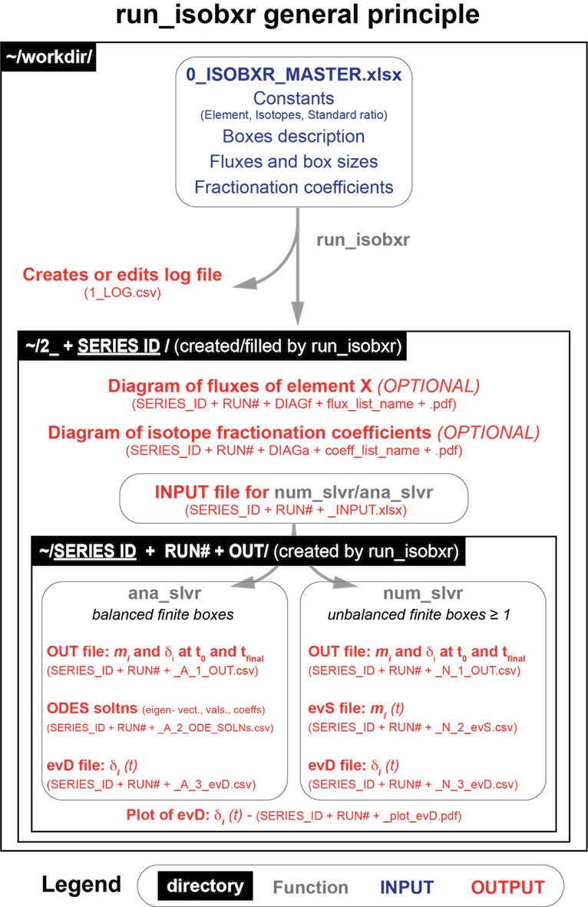
```

1. The `run_isobxr` function first extracts the configuration of the system (boxes, fluxes, fractionation coefficients) and of the given run (run duration, initial conditions).   
    i) These parameters come in majority from the *isobxr master file* (isotope system details, boxes details, flux and fractionation coefficient lists).
    i) Run specific parameters are directly set as parameters of the function (run duration, run resolution, time units for the plot).
    i) Optional parameters allow the manual forcing of some parameters (FORCING_RAYLEIGH, FORCING_SIZE, FORCING_DELTA, FORCING_ALPHA).
    
1. The `run_isobxr` function then evaluates the general design of the box model.  
    i) It will ignore boxes possibly named by user but isolated from the general system (no inward nor outward fluxes).  
    i) It will determine if the system is closed or open by identifying the presence/absence of boxes with the **INFINITE** status.  
        + In the case of a closed system, *i.e.* with no declared **INFINITE** boxes, it will display the following message in the console:  
            - **< All boxes are FINITE >**  
        + In the case of an open system, *i.e.* with declared **INFINITE** boxes, it will display the list of infinite boxes in the console:  
            - **< The INFINITE boxes are ... BOX_i ... >**  
    i) It will then determine whether some finite boxes are out of balance (unbalanced inward/outward fluxes).
        + In the case of a globally balanced system, *i.e.* no out of balance finite boxes, no message will be printed in the console.
        + In the case of a system with at least one unbalanced finite box, it will display a message for each unbalanced finite box in the console:   
            - **< BOX_i IN/OUT is pos >**  if the balance of box *i* is positive (accumulation of X)  
            - **< BOX_i IN/OUT is neg (max run: empty_duration t units) >** if the balance of box *i* is negative (loss of X).
                It will also display the maximum duration of the run until the box is totally emptied.

1. On this basis, the `run_isobxr` function then determines which solver function to run:  
    i) `ana_slvr` if all finite boxes have balanced inward and outward fluxes. It will then display the following message:  
        **< Running num_slvr (BALANCED FINITE BOXES) >**
    i) `num_slvr` if at least one finite box has unbalanced inward and outward fluxes. It will then display the following message:  
        **< Running ana_slvr (UNBALANCED FINITE BOXES) >**

**remark**
:    in the case of a system with at least one unbalanced finite box with a negative balance of inward/outward fluxes,
     the function evaluates whether the run duration excedes the shortest duration of emptying of the finite boxes with a negative balance. 
     If a box matches this criteria, the function will automatically reset the total run duration (*e.g.*, *t_max*) to the duration of emptying of this box (*e.g.*, *updated_t_max*). 
     A warning will be printed. This warning message can not be hidden by the PRINT_HIDE parameter.  
     
```{r echo=FALSE}
"*** UPDATED TOTAL RUN TIME *** < Total run time has been changed from t_max to updated_t_max (limiting box: Box_i) >"
```

## Format of the *isobxr master file*

All the functions designed to be directly used by users (`run_isobxr`, `compose_isobxr`, `sweep_steady`, `sweep_dyn`) 
are meant to be run in relation with an *isobxr master file*. 

The *isobxr master file* is the (xlsx) document containing all input data 
allowing `run_isobxr` function to perform single runs,
and is required alongside specific complementary files for functions 
performing multiple runs (`compose_isobxr`, `sweep_steady`, `sweep_dyn`).

It is where the user sets the design of their model:   

* define the isotopic system   
* define the boxes, their status (in case of an open system, details below) and the layout of the model for diagram rendering   
* define initial default box sizes (mass of element X)   
* define the values of fluxes between boxes   
* define the values of stable isotope fractionation coefficients linked to these fluxes   

The format of the *isobxr master file* is standardized. 
The user is encouraged to comply with these standards, as described thereafter, 
otherwise there is a high probability for these functions to crash.

#### **isobxr master file** name and location

* The *isobxr master file* is an xlsx file.  
* The *isobxr master file* name needs to be exactly as follows: [ **0_ISOBXR_MASTER.xlsx** ].
* the *isobxr master file* should be stored in the directory in which all runs (single or multiple runs)
    for this box model system will be performed 
    and where all outputs will be stored in automatically created subdirectories.
    This directory corresponds to the working directory (*workdir*) used as parameter of the `run_isobxr` function.

#### **isobxr master file structure**

The *isobxr master file* contains the 4 following sheet strictly named as follows: 

1. **CONSTANTS**: Sheet documenting the constants of the isotopic system
1. **BOXES**: Sheet documenting names and status of all boxes constituting the system
1. **FLUXES**: Sheet documenting the initial box sizes and massic fluxes of element X between boxes (structured as a column list)
1. **COEFFS**: Sheet documenting the isotopic fractionation coefficients between all boxes (structured as a column list)

#### **CONSTANTS** sheet

```{r echo=FALSE, out.width='75%'}
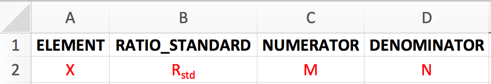
```

The **CONSTS** sheet should be strictly structured as shown here.

All *text in black* has to be strictly the same as shown.

All *red text* corresponds to numerical or litteral variables set by the user:

* **X** is the element of interest. Example: Ca
* **$R_{std}$** is the isotope ratio of a standard or reference material, used to express the delta value. Example: 3.20297
* **M** is the numerator isotope. Example: 44
* **N** is the denominator isotope. Example: 42

These constants will be used throughout all runs performed within the working directory in which the *isobxr master file* is stored.

#### **BOXES** sheet

```{r echo=FALSE, out.width='75%'}
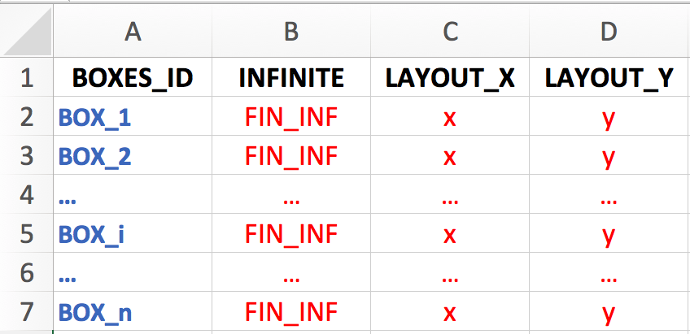
```


The **BOXES** sheet should be strictly structured as shown here.

All *black text* has to be strictly the same as shown.

All *blue text* of the column *BOXES_ID* corresponds to litteral names of the *n* boxes defined by the user.

* These names should be coherent with all other references to box names (as in **FLUXES** or **COEFFS** sheet).  
* All boxes refered to everywhere else (such as **FLUXES** or **COEFFS** sheet or called within a function) should be in this list.
* Two or more boxes can not have the exact same name.
* The user should avoid the use of numerical values in the box names.
* The user should avoid the use of spaces or special characters, with the exception of the underscore "_".
* The user should chose abbvreviated names (preferabily 3 characters, for the sake of clarity in diagrams and plots). 

* Example of lists of box names:
    + OCEAN, MTLE, C_CRUST, O_CRUST, RVR for ocean, mantle, continental crust, oceanic crust and river boxes respectively
    + DIET, MUSCLE, KDN, BONE, UR for diet, muscle, river, bone and urine boxes respectively

All *red text* corresponds to litteral or numerical variables set by the user:

* The column **INFINITE** is used to store the *status of the box* depending on the box model design. 
The first purpose of this column is to specify to the code whether the model represents an **open** or **closed system**.  
    + In the *case of an open system*, the environment boxes (typically *source* or *sink* reservoirs) need to have the **INFINITE** status (strictly spelled in this way).  
    + For all boxes corresponding to *finite boxes* that are *part of the system* being either closed or open, 
    the user is free to set a status name that describes the box category.
    In this case, the box status name needs to be named following the same spelling rules as for the box names.  
    Several boxes can have the same status name (*e.g.*, **INTERFACE** or **DEAD_END** or **FINITE**). 
    + Beyond the determination of the **INFINITE** *vs.* **FINITE** status of a box used for calculation purposes, 
    this column is used by the **isobxr** functions to set a color code in the automatic box model diagram edition.

* The **LAYOUT_X** and **LAYOUT_Y** columns correspond to the user defined layout of the box model diagram.   
    + It corresponds to the definition of the coordinates of the boxes to be displayed in the diagram over a matrix format 
    (X: line, Y: column, both being positive real numbers).
    + It is recommended to separate the boxes horizontally (LAYOUT_X) and vertically (LAYOUT_Y) 
    by at least 2 or 3 units to keep for the sake of diagram clarity. 
    + As specified above, it is recommended to keep box names in rather short abbreviated forms (up to 6 or 7 characters)
    so they remain legible in the diagram.  


#### **FLUXES** sheet

```{r echo=FALSE, out.width='100%'}
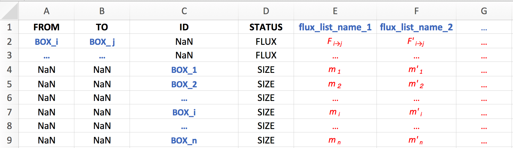
```

All *black text* has to be strictly the same as shown.  
All *blue text* corresponds to litteral names (string of characters) defined by the user.  
All *red text* corresponds to litteral or numerical variables set by the user.  

The **FLUXES** sheet takes two types of input: fluxes and box sizes. 

The **FLUXES** sheet allows the user to set as many sets of [fluxes + box sizes] conditions as desired, for the system defined in the **BOXES** sheet.

These sets of [fluxes + box sizes] conditions are called *flux lists* and are stored in as many columns as desired (columns **flux_list_name_1**, **flux_list_name_2** and so on). 

* The name of the *flux lists* columns are determined by the user and refers to a specific set of [fluxes + box sizes] conditions.  
    It should avoid spaces and special characters other than underscores.  
    It can contain a number for the sake of list itemization (e.g., **Fx_1** standing for *flux list 1*).

* The type of input is determined in the **STATUS** column by using stricly either **FLUX** or **SIZE** levels.  

* A list of flux values is built as follows  
    + considering a flux *F* of element **X** from box *i* to *j*:  
        - the column **FROM** takes the exact name of the box $i$  
        - the column **TO** takes the name of the box $j$  
        - the column **ID** remains undocumented, by leaving **NaN**  
        - the column **STATUS** takes the **FLUX** status  
        - the column **flux_list_name_1** takes the value of the desired $F_{i \to j}$ flux, as a positive or null real number.  
    + Within a given list, the user defines as many fluxes as desired (while strictly avoiding duplicate fluxes).  
    + Not all fluxes between all boxes need to be defined.  
    + All other fluxes that remain not specified by user here will be automatically set to 0 by `run_isobxr` (no exchange of element X).   

* A list of box sizes values is built as follows  
    + considering a mass *m* of element **X** in box *i*:  
        - the column **FROM** remains undocumented, by leaving **NaN**  
        - the column **TO** remains undocumented, by leaving **NaN**  
        - the column **ID** takes the exact name of the box $i$  
        - the column **STATUS** takes the **SIZE** status  
        - the column **flux_list_name_1** takes the value of the desired $m_{i}$ box size, as a positive or null real number.  
    + The user needs to define the size of all boxes.
    + If the box remains unused (no connected flux), its size can be set at 0.
    + The user is reponsible for carefully chosing meaningful sizes with respect to the inward and outward fluxes.
    + In case of a *negative balance of fluxes* for a given box (*i.e.*, the box is being emptied), 
        - If long enough, it is possible that the run leads to the total emptying of the box. 
        - This is dealt with by the `run_isobxr` function by overwriting the run duration defined by the user
        by an updated run duration corresponding to the time required to empty the box with the shortest emptying time.  
        - In this case, the user is warned by a message in the console during the model run.
    
* The **units** of the fluxes (mass unit per time unit) and sizes (mass unit) need to be homogeneous (same mass unit for both).
* The **units** of the fluxes (mass unit per time unit) and run duration set in the function (time unit) need to be homogeneous (same time unit for both).

#### **COEFFS** sheet

```{r echo=FALSE, out.width='100%'}
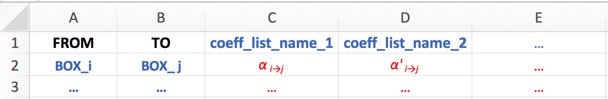
```

All *black text* has to be strictly the same as shown.  
All *blue text* corresponds to litteral names (string of characters) defined by the user.  
All *red text* corresponds to litteral or numerical variables set by the user.  

The **COEFFS** sheet takes one type of input: the values of the isotope fractionation coefficients associated to the fluxes (also referred to as $\alpha_{i \to j}$).

The **COEFFS** sheet allows the user to set as many sets of [coefficients] conditions as desired, for the system defined in the **BOXES** sheet.

These sets of [coefficients] conditions are called *coefficients lists* and
are stored in as many columns as desired (columns **coeff_list_name_1**, **coeff_list_name_2** and so on). 

* The name of the *coefficients lists* columns are determined by the user and refers to a specific set of [coefficients] conditions.  
    It should avoid spaces and special characters other than underscores.  
    It can contain a number for the sake of list itemization (e.g., **a_1** standing for *coefficients list 1*).

* A list of coefficients values is built as follows  
    + considering an isotope fractionation coefficient from box *i* to *j*:  
        - the column **FROM** takes the exact name of the box $i$  
        - the column **TO** takes the name of the box $j$  
        - the column **flux_list_name_1** takes the value of the desired $\alpha_{i \to j}$ coefficient, a strictly positive real number, usually close to 1.  
    + Within a given list, the user defines as many fractionation coefficients as desired (while strictly avoiding duplicates).  
    + Not all fractionation coefficients between all boxes need to be defined.  
    + All other fractionation coefficients that remain not specified by user here will be automatically set to 1 by `run_isobxr` (no isotope fractionation).   


**remark**
:    An important feature of the flux and coefficients lists, as documented by user in **FLUXES** and **COEFFS** sheet, 
     is that the design of these lists does not require the exhaustive description of all possible combinations of box pairs.  
     Non described box pairs will have their fractionation coefficient set to 1 (or their flux value set to 0 in the case of the fluxes description).

## Using `run_isobxr`

We consider the demonstration *isobxr master file* (0_ISOBXR_MASTER.xlsx) stored in the working directory. In the demonstration example, the *isobxr master file* describes an imaginary model. It is designed for the calcium $^{44}Ca/^{42}Ca$ isotope ratios. 

```{r echo=FALSE, out.width='75%'}
knitr::include_graphics('./10_ABCD_CONSTANTS.png')
```

The **BOXES** sheet describes a total system composed of 4 finite boxes (A, B, C, D). 
The layout of the boxes in the diagram rendering aims at placing these boxes on the four corners of 10x10 units square.


```{r echo=FALSE, out.width='50%'}
knitr::include_graphics('./11_ABCD_BOXES.png')
```
  
We assume that fluxes are expressed in mg of Ca per day, sizes in mg of Ca and run time units will be days.  

The **FLUXES** sheet describes 5 flux lists  

1. *Fx1_ABC_bal* describes a balanced closed system composed of 3 finite boxes A, B and C.   
1. *Fx2_ABC_unbal* describes an unbalanced closed system composed of 3 finite boxes A, B and C.  
1. *Fx3_ABC_unbal* describes an unbalanced closed system composed of 3 finite boxes A, B and C.   
1. *Fx4_ABCD_bal* describes a balanced closed system composed of 4 finite boxes A, B, C and D.     
1. *Fx5_ABCD_unbal*  describes an unbalanced closed system composed of 4 finite boxes A, B, C and D.  

All box sizes are here set at 2000 mg.  
  
```{r echo=FALSE, out.width='100%'}
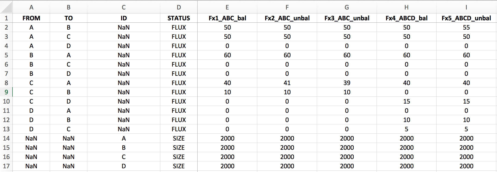
```

The **COEFFS** sheet describes 5 lists of fractionation coefficients:

* *a0* describes no isotope fractionation (all $\alpha_{i \to j}$ being equal to one)  
* *a1* describes a system with 1 fractionation coefficient being different from 1:   
    $\alpha_{A \to B} = 0.999$  
* *a2* describes a system with 2 fractionation coefficients being different from 1:  
    $\alpha_{A \to B} = 0.999$, $\alpha_{B \to A} = 1.001$  
* *a3* describes a system with 3 fractionation coefficients being different from 1:  
    $\alpha_{A \to B} = 0.999$, $\alpha_{B \to A} = 1.001$, $\alpha_{C \to A} = 0.9997$  
* *a4* describes a system with 1 fractionation coefficient being different from 1:  
    $\alpha_{C \to D} = 0.99$  
    
**Note**
:    how these lists of coefficients only refer to 4 fractionation coefficients, while the total number of possible box pairs is 16.
     The `run_isobxr` function takes into consideration the documented pairs (both for fluxes and fractionation coefficients), 
     and automatically sets the value of undocumented pairs to the default one (0 for fluxes and 1 for fractionation coefficients).

```{r echo=FALSE, out.width='100%'}
knitr::include_graphics('./13_ABCD_COEFFS.png')
```

### Balanced 3-boxes closed system model

We consider here the case a balanced closed system of 3 finite boxes (flux list *Fx1_ABC_bal*).  
For this run we use the *a1* fractionation coefficients list.  
We will run this model for a total time of 2500 days with a resolution of 1 calculation every 10 days (250 steps).  

```{r eval=FALSE}
run_isobxr(workdir = "~/DEMO_ABCD", # isobxr master file work. dir.
           SERIES_ID = "ABC_balanced_closed", # series ID of the set of runs
           flux_list_name = "Fx1_ABC_bal", # which flux list from FLUXES sheet
           coeff_list_name = "a1", # which coefficients list from COEFFS sheet 
           t_lim = 2500, # how long do I want to run
           nb_steps = 250, # how many steps over this run duration
           time_units = c("days", "years"), # run time units (days), plot time units (years)
           PLOT_evD = TRUE) # export plot as pdf 
```

The first default outputs of the run are the messages sent by the function on the R console (all of these pieces of information being besides stored in the LOG file).

The `run_isobxr` function therefore choses to run the analytical solver (`ana_slvr`).

In the case of this run we can see the following messages:

```{r echo=FALSE}
"< All boxes are FINITE >"
"< Running ana_slvr (BALANCED FINITE BOXES) > "
```

This is expected since no INFINITE box has been declared and all inward and outward fluxes for each box are expected to be balanced.

The associated pre-run outputs (optional) are the model diagrams of fluxes (left) and of fractionation coefficients (right, expressed as amplitude of isotope fractionation, in ‰). 

```{r echo=FALSE, out.width='47%'}
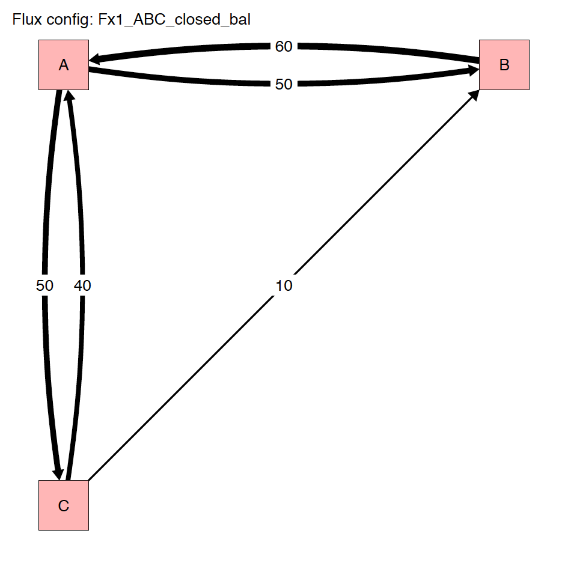
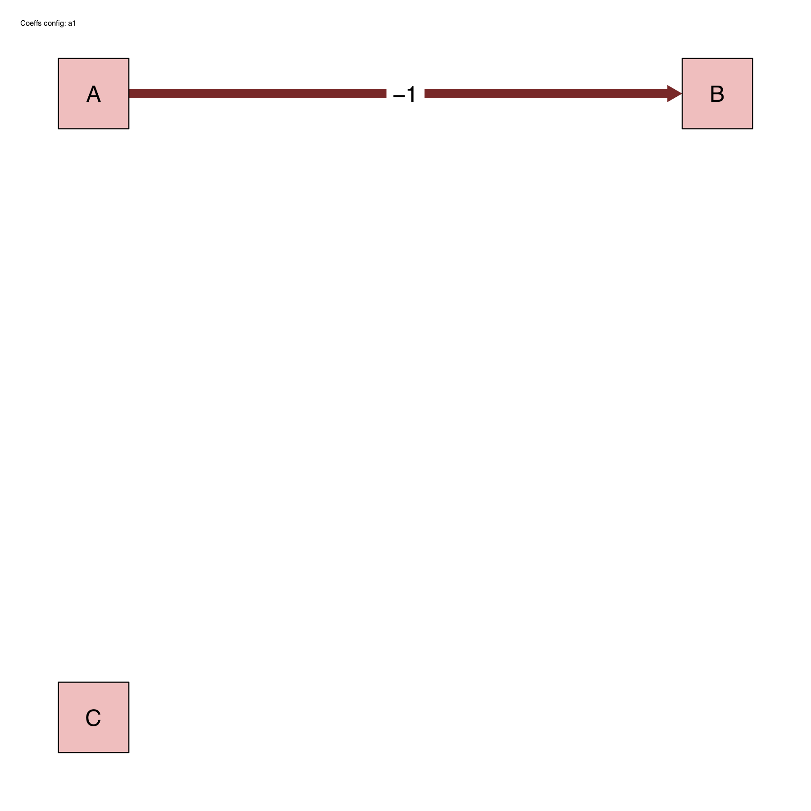
```

Finally, the post-run output includes the evolution of $\delta$ values over the run duration, shown in years for this run.

```{r echo=FALSE, out.width='100%'}
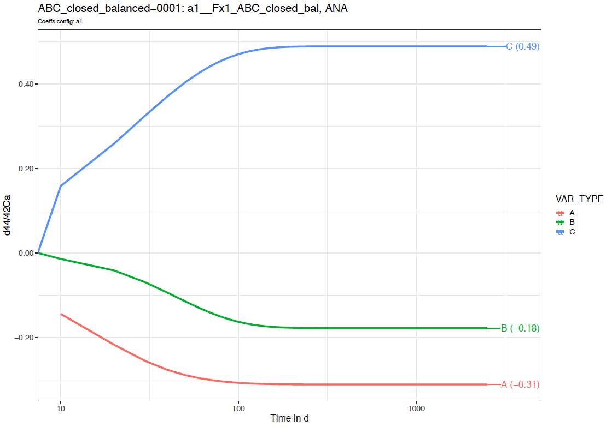
```

Note that the run resolution can be seen by the discrete behavior of the evolution of $\delta$ values on the left handside of the logarithmic time scale. 
This display effect would be smoothed out by a higher run resolution (nb_steps = 2500 or 25000 for instance).


### Unbalanced 3-boxes closed system model

We consider here the case of an unbalanced closed system of 3 finite boxes (flux list *Fx2_ABC_unbal*).  
For this run we use the *a1* fractionation coefficients list.  
We will run this model for a total time of 2500 days with a resolution of 1 calculation every 10 days (250 steps).  

```{r eval=FALSE}
run_isobxr(workdir = "~/DEMO_ABCD", # isobxr master file work. dir.
           SERIES_ID = "ABC_unbalanced_closed", # series ID of the set of runs
           flux_list_name = "Fx2_ABC_unbal", # which flux list from FLUXES sheet
           coeff_list_name = "a1", # which coefficients list from COEFFS sheet 
           t_lim = 2500, # how long do I want to run
           nb_steps = 250, # how many steps over this run duration
           time_units = c("days", "years"), # run time units (days), plot time units (years)
           PLOT_evD = TRUE) # export plot as pdf 
```


The first default outputs of the run are the messages sent by the function on the R console (all of these pieces of information being besides stored in the LOG file).

In the case of this run we can see the following messages:

```{r echo=FALSE}
"< All boxes are FINITE >"
"< A IN-OUT BALANCE is pos >" 
"< C IN-OUT BALANCE is neg (max run: 2000 t units) >" 
"< Running num_slvr (UNBALANCED FINITE BOXES) >" 
"*** UPDATED TOTAL RUN TIME *** < Total run time has been changed from 2500 to 2000 (limiting box: C) > "
```

The first message is expected since no INFINITE box has been declared.

The second and third lines point out the fact that boxes A and C are out of balance: A accumulates calcium while C loses calcium. 

The function also tells us that it will take in total 2000 days for the box C to be totally emptied. This is expected since C has a size of 2000 mg and, as can be seen on the flux diagram below, C loses 1 mg of Ca per day.

The `run_isobxr` function therefore choses to run the numerical solver (`num_slvr`).

Finally, the `run_isobxr` function warns the user: it automatically updated the total run time, changing it from 2500 days to 2000 days because the box C would have lost all of its calcium by 2000 days.

The associated pre-run outputs (optional) are the model diagrams of fluxes (left) and of fractionation coefficients (right, expressed as amplitude of isotope fractionation, in ‰). 

```{r echo=FALSE, out.width='47%'}
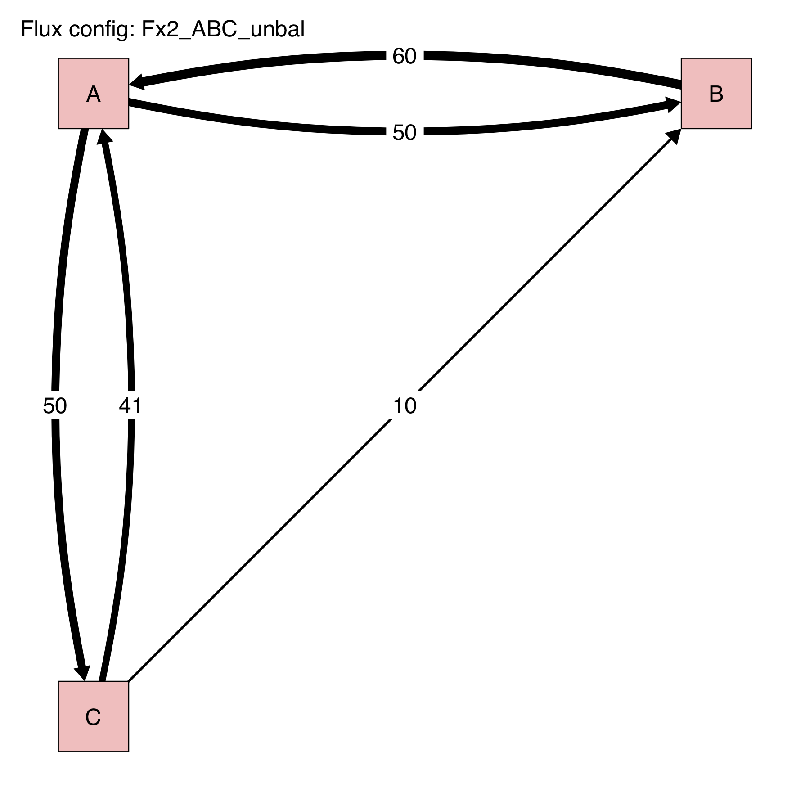

```

Finally, the post-run output includes the evolution of $\delta$ values over the run duration, shown in years for this run.

```{r echo=FALSE, out.width='100%'}
knitr::include_graphics('./19_ABC_unbalanced_closed_0001_plot_evD.png')
```

Note that in this example, the slight imbalance does not affect the overall bevaviour of the system at time scale when compared to the balanced system.

### Formatting the forcing parameters
#### Forcing initial box sizes

By default, the `run_isobxr` function sets the initial box sizes (mass of element X in each box) 
at the values found in the flux list specified by user.

It is possible to manually overwrite the initial size of one, 
several or all boxes for a given run performed by `run_isobxr`.  
It is done by defining a data frame structured as follows.

```{r echo=TRUE}
FORCING_SIZE <- 
  data.frame(BOXES_ID = c("BOX_1", "...", "BOX_i", "..."),
             SIZE_INIT = c("updated_size_1", "...", "updated_size_i", "..."))

FORCING_SIZE
```

For the 3-boxes closed system model (ABC), in order to change the size of box C from 2000 mg of Ca 
(default as specified in *isobxr master file* for all flux lists of **FLUXES** sheet)
to 3000 mg of Ca, the data frame should be structured as follows:

```{r echo=TRUE}
FORCING_SIZE <- 
  data.frame(BOXES_ID = c("C"),
             SIZE_INIT = c(3000))

FORCING_SIZE
```

#### Forcing initial delta values

By default, the `run_isobxr` function sets the initial delta values of all boxes at 0 ‰.

It is possible to manually overwrite the initial delta values of one, 
several or all boxes for a given run performed by `run_isobxr`.  
It is done by defining a data frame structured as follows.

```{r echo=TRUE}
FORCING_DELTA <- 
  data.frame(BOXES_ID = c("BOX_1", "...", "BOX_i", "..."),
             DELTA_INIT = c("updated_delta_1", "...", "updated_delta_i", "..."))

FORCING_DELTA
```

For the 3-boxes closed system model (ABC), in order to force the fractionation coefficient 
associated to the flux of Ca from box A to B to the value of 1.02,
the data frame should be structured as follows:

```{r echo=TRUE}
FORCING_DELTA <- 
  data.frame(BOXES_ID = c("A"),
             DELTA_INIT = c(-1))

FORCING_DELTA
```

#### Forcing isotope fractionation coefficients

By default, the `run_isobxr` function sets the isotope fractionation coefficients 
at the values found in the coefficients list specified by user.

It is possible to manually overwrite the fractionation coefficients of one, several or all pairs of boxes for a given run performed by `run_isobxr`.  
It is done by defining a data frame structured as follows.

```{r echo=TRUE}
FORCING_ALPHA <- 
  data.frame(FROM = c("BOX_i", "..."),
             TO = c("BOX_j", "..."),
             ALPHA = c("new_coeff_value", "..."),
             FROM_TO = c("BOX_i_BOX_j", "..."))

FORCING_ALPHA
```

For the 3-boxes closed system model (ABC), in order to force the fractionation coefficient 
associated to the flux of Ca from box A to B to the value of 1.02,
the data frame should be structured as follows:

```{r echo=TRUE}
FORCING_ALPHA <- 
  data.frame(FROM = c("A"),
             TO = c("B"),
             ALPHA = c(1.02),
             FROM_TO = c("A_B"))

FORCING_ALPHA
```

#### Forcing fractionation coefficient to a Rayleigh distillation model

It is possible to overwrite isotope fractionation coefficients 
by defining their values as the result of Rayleigh type isotope
distillation in the context of a fractional exchange at an interface. 

We consider here the case of the loss of element X from a box A to a box C through an interface box B, 
all possibly part of a bigger box model system.

We suppose that the apparent fractionation coefficient $\alpha_{A \to C}$ associated to this flux $F_{A \to C}$ 
results from a Rayleigh type distillation occuring during the fractional exchange of element X at the interface box B.

```{r echo=FALSE, out.width='100%'}
knitr::include_graphics('./20_Rayleigh_distillation_design.png')
```

In this situation, the box A exchanges element X with box B (and possibly other boxes).

This is a fractional exchange, *i.e.* during this exchange, box A sends more of element X to box B than B sends back ($F_{A \to B} > F_{B \to A}$).  

As we consider box B to be balanced, it loses the difference to box C: $F_{B \to C} = F_{A \to B} - F_{B \to A}$.  

As a result, box A loses a total of $F_{B \to C}$ of element X per time unit.  

We suppose here that the $F_{A \to B}$ that feeds box B is associated to no isotope fractionation.  

On the other hand, we suppose that the $F_{B \to A}$ flux corresponding to the fractional loss of element X from interface box B, and returning to box A, 
is associated to an *equilibrium* or *incremental* isotope fractionation ($\alpha^0 _{B \to A}$).

The Rayleigh distillation model of isotopes thus predicts the following: 

$$R_{C} = R_{C, t_0} \dfrac{F_{B \to C}}{F_{A \to B}}^{\alpha^0 _{B \to A} - 1}  $$

The $R_{C, t_0}$ corresponds to the isotope ratio of the element X in box B before any exchange with box A occurs. 
It is thus equivalent to $R_{A}$ since the box B only input is *via* the $F_{A \to B}$ flux.

We thus can write the following definition of $\alpha_{B \to C}$ (equivalent here to $\alpha_{A \to C}$):

$\alpha_{B \to C} = \dfrac{R_{C}}{R_{A}} = \dfrac{F_{B \to C}}{F_{A \to B}}^{\alpha^0 _{B \to A} - 1}$

The `run_isobxr` function here takes as an optional input the data frame structured as follows:

```{r}
FORCING_RAYLEIGH <- 
  data.frame(XFROM = c("B"), # Define the B>C flux at numerator
             XTO = c("C"),
             YFROM = c("A"), # Define the A>B flux at denominator
             YTO = c("B"),
             AFROM = c("B"), # Define the resulting fractionation coefficient
             ATO = c("C"),
             ALPHA_0 = c("a0") # Define the value of incremental B>A coefficient
  ) 

FORCING_RAYLEIGH
```

The `run_isobxr` function will in this case overwrite the value of $\alpha_{B \to C}$ set in *isobxr master file* or using the FORCING_ALPHA parameter. 

Indeed, if the user forced a new value for $\alpha_{B \to C}$ using the FORCING_ALPHA parameter, 
the `run_isobxr` function will prioritize the FORCING_RAYLEIGH parameter. 

It is possible to define several Rayleigh distillation apparent fractionation coefficients in a given model.  
This is done by adding rows to this data frame.

### Dealing with an open system

The user should define a source box and a sink box and declare them in the **BOXES** sheet as INFINITE. 
We give below an example of a run of for an open system.

```{r echo=FALSE, out.width='50%'}
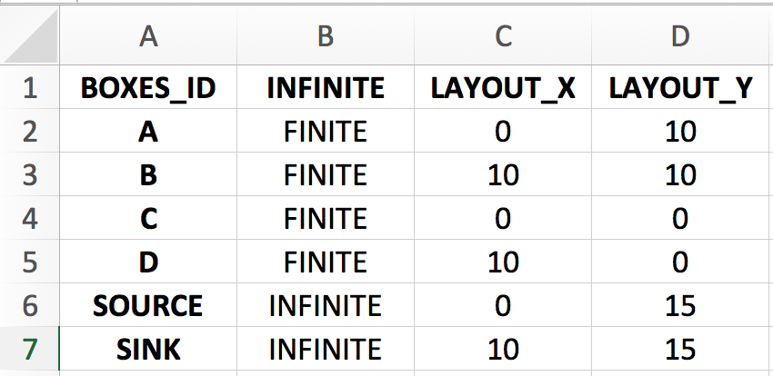
```

These boxes should have infinite sizes defined in relation to the system scale 
(important for runs with unbalanced finite boxes, which will use the numerical solver). 
In this example, both source and sink box sizes were set at $10^{15}$.

The source box should only be used with outward fluxes to the open system and should not receive any flux from it.

The sink box should only be used with inward fluxes from the open system and should not send any flux to it.

The function call would be the following for a run of 25000 days, with one calculation every 10 days (nb_steps = 2500).  

We use the *Fx6_ABC_open_bal* flux list and the *a1* coefficient list.

```{r eval=FALSE}
run_isobxr(workdir = "~/DEMO_ABCD", # isobxr master file work. dir.
           SERIES_ID = "ABC_balanced_open", # series ID of the set of runs
           flux_list_name = "Fx6_ABC_open_bal", # which flux list from FLUXES sheet
           coeff_list_name = "a1", # which coefficients list from COEFFS sheet 
           t_lim = 25000, # how long do I want to run
           nb_steps = 2500, # how many steps over this run duration
           time_units = c("days", "years"), # run time units (days), plot time units (years)
           PLOT_evD = TRUE) # export plot as pdf 
```

We obtain the following diagrams, where the infinite boxes display a different color. 

```{r echo=FALSE, out.width='47%'}
knitr::include_graphics('./22_ABC_balanced_open_0001_DIAGf_Fx6_ABC_open_bal.png')
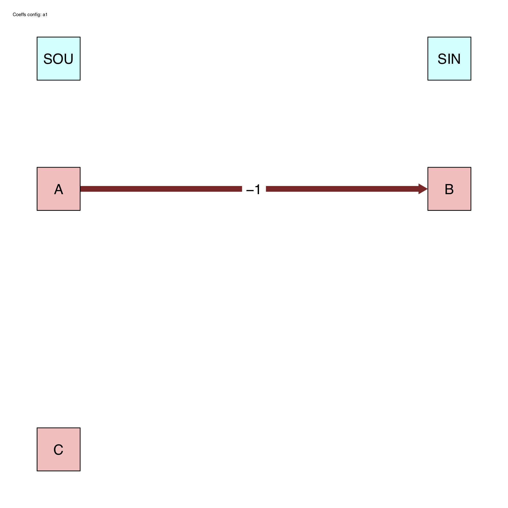
```

And we finally obtain the following plot of the evolution of $\delta$ values in all finite boxes over time, 
where we observe the relaxation of the system to it's steady state. 

```{r echo=FALSE, out.width='100%'}
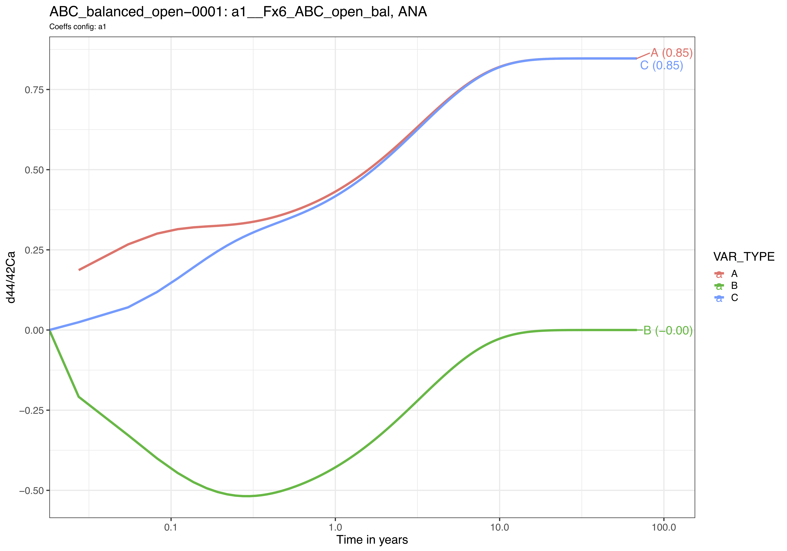
```

Note that both infinite boxes are hidden from this graphic representation but the isotope compositions of all boxes - including source and sink - are stored in the output data files.  

While the sink (or waste) box is not informative as such,
the source could have varying/non-zero initial $\delta$ values,
depending on the run parameters, 
used to force the open system. It will be notably of importance for the use of the `compose_isobxr` function, described thereafter.

******************************************************
# Compose isobxr scenarios with `compose_isobxr`
## How does `compose_isobxr` work?

The `compose_isobxr` function allows to perform a series of successive isobxr runs (calling the `run_isobxr` function), 
allowing to build a scenario of composite runs each one 
inheriting the final state of the previous run as its own initial state.

As defined in the documentation, `compose_isobxr` takes a series of inputs from a working directory as well as from the user in the console, 
it stores a track of all the run conditions both in run specific files and in a global LOG file, 
and it returns several outputs files to an automatically created and managed directory and subdirectories.

To find the detailed description of `compose_isobxr` inputs and outputs, refer to its documentation:
```{r eval = FALSE, message=FALSE, warning=FALSE, paged.print=FALSE}
# To see documentation on run_isobxr function, type in console:
?compose_isobxr
```

The `compose_isobxr` general principle is shown in following diagram.

```{r echo=FALSE, out.width='75%'}
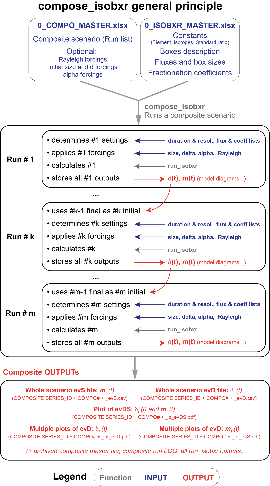
```

The basic principle of the `compose_isobxr` function lies in the fact that it performs a series of successive runs each of them inheriting from the previous runs final conditions as starting conditions.

The simplest use of the `compose_isobxr` function consists in composing a list of runs with various run duration and resolutions and changing flux lists or coefficients from one run to another. 

For instance, it is possible to run a model of balanced system of finite boxes until total relaxation to steady state followed by a run of the same system in a given unbalanced conformation (different flux list) 
or with a modified set of fractionation coefficients (different coeff list).

Each run will inherit from the previous run final delta values and box sizes and use these as initial values.

It is possible to run the `compose_isobxr` function with various forcing parameters. 

## Format of the *compose master file*

In addition to the global *isobxr master file*, the `compose_isobxr` function
requires a *compose master file*. 

The *compose master file* is the (xlsx) document containing all commands
allowing `compose_isobxr` function to compose a series of runs and build an isobxr scenario.

It is where the user sets the design of their isobxr scenario:

* necessary: define the list of *m* runs composing the scenario (run durations, run resolutions, lists of fluxes, lists of coefficients).  
* optional: define the forcings over one or several runs composing the composite scenario (FORCING_RAYLEIGH, FORCING_ALPHA, FORCING_DELTA, FORCING_SIZE).  

The format of the *compose master file* is standardized. 
The user is encouraged to comply with these standards, as described thereafter, 
otherwise there is a high probability for these functions to crash.


#### **compose master file** name and location

* The *compose master file* is an xlsx file.  
* The *compose master file* name is chose by user and specified in the `compose_isobxr` function inputs: [*e.g.*, **0_COMPO_MASTER.xlsx** ].  
* the *compose master file* should be stored in the directory in which *isobxr master file* is found,
    where all runs for this box model system will be performed and where all outputs will be stored 
    in automatically created subdirectories. This directory corresponds to the working directory (*workdir*) 
    used as parameter of the `compose_isobxr` function.

#### **compose master file structure**

The *compose master file* contains the 5 following sheet strictly named as follows: 

1. **RUN_LIST**: define the list of *m* runs composing the scenario (run durations, run resolutions, lists of fluxes, lists of coefficients).  
1. **FORCING_RAYLEIGH**: define Rayleigh forcings over one or several runs composing the composite scenario.  
1. **FORCING_ALPHA**: define Rayleigh forcings over one or several runs composing the composite scenario.  
1. **FORCING_DELTA**: define initial delta forcings over one or several runs composing the composite scenario.  
1. **FORCING_SIZE**: define initial box size forcings over one or several runs composing the composite scenario.  

#### **RUN_LIST** sheet (*FILLING REQUIRED*)

```{r echo=FALSE, out.width='100%'}
knitr::include_graphics('./24_COMPO_RUN_LIST.png')
```

The `compose_isobxr` function requires a list of successive *m* runs.

Each of these runs should be succesively described one by one on every row of this sheet, with notably:   

1. the run number (COMPO_RUN_n column)  
1. the run duration (t_lim_list column)  
1. the run resolution (nb_steps_list)  
1. the flux list name (flux_list) that will be read from *isobxr master file*  
1. the coefficients list name (coeff_list) that will be read from *isobxr master file*  

One run should not be described twice.

#### **FORCING_SIZE** sheet (*FILLING OPTIONAL*)

```{r echo=FALSE, out.width='50%'}
knitr::include_graphics('./26_COMPO_FORCING_SIZE.png')
```

It is possible to force the initial size of a given run for one or several boxes.

To do so, you need to specify which run the forcing should apply to (COMPO_RUN_n column)  
and the same details as required for the FORCING_SIZE parameter in `run_isobxr` (see previous section).

It is possible to force the local run initial size of several boxes within a given composite run by filling one line per box, with the same COMPO_RUN_n number.

In case no size forcing is required by the user, this sheet should remain with the table headers as such but with empty lines below.

#### **FORCING_DELTA** sheet (*FILLING OPTIONAL*)

```{r echo=FALSE, out.width='50%'}
knitr::include_graphics('./27_COMPO_FORCING_DELTA.png')
```

It is possible to force the initial delta values of a given run for one or several boxes.

To do so, you need to specify which run the forcing should apply to (COMPO_RUN_n column)  
and the same details as required for the FORCING_DELTA parameter in `run_isobxr` (see previous section).

It is possible to force the local run initial delta of several boxes within a given composite run by filling one line per box, with the same COMPO_RUN_n number.

In case no delta forcing is required by the user, this sheet should remain with the table headers as such but with empty lines below.

#### **FORCING_ALPHA** sheet (*FILLING OPTIONAL*)

```{r echo=FALSE, out.width='50%'}
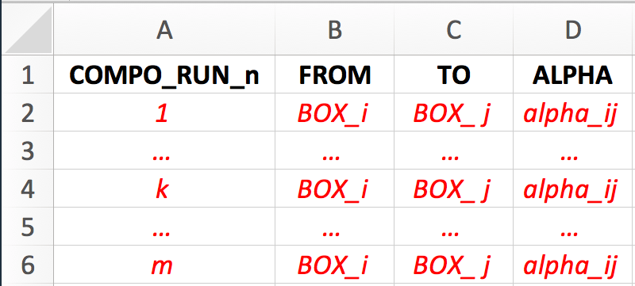
```

It is possible to force the fractionation coefficient values of a given run for one or several pairs of boxes.

To do so, you need to specify which run the forcing should apply to (COMPO_RUN_n column)  
and the same details as required for the FORCING_ALPHA parameter in `run_isobxr` (see previous section).

It is possible to force the local run fractionation coefficients of several pairs of boxes within a given composite run by filling one line per pair of boxes, with the same COMPO_RUN_n number.

In case no alpha forcing is required by the user, this sheet should remain with the table headers as such but with empty lines below.

#### **FORCING_RAYLEIGH** sheet (*FILLING OPTIONAL*)

```{r echo=FALSE, out.width='100%'}
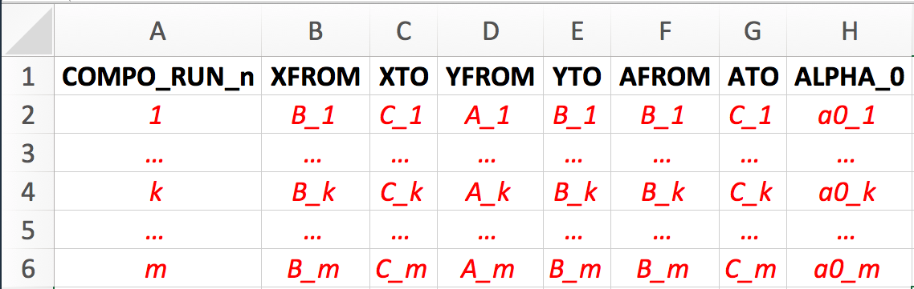
```


It is possible to force the fractionation coefficient to follow a Rayleigh distillation model in a given run for one or several Rayleigh distillation models.

To do so, you need to specify which run the forcing should apply to (COMPO_RUN_n column)  
and the same details as required for the FORCING_RAYLEIGH parameter in `run_isobxr` (see previous section).

It is possible to force the local run fractionation coefficients of several pairs of boxes within a given composite run by filling one line per pair of boxes, with the same COMPO_RUN_n number.

In case no Rayleigh forcing is required by the user, this sheet should remain with the table headers as such but with empty lines below.


## Using `compose_isobxr`

### example #1: perturbating the fluxes  
We compose here the first scenario as described on the screenshot of the *composite master file* used for this run.

```{r echo=FALSE, out.width='75%'}
knitr::include_graphics('./30_RUN_LIST_ABC.png')
```

Here, we start with the previous example: a set of 3 finite boxes (A, B, C) consituting an open system interacting with the environment (SOURCE and SINK boxes).

1. We first let the system relax to its' steady-state in a balanced configuration using the *Fx6_ABC_open_bal* flux list for a total of 25000 days (70 years).  
1. We then let the system run with the exact same conditions for 100 days.   
1. We then provoke a disequilibrium by using an unbalanced *Fx7_ABC_open_unbal* flux list (A loses 10 mg of Ca per day, B accumulates 10 mg of Ca per day).  
1. We then let the system relax again with the previous balanced flux configuration (*Fx6_ABC_open_bal*) but with automatically inherited different initial conditions of delta and size values.  

We call the function as follows:

```{r eval=FALSE}
workdir <- "~/DEMO_ABCD" # isobxr and compo master file work. dir.
SERIES_ID <- "ABC_change_balance" # series ID of the set of compo runs
time_units <- c("days", "days") # time units for run (days) and for plots (years)
COMPO_MASTER <- "0_COMPO_MASTER_balance_change.xlsx" # compo master file name
plot_HIDE_BOXES_delta <- c("SINK") # boxes to hide from evD plot
plot_HIDE_BOXES_size <- c("SOURCE", "SINK") # boxes to hide from evS plot
  
compose_isobxr(workdir,
               SERIES_ID, 
               time_units,
               COMPO_MASTER, 
               plot_HIDE_BOXES_delta, 
               plot_HIDE_BOXES_size)
```

We obtain the following overviews of the evolution of delta values and box sizes over the run duration. 
By default the plotting functionnality of the `compose_isobxr` function hides initial run of the composite scenario 
because it is usually used as a run to let the system artificially relax to it's steady state.  
Nevertheless, all the data files edited by the function do include the initial run of the composite scenario.

Below is the plot evDS output of both delta and box sizes over time.
```{r echo=FALSE, out.width='100%'}
knitr::include_graphics('./31_CPS_ABC_change_balance_001_p_evDS.png')
```

Below is the facetted plot evD output of delta values in each box over time.
```{r echo=FALSE, out.width='100%'}
knitr::include_graphics('./32_CPS_ABC_change_balance_001_pf_evD.png')
```

Below is the facetted plot evS output of box sizes in each box over time.
```{r echo=FALSE, out.width='100%'}
knitr::include_graphics('./33_CPS_ABC_change_balance_001_pf_evS.png')
```


### example #2: changing the source isotope composition

We consider here the same model example of 3 balanced finite boxes in an open system.

In this case, we leave the same balanced flux configuration for the whole duration of the scenario. 
We also leave the run durations and resolutions unchanged.

```{r echo=FALSE, out.width='75%'}
knitr::include_graphics('./35_FORCING_DELTA_ABC_RUN_LIST.png')
```

We however force the delta values of the source box as shown below: 

```{r echo=FALSE, out.width='50%'}
knitr::include_graphics('./34_FORCING_DELTA_ABC.png')
```

1. At runs 1 and 2, we leave the source default delta value (0‰).
1. At run 3, we change the source default delta value from 0 to + 0.5 ‰. 
1. At run 4, we change the source delta value bcak to 0‰.

We call the function as follows:

```{r eval=FALSE}
workdir <- "~/DEMO_ABCD" # isobxr and compo master file work. dir.
SERIES_ID <- "ABC_change_source" # series ID of the set of compo runs
time_units <- c("days", "days") # time units for run (days) and for plots (years)
COMPO_MASTER <- "0_COMPO_MASTER_source_change.xlsx" # compo master file name
plot_HIDE_BOXES_delta <- c("SINK") # boxes to hide from evD plot
plot_HIDE_BOXES_size <- c("SOURCE", "SINK") # boxes to hide from evS plot
  
compose_isobxr(workdir,
               SERIES_ID, 
               time_units,
               COMPO_MASTER, 
               plot_HIDE_BOXES_delta, 
               plot_HIDE_BOXES_size)
```

And for instance, we obtain the following evDS pdf output where we see that the effect of the change in the source isotope composition slightly affects the delta values of A, B and C boxes. 

```{r echo=FALSE, out.width='100%'}
knitr::include_graphics('./36_0_CPS_ABC_change_source_001_p_evDS.png')
```

******************************************************
# 2D sweep final state with `sweep_steady`

## How does `sweep_steady` work?

The `sweep_steady` function is designed to allow the user to map the combined effects of two parameters over the final state of an **isobxr** box model. 

It's structure is shown below: 

```{r echo=FALSE, out.width='75%'}
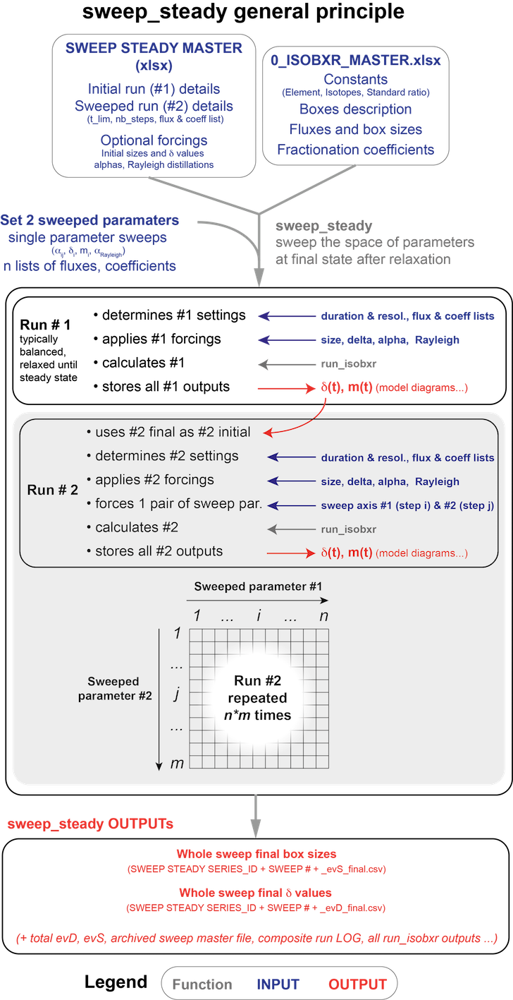
```

The `sweep_steady` function  is built as a 2 steps composite scenario. 

1. The first run (run #1) is used to force the initial conditions of the second run. It is run once only. 

2. The second run (run #2) is repeated for all the combinations of the two parameters values.  
    + Each parameter varies over a range of values defined by the user:  
        - parameter #1 is ranging over *n* values, parameter #2 over *m* values.  
    + Run #2 is repeated over the whole 2D space of parameters ($n \times m$ times).  

The main purpose of this `sweep_steady` structure is:

* to explore the influence of a pair of parameters over the distribution of isotopes in the system at the final state of run #2  
* while starting this run #2 from a common initial state, defined by run #1  
* run #1 typically being for a balanced system, relaxed to it's steady state  


##  Format of the *sweep steady master file*

In addition to the global *isobxr master file*, the `sweep_steady` function
requires a *sweep steady master file*. 

The *sweep steady master file* is the (xlsx) document containing all commands
allowing `sweep_steady` function to compose a scenario of 2 runs. 

The two parameters to be sweeped over run #2 are defined by user directly in the function input, in the R console. 

The format of the *sweep steady master file* is the same as the *compose master file* and the *sweep dynamic master file*.

It is where the user sets the design of their 2 runs scenario to be sweeped:

* necessary: define the list of 2 runs composing the scenario (run durations, run resolutions, lists of fluxes, lists of coefficients).  
* optional: define the forcings over one or both runs composing the composite scenario (FORCING_RAYLEIGH, FORCING_ALPHA, FORCING_DELTA, FORCING_SIZE).  

The format of the *sweep steady master file* is standardized. 
The user is encouraged to comply with these standards, as described thereafter, 
otherwise there is a high probability for these functions to crash.

#### **sweep steady master file** name and location

* The *sweep steady master file* is an xlsx file.  
* The *sweep steady master file* name is chosen by user and specified in the `sweep_steady` function inputs: [*e.g.*, **0_SWEEP_STEADY_MASTER.xlsx** ].  
* the *sweep steady master file* should be stored in the directory in which *isobxr master file* is found, 
    where all runs for this box model system will be performed 
    and where all outputs will be stored in automatically created subdirectories. 
    This directory corresponds to the working directory (*workdir*) used as parameter of the `sweep_steady` function.

#### **sweep steady master file structure**

The *sweep steady master file* contains the 5 following sheet strictly named as follows: 

1. **RUN_LIST**: define the list of 2 runs composing the sweep steady scenario (run durations, run resolutions, lists of fluxes, lists of coefficients).  
1. **FORCING_RAYLEIGH**: define Rayleigh forcings over one or several runs composing the sweep 2 steps scenario.  
1. **FORCING_ALPHA**: define Rayleigh forcings over one or several runs composing the sweep 2 steps scenario.  
1. **FORCING_DELTA**: define initial delta forcings over one or several runs composing the sweep 2 steps scenario.  
1. **FORCING_SIZE**: define initial box size forcings over one or several runs composing the sweep 2 steps scenario.  

#### **RUN_LIST** sheet (*FILLING REQUIRED*)
```{r echo=FALSE, out.width='75%'}
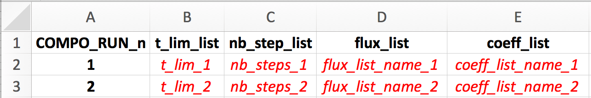
```

The `sweep_steady` function strictly requires a list of *2* successive runs.

Both of these runs should be succesively described one by one on two rows of this sheet, with notably:  

1. the run number (COMPO_RUN_n column)  
1. the run duration (t_lim_list column)  
1. the run resolution (nb_steps_list)  
1. the flux list name (flux_list) that will be read from *isobxr master file*  
1. the coefficients list name (coeff_list) that will be read from *isobxr master file*  

#### **FORCING_SIZE** sheet (*FILLING OPTIONAL*)
```{r echo=FALSE, out.width='50%'}
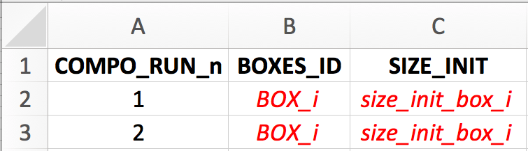
```

See *composite master file* format description for details.

#### **FORCING_DELTA** sheet (*FILLING OPTIONAL*)
```{r echo=FALSE, out.width='50%'}
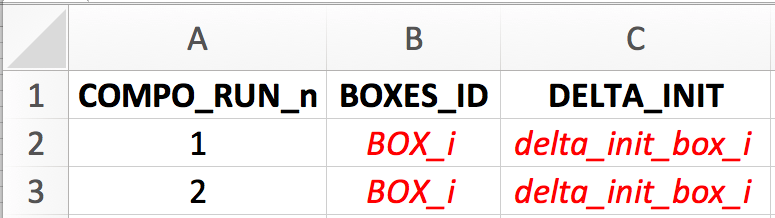
```

See *composite master file* format description for details.

#### **FORCING_ALPHA** sheet (*FILLING OPTIONAL*)
```{r echo=FALSE, out.width='50%'}
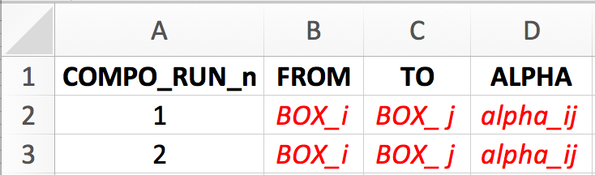
```

See *composite master file* format description for details.

#### **FORCING_RAYLEIGH** sheet (*FILLING OPTIONAL*)
```{r echo=FALSE, out.width='75%'}
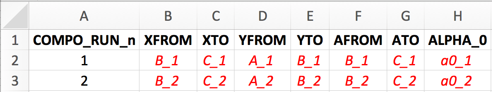
```

See *composite master file* format description for details.

##  Using `sweep_steady`

### Preparing the *sweep steady master* file

The user needs to define the two runs composing the 2 steps scenario. 

1. The first run is used to let the system relax to its steady state used as an initial state in run #2.  
    i) The user should consider here a balanced system. The **isobxr** functions will thus use the analytical solver (`ana_slvr`).
    i) We thus recommand the user to set the number of steps for run #1 (nb_steps) to 1 (its' minimum value).  
        This allows to only calculate the final state of the system, at the end of run #1.  
        This reduces the calculation time and data produced without affecting the accuracy of the calculation.  

1. The second run is used to explore the final state of the system as a function of all combinations of parameters #1 and #2 values. 
    i) The main purpose of this function is to explore the influence of the 2 combined parameters over the final state of a system that relaxed to it's steady state. 
    i) It is therefore recommended to use the same balanced system over the second run, allowing to analytically solve the system (with `ana_slvr`).
    i) The use of the analytical solver will notably allow to map the final state at a high resolution of parameters #1 and #2  
        while minimizing the required calculation time as well as RAM and hard memory.  
    i) We thus recommand the user to set the number of steps for run #2 (nb_steps) to 1 (its' minimum value).  
        This allows to only calculate the final state of the system, at the end of run #2.  
        This reduces the calculation time and data produced without affecting the accuracy of the calculation.  
        
**remark**  
:    The reason why the `sweep_steady` function begins with a run #1 which final state defines a common initial state for all repeated run #2 sweeps 
    is that it can allow the user to sweep the final state of a system in the course transient/dynamic state of run #2, being in a balanced or unbalanced system. 
    This needs however to be designed with care as depending on the defined or forced parameters on run #2 vs. run #1, 
    the continuity of the conditions of run #1 and run #2 is not certain. It is then advised to use the better suited `sweep_dyn` function described thereafter.

**Forcings**   
:    The user can define some forcings over the system (will affect both run #1 and run #2).  
    These forcings will overwrite the conditions set by the reading of the *isobxr master file*.  
    These forcings will be overwritten by the sweeped parameters that affect run #2.


### `sweep_steady` console defined sweep parameters
In addition to all the usual input parameters required for the `sweep_steady` function, the user has to define the two parameters to be sweeped.

There are 6 types of sweepable parameters (or that can be explored), which names are strictly defined as follows:

```{r echo=FALSE}
# explore a series of flux lists as defined in isobxr master file
"EXPLO_n_FLUX_MATRICES" 

# explore a series of coeff lists as defined in isobxr master file
"EXPLO_n_ALPHA_MATRICES" 

# explore a vector of sizes for a given box 
"EXPLO_1_SIZE" 

# explore a vector of delta values for a given box 
"EXPLO_1_DELTA" 

# explore a vector of alpha (coeff) values for a given flux
"EXPLO_1_ALPHA" 

# explore a vector of incremental alpha values for a Rayleigh distillation model
"EXPLO_1_RAYLEIGH_ALPHA" 

```


#### **EXPLO_n_FLUX_MATRICES**: 

This type of parameter allows to explore a series of flux lists as defined in *isobxr master file*.

```{r echo=TRUE, results = "hide"}
data.frame(VALUES = c("flux_list_1",  # vector of n strings of characters
                      "...", 
                      "flux_list_i", 
                      "...", 
                      "flux_list_n"),  
           EXPLO_TYPES = "EXPLO_n_FLUX_MATRICES") # stricly leave as such

```

The **EXPLO_n_FLUX_MATRICES** parameter will allow the `sweep_steady` function to sweep the effect of a series of flux lists 
(defining flux matrices and initial box sizes) on run #2 evolution.

The format of this data frame should be exactly as shown above. 

The values are a vector of strings of characters containing the list of flux list names, 
that will be called from the *isobxr master file*

#### **EXPLO_n_ALPHA_MATRICES**: 

This type of parameter allows to explore a series of lists of coefficients as defined in *isobxr master file*.

```{r echo=TRUE, results = "hide"}
data.frame(VALUES = c("coeff_list_1", # vector of n strings of characters
                      "...", 
                      "coeff_list_i", 
                      "...", 
                      "coeff_list_n"), 
           EXPLO_TYPES = "EXPLO_n_ALPHA_MATRICES") # stricly leave as such


```

The **EXPLO_n_ALPHA_MATRICES** parameter will allow the `sweep_steady` function to sweep the effect of a series of isotope fractionation coefficient lists 
(defining coefficient matrices) on run #2 evolution.

The format of this data frame should be exactly as shown above. 

The values are a vector of strings of characters containing the list of coefficients list names, 
that will be called from the *isobxr master file*

#### **EXPLO_1_SIZE**: 

This type of parameter allows to explore a range of sizes for a given box.

```{r echo=TRUE, results = "hide"}
data.frame(BOXES_ID = "BOX_i", # 1 string of char
           SIZE_MIN = "min_sweep_value", # 1 numerical value
           SIZE_MAX = "max_sweep_value", # 1 numerical value
           SIZE_STEPS = "sweep_steps", # 1 numerical value
           EXPLO_TYPES = "EXPLO_1_SIZE") # stricly leave as such


```

The **EXPLO_1_SIZE** parameter will allow the `sweep_steady` function to sweep the effect of a range of box sizes for a given box
on run #2 evolution.

The format of this data frame should be exactly as shown above. 

#### **EXPLO_1_DELTA**: 

This type of parameter allows to explore a range of delta values for a given box.

```{r echo=TRUE, results = "hide"}
data.frame(BOXES_ID = "BOX_i", # 1 string of char
           DELTA_MIN = "min_sweep_value", # 1 numerical value
           DELTA_MAX = "max_sweep_value", # 1 numerical value
           DELTA_STEPS = "sweep_steps", # 1 numerical value
           EXPLO_TYPES = "EXPLO_1_DELTA") # stricly leave as such


```

#### **EXPLO_1_ALPHA**: 

This type of parameter allows to explore a range of alpha (coeff) values for a given flux.

```{r echo=TRUE, results = "hide"}
data.frame(FROM = "BOX_i", # 1 string of char
           TO = "BOX_j", # 1 string of char
           ALPHA_MIN = "min_sweep_value", # 1 numerical value
           ALPHA_MAX = "max_sweep_value", # 1 numerical value
           ALPHA_STEPS = "sweep_steps", # 1 numerical value
           EXPLO_TYPES = "EXPLO_1_ALPHA") # stricly leave as such


```

#### **EXPLO_1_RAYLEIGH_ALPHA**: 

This type of parameter allows to explore a range of incremental alpha values for a Rayleigh distillation model.

```{r echo=TRUE, results = "hide"}
data.frame(XFROM = "Box_B", # B>C flux at numerator (strings of char)
           XTO = "Box_C",
           YFROM = "Box_A", # A>B flux at denominator (strings of char)
           YTO = "Box_B",
           AFROM = "Box_B", # resulting fract. coefficient (strings of char)
           ATO = "Box_C",
           ALPHA_0_MIN = "min_sweep_value", # value of incremental B>A coeff. (num.)
           ALPHA_0_MAX = "max_sweep_value", 
           ALPHA_0_STEPS = "sweep_steps",
           EXPLO_TYPES = "EXPLO_1_RAYLEIGH_ALPHA") # stricly leave as such


```


******************************************************

### Example: sweeping two fractionation coefficients in a 3-boxes balanced open system

Here:

* using the *sweep steady master file* provided for demonstration (0_EXPLO_STEADY_MASTER_demo1.xlsx)
* we perform a sweep of the $\alpha _{C \to B}$ values and $\alpha _{A \to C}$ values at steady state of run #2  
* starting from a run #1 at steady state obtained by the relaxation of the system with the *a1* coefficients list and the *Fx6_ABC_open_bal* flux list 

No forcings are applied. 

To do so, the `sweep_steady` function can be used as follows: 

```{r eval=FALSE, include=TRUE}
workdir <- "~/DEMO_ABCD" # isobxr and compo master file work. dir.
SERIES_ID <- "ABC_sweep_steady_demo1" # series ID of the set of compo runs
time_units <- c("days", "days") # time units for run (days) and for plots (years)
EXPLO_MASTER <- "0_EXPLO_STEADY_MASTER_demo1.xlsx" # compo master file name

EXPLO_AXIS_1 <- data.frame(FROM = c("C"), 
                           TO = c("B"), 
                           ALPHA_MIN = 1, 
                           ALPHA_MAX = 1.0005, 
                           ALPHA_STEPS = 0.00005, 
                           EXPLO_TYPES = "EXPLO_1_ALPHA")

EXPLO_AXIS_2 <- data.frame(FROM = c("A"), 
                           TO = c("C"), 
                           ALPHA_MIN = 0.9996, 
                           ALPHA_MAX = 1, 
                           ALPHA_STEPS = 0.00005, 
                           EXPLO_TYPES = "EXPLO_1_ALPHA")

sweep_steady(workdir,
             SERIES_ID,
             time_units,
             EXPLO_MASTER,
             EXPLO_AXIS_1, 
             EXPLO_AXIS_2)
```

You can explore the outputs by then using the **isobxr** Shiny app (`runShinyPlots` function, presented below).

************************************************
# 2D sweep dynamic response with `sweep_dyn`

## How does `sweep_dyn` work?

The `sweep_dyn` function is designed to allow the user to map the combined effects of two parameters over the dynamic response of an **isobxr** box model, 
typically in a system at steady state suddenly facing a perturbation. 

It's structure is shown below: 

```{r echo=FALSE, out.width='75%'}
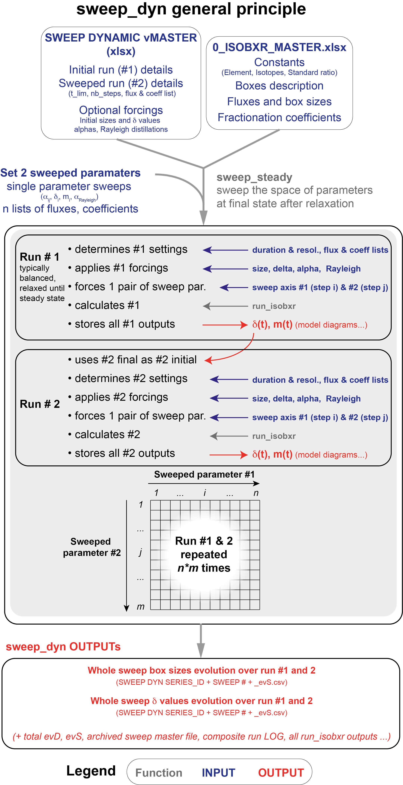
```

The `sweep_dyn` function  is built as a 2 steps composite scenario. 

1. The first run (run #1) is used to force the initial conditions of the second run. It is run repeatedly together with run #2 over the whole space of parameters defined by user. 
1. The second run (run #2) takes system final state of the run #2 as initial state. It is run repeatedly together with run #1 over the whole space of parameters defined by user. 
1. Both runs (#1 and #2) are repeated together for all the combinations of the two parameters values.  
    + Each parameter varies over a range of values defined by the user:  
        - parameter #1 is ranging over *n* values, parameter #2 over *m* values.  
    + Run #1 and #2 are repeated over the whole 2D space of parameters ($n \times m$ times).  

The main purpose of this `sweep_dyn` structure is:

* to explore the influence of a pair of parameters over the dynamic evolution during run #2 of isotope compositions (and box sizes) in all boxes,
* while starting this run #2 from a an initial state defined by run #1 that also depends on the sweeped parameters
* run #1 typically being for a balanced system, relaxed to it's steady state  

##  Format of the *sweep dyn master file*

In addition to the global *isobxr master file*, the `sweep_dyn` function
requires a *sweep dyn master file*. 

The *sweep dyn master file* is the (xlsx) document containing all commands
allowing `sweep_dyn` function to compose a scenario of 2 runs. 

The two parameters to be sweeped over run #1 and #2 are defined by user directly in the function input, in the R console. 

The format of the *sweep dyn master file* is the same as the *compose master file* and the *sweep steady master file*.

It is where the user sets the design of their 2 runs scenario to be sweeped:

* necessary: define the list of 2 runs composing the scenario (run durations, run resolutions, lists of fluxes, lists of coefficients).  
* optional: define the forcings over one or both runs composing the scenario (FORCING_RAYLEIGH, FORCING_ALPHA, FORCING_DELTA, FORCING_SIZE).  

The format of the *sweep dyn master file* is standardized. 
The user is encouraged to comply with these standards, as described thereafter, 
otherwise there is a high probability for these functions to crash.

#### **sweep dyn master file** name and location

* The *sweep dyn master file* is an xlsx file.  
* The *sweep dyn master file* name is chosen by user and specified in the `sweep_dyn` function inputs: [*e.g.*, **0_SWEEP_DYN_MASTER.xlsx** ].  
* the *sweep dyn master file* should be stored in the directory in which *isobxr master file* is found, 
    where all runs for this box model system will be performed 
    and where all outputs will be stored in automatically created subdirectories. 
    This directory corresponds to the working directory (*workdir*) used as parameter of the `sweep_dyn` function.

#### **sweep dyn master file structure**

The *sweep dyn master file* contains the 5 following sheet strictly named as follows: 

1. **RUN_LIST**: define the list of 2 runs composing the sweep dyn scenario (run durations, run resolutions, lists of fluxes, lists of coefficients).  
1. **FORCING_RAYLEIGH**: define Rayleigh forcings over one or several runs composing the sweep 2 steps scenario.  
1. **FORCING_ALPHA**: define Rayleigh forcings over one or several runs composing the sweep 2 steps scenario.  
1. **FORCING_DELTA**: define initial delta forcings over one or several runs composing the sweep 2 steps scenario.  
1. **FORCING_SIZE**: define initial box size forcings over one or several runs composing the sweep 2 steps scenario.  

#### **RUN_LIST** sheet (*FILLING REQUIRED*)
```{r echo=FALSE, out.width='75%'}

```

The `sweep_dyn` function strictly requires a list of *2* successive runs.

Both of these runs should be succesively described one by one on two rows of this sheet, with notably:  

1. the run number (COMPO_RUN_n column)  
1. the run duration (t_lim_list column)  
1. the run resolution (nb_steps_list)  
1. the flux list name (flux_list) that will be read from *isobxr master file*  
1. the coefficients list name (coeff_list) that will be read from *isobxr master file*  

#### **FORCING_SIZE** sheet (*FILLING OPTIONAL*)
```{r echo=FALSE, out.width='50%'}

```

See *composite master file* format description for details.

#### **FORCING_DELTA** sheet (*FILLING OPTIONAL*)
```{r echo=FALSE, out.width='50%'}

```

See *composite master file* format description for details.

#### **FORCING_ALPHA** sheet (*FILLING OPTIONAL*)
```{r echo=FALSE, out.width='50%'}

```

See *composite master file* format description for details.

#### **FORCING_RAYLEIGH** sheet (*FILLING OPTIONAL*)
```{r echo=FALSE, out.width='75%'}

```

See *composite master file* format description for details.

##  Using `sweep_dyn`

### Preparing the *sweep dyn master* file

The user needs to define the two runs composing the 2 steps scenario. 

1. The first run is typically used to let the system relax to its steady state used as an initial state in run #2.  
    i) The user should consider here a balanced system. The **isobxr** functions will thus use the analytical solver (`ana_slvr`).
    i) We thus recommand the user to set the number of steps for run #1 (nb_steps) to 1 (its' minimum value).  
        This allows to only calculate the final state of the system, at the end of run #1.  
        This reduces the calculation time and data produced without affecting the accuracy of the calculation.  

1. The second run is used to explore the dynamic response of the system in the face of a given **perturbation**, as a function of all combinations of parameters #1 and #2 values. 
    i) The main purpose of this function is to explore the influence of the 2 combined parameters over the time dependent response of a system that previously relaxed to it's steady state. 
    i) The user has the choice to define a balanced or an unbalanced system in the run #2. 
        A. The latter case (unbalanced system) could here constitute the perturbation of the system. The `sweep_dyn` function will here numerically solve the run #2 (`num_slvr`).
        A. In the case of a balanced system for run #2, the `sweep_dyn` function will analytically solve the run #2 (`ana_slvr`). 
        A. The user should here be aware that the sweeping of the space of parameters using either the `num_slvr` or `ana_slvr` can be time consuming and require a fair bit of calculating power.  
            The user is advised to wisely define the space of parameters (which will define the number of $n \times m$ iterations) as well as the run resoluion of run #2 (nb_steps).

**remark**  
:    The reason why the `sweep_dyn` function sweeps both initial run #1 and run #2 
    is that the user might want to sweep parameters that are actually affecting the steady state of the system (e.g., sweep a series of lists of fluxes or coefficients). 
    
**Forcings**   
:    The user can define some forcings over the system (will affect both run #1 and run #2).  
    These forcings will overwrite the conditions set by the reading of the *isobxr master file*.  
    These forcings will be overwritten by the sweeped parameters that affect run #1 and #2.

### `sweep_dyn` console defined sweep parameters

In addition to all the usual input parameters required for the `sweep_dyn` function, the user has to define the two parameters to be sweeped.

There are 6 types of sweepable parameters (or that can be explored), which names are strictly defined as follows:

```{r echo=FALSE}
# explore a series of flux lists as defined in isobxr master file
"EXPLO_n_FLUX_MATRICES" 

# explore a series of coeff lists as defined in isobxr master file
"EXPLO_n_ALPHA_MATRICES" 

# explore a vector of sizes for a given box 
"EXPLO_1_SIZE" 

# explore a vector of delta values for a given box 
"EXPLO_1_DELTA" 

# explore a vector of alpha (coeff) values for a given flux
"EXPLO_1_ALPHA" 

# explore a vector of incremental alpha values for a Rayleigh distillation model
"EXPLO_1_RAYLEIGH_ALPHA" 

```

#### **EXPLO_n_FLUX_MATRICES**: 

This type of parameter allows to explore two series of flux lists as defined in *isobxr master file*, one for run #1 and one for run #2.

```{r echo=TRUE, results = "hide"}
data.frame(VALUES_1 = c("flux_list_1",  # RUN #1 vector of n strings of chars.
                        "...", 
                        "flux_list_i", 
                        "...", 
                        "flux_list_n"),  
           VALUES_2 = c("flux_list_1",  # RUN #2 vector of n strings of chars.
                        "...", 
                        "flux_list_i", 
                        "...", 
                        "flux_list_n"),  
           EXPLO_TYPES = "EXPLO_n_FLUX_MATRICES") # stricly leave as such

```

The **EXPLO_n_FLUX_MATRICES** parameter will allow the `sweep_dyn` function to sweep the effect 
of two series of flux lists 
(defining flux matrices and initial box sizes) on run #1 and run #2 evolutions.

The format of this data frame should be exactly as shown above. 

The values are two vectors of strings of characters containing the list of flux list names, 
that will be called from the *isobxr master file*.

#### **EXPLO_n_ALPHA_MATRICES**: 

This type of parameter allows to explore two series of lists of coefficients as defined in *isobxr master file*, one for run #1 and one for run #2.

```{r echo=TRUE, results = "hide"}
data.frame(VALUES_1 = c("coeff_list_1", # RUN #1 vector of n strings of chars.
                        "...", 
                        "coeff_list_i", 
                        "...", 
                        "coeff_list_n"), 
           VALUES_2 = c("coeff_list_1", # RUN #2 vector of n strings of chars.
                        "...", 
                        "coeff_list_i", 
                        "...", 
                        "coeff_list_n"), 
           EXPLO_TYPES = "EXPLO_n_ALPHA_MATRICES") # stricly leave as such


```

The **EXPLO_n_ALPHA_MATRICES** parameter will allow the `sweep_dyn` function to sweep the effect 
of two series of isotope fractionation coefficient lists 
(defining coefficient matrices) on run #1 and run #2 evolutions.

The format of this data frame should be exactly as shown above. 

The values are two vectors of strings of characters containing the list of coefficients list names, 
that will be called from the *isobxr master file*.

#### **EXPLO_1_SIZE**: 

This type of parameter allows to explore a range of sizes for a given box over both run #1 and run #2.

This parameter should be used only in the case where RUN #1 is balanced since it sets the initial box size for each run initial condition.

```{r echo=TRUE, results = "hide"}
data.frame(BOXES_ID = "BOX_i", # 1 string of char
           SIZE_MIN = "min_sweep_value", # 1 numerical value
           SIZE_MAX = "max_sweep_value", # 1 numerical value
           SIZE_STEPS = "sweep_steps", # 1 numerical value
           EXPLO_TYPES = "EXPLO_1_SIZE") # stricly leave as such


```

The **EXPLO_1_SIZE** parameter will allow the `sweep_dyn` function to sweep the effect of a range of box sizes for a given box
on run #1 and #2 evolution.

The format of this data frame should be exactly as shown above. 

#### **EXPLO_1_DELTA**: 

This type of parameter allows to explore a range of delta values for a given box over both run #1 and run #2.

This parameter should be used only for source boxes, since it will force the initial isotope composition of this box for both run #1 and run #2.

```{r echo=TRUE, results = "hide"}
data.frame(BOXES_ID = "BOX_i", # 1 string of char
           DELTA_MIN = "min_sweep_value", # 1 numerical value
           DELTA_MAX = "max_sweep_value", # 1 numerical value
           DELTA_STEPS = "sweep_steps", # 1 numerical value
           EXPLO_TYPES = "EXPLO_1_DELTA") # stricly leave as such


```

#### **EXPLO_1_ALPHA**: 

This type of parameter allows to explore a range of alpha (coeff) values for a given flux over both run #1 and run #2.

```{r echo=TRUE, results = "hide"}
data.frame(FROM = "BOX_i", # 1 string of char
           TO = "BOX_j", # 1 string of char
           ALPHA_MIN = "min_sweep_value", # 1 numerical value
           ALPHA_MAX = "max_sweep_value", # 1 numerical value
           ALPHA_STEPS = "sweep_steps", # 1 numerical value
           EXPLO_TYPES = "EXPLO_1_ALPHA") # stricly leave as such


```

#### **EXPLO_1_RAYLEIGH_ALPHA**: 

This type of parameter allows to explore a range of incremental alpha values for a Rayleigh distillation model for both run #1 and run #2. 
It is calculated for each run using the run's local flux configuration.

```{r echo=TRUE, results = "hide"}
data.frame(XFROM = "Box_B", # B>C flux at numerator (strings of char)
           XTO = "Box_C",
           YFROM = "Box_A", # A>B flux at denominator (strings of char)
           YTO = "Box_B",
           AFROM = "Box_B", # resulting fract. coefficient (strings of char)
           ATO = "Box_C",
           ALPHA_0_MIN = "min_sweep_value", # value of incremental B>A coeff. (num.)
           ALPHA_0_MAX = "max_sweep_value", 
           ALPHA_0_STEPS = "sweep_steps",
           EXPLO_TYPES = "EXPLO_1_RAYLEIGH_ALPHA") # stricly leave as such


```


******************************************************

### Example: dynamic sweeping of the size of box B and one fractionation coefficient in a 3-boxes balanced open system after a change in the source isotope composition

Both run #1 and run #2 are performed with the *a1* coefficients list, the *Fx6_ABC_open_bal* flux list and the sweeping paramaters. 

The system faces a perturbation: the source isotope composition is shifted from 0 to -1 ‰ using the FORCING_DELTA sheet of the *sweeping dynamic master file*.

Here: 

* using the *sweep dynamic master file* provided for demonstration (0_EXPLO_DYN_MASTER_demo1.xlsx)  
* we perform a sweep of the box B size values and $\alpha _{A \to C}$ values  
* during the first 1000 days of run #2  
* starting from a run #1 at steady state obtained by the relaxation of the system 

No forcings other than the FORCING_DELTA on the SOURCE box are applied. 

To do so, the `sweep_steady` function can be used as follows: 

```{r eval=FALSE, include=TRUE}
workdir <- "~/DEMO_ABCD" # isobxr and compo master file work. dir.
SERIES_ID <- "ABC_change_source_sweep_dyn_demo1" # series ID of the set of compo runs
time_units <- c("days", "days") # time units for run (days) and for plots (years)
EXPLO_MASTER <- "0_EXPLO_DYN_MASTER_demo1.xlsx" # compo master file name

EXPLO_AXIS_1 <- data.frame(BOXES_ID = c("B"), 
                           SIZE_MIN = 1500, 
                           SIZE_MAX = 2500, 
                           SIZE_STEPS = 250, 
                           EXPLO_TYPES = "EXPLO_1_SIZE")

EXPLO_AXIS_2 <- data.frame(FROM = c("A"), 
                           TO = c("C"), 
                           ALPHA_MIN = 0.9988, 
                           ALPHA_MAX = 1, 
                           ALPHA_STEPS = 0.0004, 
                           EXPLO_TYPES = "EXPLO_1_ALPHA")

sweep_dyn(workdir,
          SERIES_ID,
          time_units,
          EXPLO_MASTER,
          EXPLO_AXIS_1, 
          EXPLO_AXIS_2)
```

************************************************
# Plotting with the **isobxr** Shiny app
## Calling the Shiny app
The `runShinyPlots` function calls an **isobxr Shiny app** plotting interface (html interface accessible with any type of internet browser).

This app is still in its' $\beta$ version but already allows to create many plots with a series of options for all outputs given by `compose_isobxr`, `sweep_steady` & `sweep_dyn` functions.

This is notably very useful for the complex outputs of `sweep_steady` & `sweep_dyn` functions. 

This app also allows to export a pdf version of the plot.

```{r eval = FALSE, include=TRUE}
# define workdir in which the SERIES directories are found 
# (SERIES directories start with 3_CPS, 4_STD or 4_DYN) 
# for instance:
workdir <- "~/DEMO_ABCD"

# Launch the shiny app
runShinyPlots()
```


## Short introduction to the graphic interface  


### Welcome page
```{r echo=FALSE, out.width='100%'}
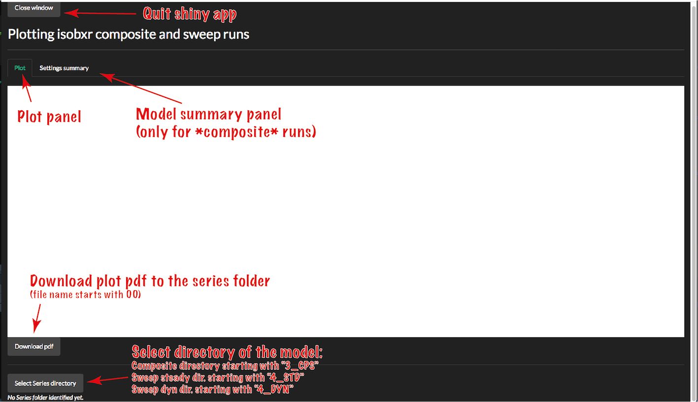
```


### Plotting `compose_isobxr` outputs
```{r echo=FALSE, out.width='100%'}
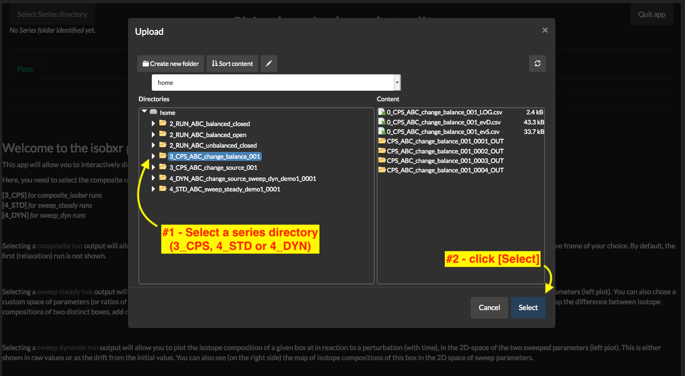
```

### Summary of `compose_isobxr` outputs
```{r echo=FALSE, out.width='100%'}
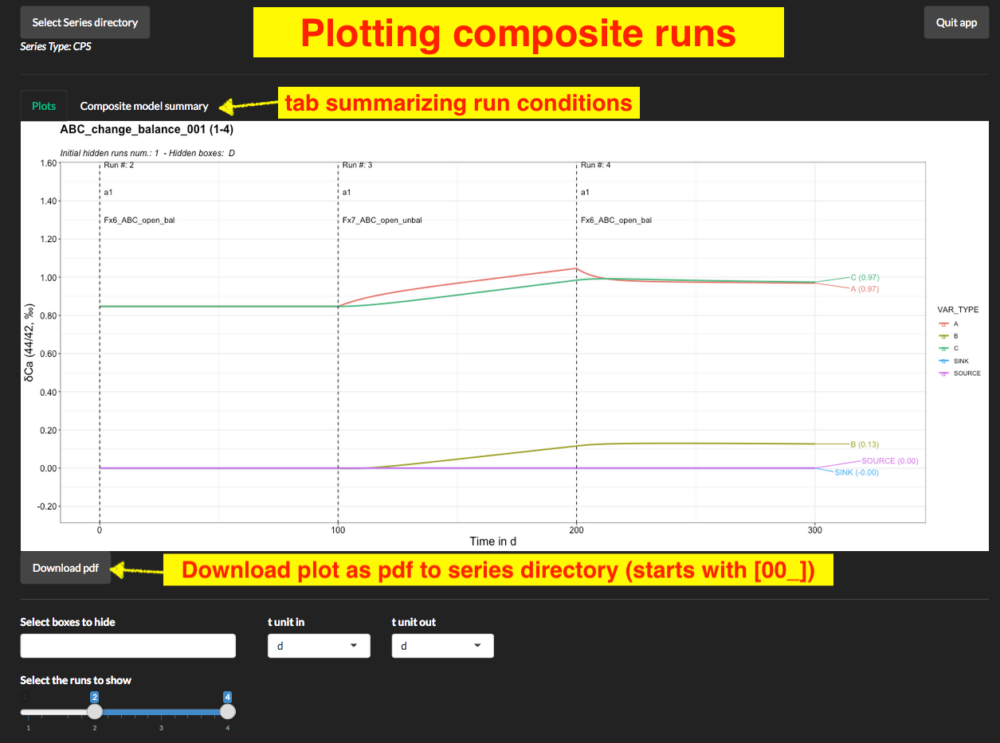
```

### Plotting `sweep_steady` outputs at final state
```{r echo=FALSE, out.width='100%'}
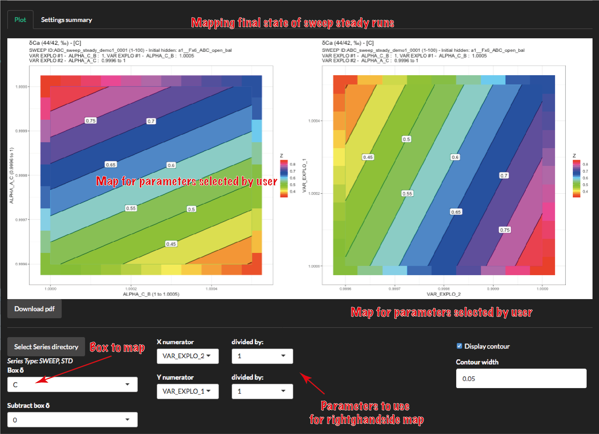
```

### Plotting `sweep_dyn` outputs
```{r echo=FALSE, out.width='100%'}
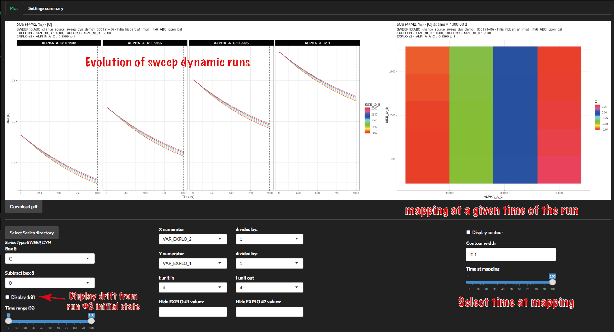
```
