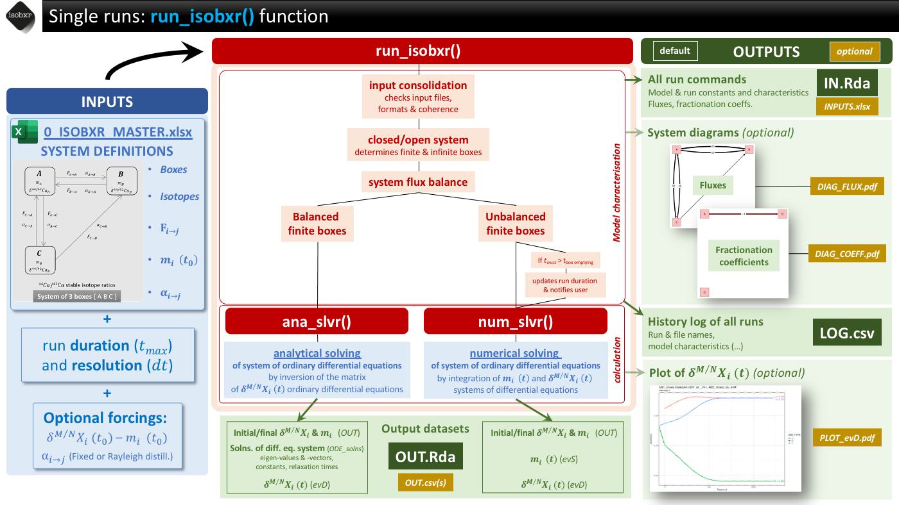
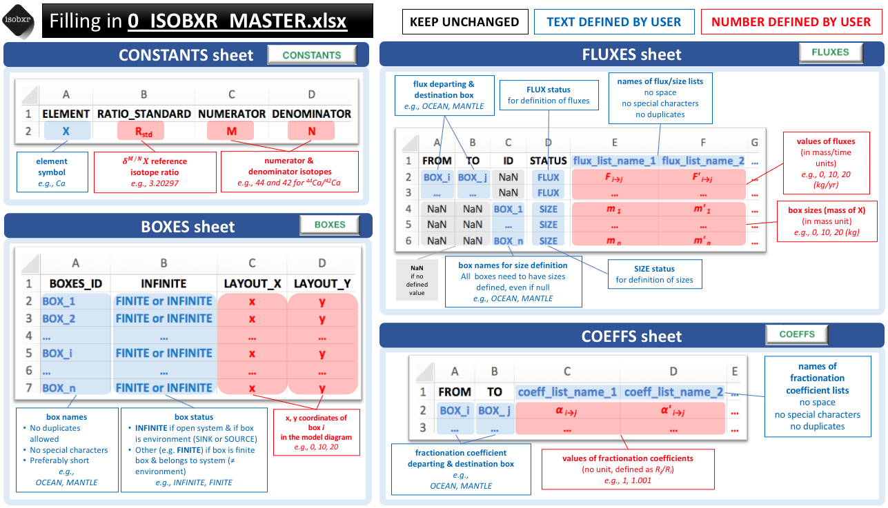
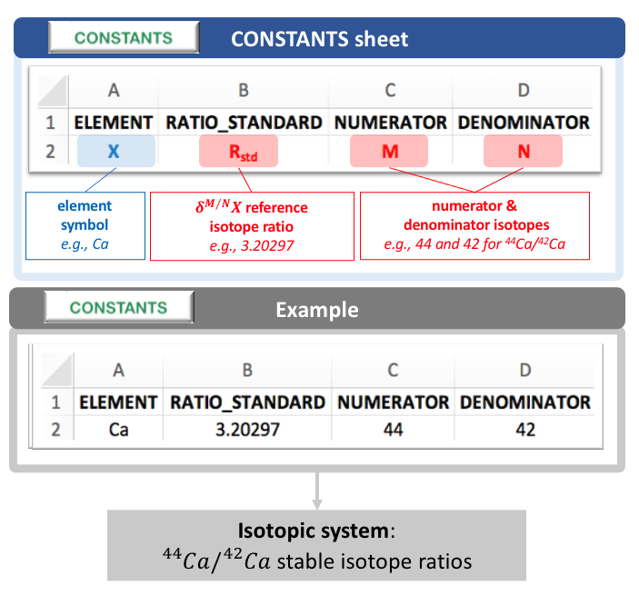
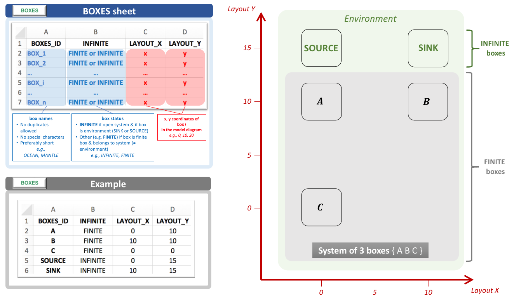
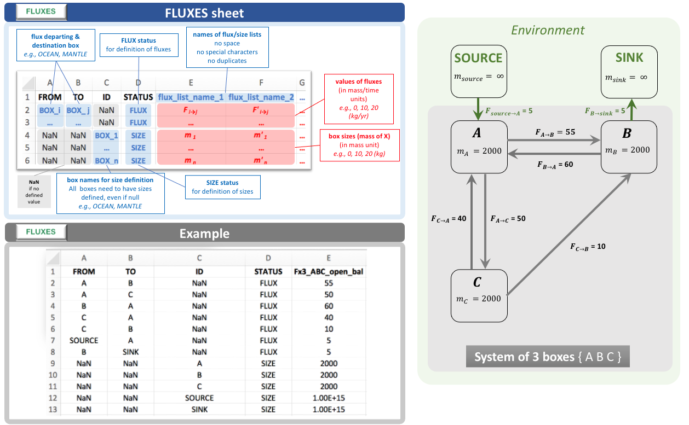
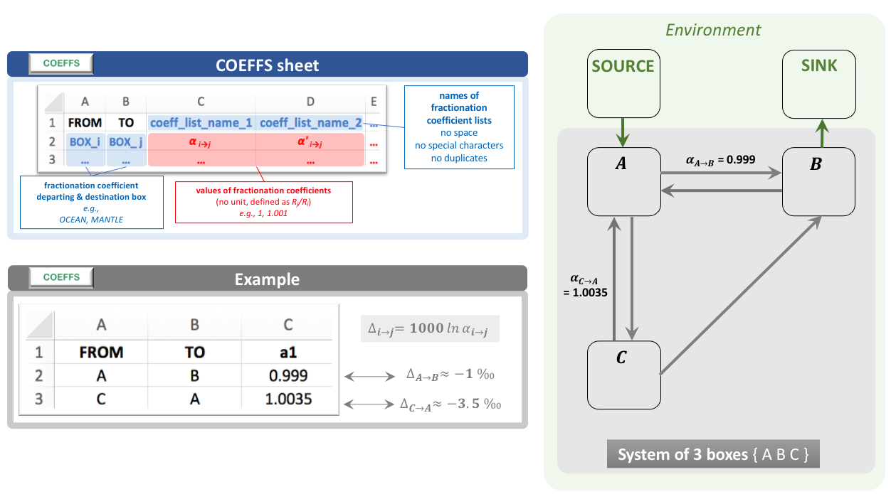

```{r, include = FALSE}
knitr::opts_chunk$set(
  collapse = TRUE,
  comment = "#>")
options(rmarkdown.html_vignette.check_title = FALSE)
```

----

In this vignette, the user will be introduced to the main function of [isobxr](https://ttacail.github.io/isobxr/): `run_isobxr`.

Here, we shortly present the principles and general usage of the `run_isobxr` function. 

The user is then invited to follow and run a step-by-step tutorial presenting several typical runs (3 - Run_isobxr: tutorial). <!-- ADD LINK -->

----

# System definitions

As a reminder, the systems considered in the [isobxr](https://ttacail.github.io/isobxr/) package 
are described in the cheatsheet below:

```{r echo=FALSE, out.width='100%'}
knitr::include_graphics('./02_basics_01_sysdef.png')
```

----

# How does `run_isobxr` work?

The `run_isobxr` function is the main function of the [isobxr](https://ttacail.github.io/isobxr/) package.

The `run_isobxr` function is used to perform single runs of stable isotope box models of all types of systems.

The `run_isobxr` function allows to: 

1. assess the type of modelled system

1. render and archive the design of the model and run commands

1. automatically run `num_slvr` or `ana_slvr` solvers depending on the model design

1. provide user with the time evolutions of isotope compositions and masses of X in each box

The general workflow of the `run_isobxr` function is summarised in the cheatsheet below:

```{r echo=FALSE, out.width='100%'}

```

To find the detailed description of `run_isobxr` inputs and outputs, 
the user can always refer to its documentation:

```{r eval = FALSE, message=FALSE, warning=FALSE, paged.print=FALSE}
# To see documentation on run_isobxr function, type in console:
?run_isobxr
```

----

# Filling in **0_ISOBXR_MASTER.xlsx**

The **isobxr master file** is the excel document containing all data 
defining the modelled system.

It provides the `run_isobxr` function with the 
**main commands** for a run of stable isotope box model.

**Note**
:    All the [isobxr](https://ttacail.github.io/isobxr/) functions 
     are meant to be run in relation with an **isobxr master file**. 
     As `run_isobxr` is the fundamental function, called by the other 
     [isobxr](https://ttacail.github.io/isobxr/) functions, 
     the **isobxr master file** is also required to run functions 
     performing multiple runs (`compose_isobxr`, `sweep_steady`, `sweep_dyn`).


## Name and location 

* The **isobxr master file** is an xlsx file
* The **isobxr master file** name needs to be exactly as follows: **0_ISOBXR_MASTER.xlsx**
* The **isobxr master file** has to be stored in the working directory (*workdir*) 

## Structure and format

The **isobxr master file** contains the 4 following sheet strictly named as follows: 

1. **CONSTANTS**: Sheet defining the constants of the isotopic system
1. **BOXES**: Sheet defining names and status of all boxes constituting the system
1. **FLUXES**: Sheet defining the initial box sizes and massic fluxes of element X between boxes (structured as a column list)
1. **COEFFS**: Sheet defining the isotopic fractionation coefficients between all boxes (structured as a column list)

The general rules for the filling in of the **isobxr master file** are shown in cheatsheet below:

```{r echo=FALSE, out.width='100%'}

```

### **CONSTANTS**

```{r echo=FALSE, out.width='100%'}

```

### **BOXES** sheet

```{r echo=FALSE, out.width='100%'}

```

[INFINITE] column 
:    
* stores the *status of the box* depending on the box model design (**open** or **closed**)  
    + If system is **open**, environment boxes are declared as **INFINITE**.
* All *finite boxes* can be declared with **FINITE** status or other user-defined status
    (*e.g.*, **INTERFACE** or **DEAD_END** or **FINITE**)
* Status of *finite boxes* also define color code of system diagrams.

[LAYOUT] columns 
:    
* *LAYOUT_X* and *LAYOUT_Y* columns correspond to the layout of the **box model diagram**   
* They define the coordinates of boxes in the diagram in a X,Y space.

### **FLUXES** sheet

```{r echo=FALSE, out.width='100%'}

```

The *flux lists* columns define a set of [fluxes + box sizes] conditions.  

* Flux values (**STATUS** = **FLUX**):
    + Within a given column, users define as many fluxes as desired 
    + Undefined fluxes are set to 0 by `run_isobxr` (no exchange of element X)

* Sizes values (**STATUS** = **SIZE**):
    + **Sizes must be defined for all boxes**
    + If a box remains unused (no connected flux), its size can be set to 0

<!-- **Negative balance of fluxes** :  -->
<!-- If too long, the run could lead to the total emptying of the box:  -->

<!-- * run duration automatically updated to shortest duration box emptying -->
<!-- * user is advised with a **warning message** in R console -->

<!-- **Mass and time units** -->
<!-- :         -->
<!-- * The **units** of the fluxes (mass/time unit) and sizes (mass unit) need to be homogeneous (same mass unit for both). -->
<!-- * The **units** of the fluxes (mass unit per time unit) and run duration set in the function (time unit) need to be homogeneous (same time unit for both). -->

### **COEFFS** sheet

```{r echo=FALSE, out.width='100%'}

```

<!-- All *black text* has to be strictly the same as shown.   -->
<!-- All *blue text* corresponds to litteral names (string of characters) defined by the user.   -->
<!-- All *red text* corresponds to litteral or numerical variables set by the user.   -->

The **COEFFS** sheet takes the values of the isotope fractionation coefficients ($\alpha_{i \to j}$):

* Users define as many *coefficients lists* as desired
* Each *coefficients lists* defines a set of fractionation coefficients
* Undefined coefficients are set to 1 by `run_isobxr` (no isotope fractionation)  

----

# Main arguments and outputs

The `run_isobxr` function takes required and optional arguments that are described in this section.
 
All arguments definitions of the `run_isobxr` function are accessible in its documentation called as follows


```{r eval=FALSE}
?run_isobxr
```

## `run_isobxr` required arguments

The arguments required to run the `run_isobxr` function are examplified and described here:

```{r eval=FALSE}
run_isobxr(workdir = "/Users/username/1_isobxr_working_directory/",
           SERIES_ID = "Name_of_SERIES_ID", # defining the name of the SERIES of run
           flux_list_name = "Fx3_ABC_open_bal", # calling the list of fluxes
           coeff_list_name = "a1", #  calling the list of coefficients
           t_lim = 1000, # running model for 1000 time units
           nb_steps = 100, # running model with 100 steps
           time_units = c("d", "yr")) # plot results in years as time units.
```

**workdir** 
:     Working directory of 0_ISOBXR_MASTER.xlsx master file and where output files will be stored. 

**SERIES_ID**	
:     Name of the model series the run belongs to. 
It determines the folder in which the output files will be stored.

**flux_list_name**
:     Name of the list of fluxes and initial box sizes to be used for the run, 
calling (by its header name) a single column of the FLUXES sheet of the 0_ISOBXR_MASTER.xlsx file. 


**coeff_list_name**
:     Name of the list of fractionation coefficients to be used for the run, 
calling (by its header name) a single column of the COEFFS sheet of the 0_ISOBXR_MASTER.xlsx file. 

**t_lim**	
:     Run duration, given in the same time units as the fluxes. 

**nb_steps**
:     Number of calculation steps. 
It determines the resolution of the run. 

**time_units**	
:     
* Vector defining the initial time unit (identical to unit used in fluxes), 
followed by the time unit used for the graphical output
* to be selected amongst the following: *micros, ms, s, min, h, d, wk, mo, yr, kyr, Myr, Gyr*
* e.g., c("d", "yr") to convert days into years


## `run_isobxr` default and optional outputs

The `run_isobxr` outputs are stored in the working directory. 

The `run_isobxr` outputs are structured as follows:

```{r echo=FALSE, out.width='100%'}
knitr::include_graphics('./03_Run_isobxr_06_outputs_structure.png')
```

In addition to the default outputs,
the `run_isobxr` function allows to: 

* export system diagrams (as pdf, using the **to_DIGEST_DIAGRAMS = TRUE** argument)
* export evolution of isotope compositions (as pdf, using the **to_DIGEST_evD_PLOT = TRUE** argument)
* export input and output datasets (as csv and xlsx, using the **to_DIGEST_CSV_XLS = TRUE** argument)

These arguments are called as follows: 


```{r eval=FALSE}
run_isobxr(workdir = "/Users/username/1_isobxr_working_directory/",
           SERIES_ID = "Name_of_SERIES_ID", 
           flux_list_name = "Fx3_ABC_open_bal", 
           coeff_list_name = "a1", 
           t_lim = 1000, 
           nb_steps = 100, 
           time_units = c("d", "yr"), 
           to_DIGEST_DIAGRAMS = TRUE, # default is TRUE
           to_DIGEST_evD_PLOT = TRUE, # default is TRUE
           to_DIGEST_CSV_XLS = TRUE  # default is FALSE
           )
```

## Additional forcing arguments

### Forcing initial box sizes

By default, `run_isobxr` sets the initial box sizes 
at the values found in the flux list.

It is possible to manually overwrite the initial size of one, 
several or all boxes for a given run performed by `run_isobxr`.  

It is done by defining a data frame structured as follows.

```{r echo=TRUE}
FORCING_SIZE <- 
  data.frame(BOXES_ID = c("BOX_1", "...", "BOX_i", "..."),
             SIZE_INIT = c("updated_size_1", "...", "updated_size_i", "..."))

FORCING_SIZE
```

For the 3-boxes closed system model (ABC), in order to change the size of box C from 2000 mg of Ca 
(default as specified in **isobxr master file** for all flux lists of **FLUXES** sheet)
to 3000 mg of Ca, the data frame should be structured as follows:

```{r echo=TRUE}
FORCING_SIZE <- 
  data.frame(BOXES_ID = c("C"),
             SIZE_INIT = c(3000))

FORCING_SIZE
```

### Forcing initial delta values

By default, the `run_isobxr` function sets the initial delta values of all boxes at 0 ‰.

It is possible to manually overwrite the initial delta values of one, 
several or all boxes for a given run performed by `run_isobxr`.  
It is done by defining a data frame structured as follows.

```{r echo=TRUE}
FORCING_DELTA <- 
  data.frame(BOXES_ID = c("BOX_1", "...", "BOX_i", "..."),
             DELTA_INIT = c("updated_delta_1", "...", "updated_delta_i", "..."))

FORCING_DELTA
```

For the 3-boxes closed system model (ABC),
in order to force initial isotope composition of box A to -1‰,
and leave B and C initial values at 0‰,
the data frame should be structured as follows:

```{r echo=TRUE}
FORCING_DELTA <- 
  data.frame(BOXES_ID = c("A"),
             DELTA_INIT = c(-1))

FORCING_DELTA
```

### Forcing isotope fractionation coefficients

By default, the `run_isobxr` function sets the isotope fractionation coefficients 
at the values found in the coefficients list specified by user.

It is possible to manually overwrite the fractionation coefficients of one,
several or all pairs of boxes for a given run performed by `run_isobxr`.  
It is done by defining a data frame structured as follows.

```{r echo=TRUE}
FORCING_ALPHA <- 
  data.frame(FROM = c("BOX_i", "..."),
             TO = c("BOX_j", "..."),
             ALPHA = c("new_coeff_value", "..."),
             FROM_TO = c("BOX_i_BOX_j", "..."))

FORCING_ALPHA
```

For the 3-boxes closed system model (ABC), in order to force the fractionation coefficient 
associated to the flux of Ca from box A to B to the value of 1.02,
the data frame should be structured as follows:

```{r echo=TRUE}
FORCING_ALPHA <- 
  data.frame(FROM = c("A"),
             TO = c("B"),
             ALPHA = c(1.02),
             FROM_TO = c("A_B"))

FORCING_ALPHA
```

### Forcing fractionation coefficient to a Rayleigh distillation model

It is possible to overwrite isotope fractionation coefficients 
by defining their values as the result of Rayleigh type isotope
distillation in the context of a fractional exchange at an interface. 

We consider here the case of the loss of element X from a box A to a box C through an interface box B, 
all possibly part of a bigger box model system.

We suppose that the apparent fractionation coefficient $\alpha_{A \to C}$ associated to this flux $F_{A \to C}$ 
results from a Rayleigh type distillation occuring during the fractional exchange of element X at the interface box B.

```{r echo=FALSE, out.width='100%'}
knitr::include_graphics('./03_Run_isobxr_07_Rayleigh.png')
```

In this situation, the box A exchanges element X with box B (and possibly other boxes).

This is a fractional exchange, *i.e.* during this exchange, box A sends more of element X to box B than B sends back ($F_{A \to B} > F_{B \to A}$).  

As we consider box B to be balanced, it loses the difference to box C: $F_{B \to C} = F_{A \to B} - F_{B \to A}$.  

As a result, box A loses a total of $F_{B \to C}$ of element X per time unit.  

We suppose here that the $F_{A \to B}$ that feeds box B is associated to no isotope fractionation.  

On the other hand, we suppose that the $F_{B \to A}$ flux corresponding to the fractional loss of element X from interface box B, and returning to box A, 
is associated to an *equilibrium* or *incremental* isotope fractionation ($\alpha^0 _{B \to A}$).

The Rayleigh distillation model of isotopes thus predicts the following: 

$$R_{C} = R_{C, t_0} \dfrac{F_{B \to C}}{F_{A \to B}}^{\alpha^0 _{B \to A} - 1}  $$

The $R_{C, t_0}$ corresponds to the isotope ratio of the element X in box B before any exchange with box A occurs. 
It is thus equivalent to $R_{A}$ since the box B only input is *via* the $F_{A \to B}$ flux.

We thus can write the following definition of $\alpha_{B \to C}$ (equivalent here to $\alpha_{A \to C}$):

$\alpha_{B \to C} = \dfrac{R_{C}}{R_{A}} = \dfrac{F_{B \to C}}{F_{A \to B}}^{\alpha^0 _{B \to A} - 1}$

The `run_isobxr` function here takes as an optional input the data frame structured as follows:

```{r}
FORCING_RAYLEIGH <- 
  data.frame(XFROM = c("B"), # Define the B>C flux at numerator
             XTO = c("C"),
             YFROM = c("A"), # Define the A>B flux at denominator
             YTO = c("B"),
             AFROM = c("B"), # Define the resulting fractionation coefficient
             ATO = c("C"),
             ALPHA_0 = c("a0") # Define the value of incremental B>A coefficient
  ) 

FORCING_RAYLEIGH
```

The `run_isobxr` function will in this case overwrite the value of $\alpha_{B \to C}$ set in **isobxr master file** or using the FORCING_ALPHA parameter. 

Indeed, if the user forced a new value for $\alpha_{B \to C}$ using the FORCING_ALPHA parameter, 
the `run_isobxr` function will prioritize the FORCING_RAYLEIGH parameter. 

It is possible to define several Rayleigh distillation apparent fractionation coefficients in a given model.  
This is done by adding rows to this data frame.


<!-- # Prepare the demo -->

<!-- 1. If not done yet, install the [isobxr](https://ttacail.github.io/isobxr/) package ([installation instructions](https://ttacail.github.io/isobxr/articles/isobxr_vignette.html#installation-1)). -->

<!-- 2. Load isobxr in R: -->

<!-- ```{r eval=FALSE} -->
<!-- library(isobxr) -->
<!-- ``` -->

<!-- 3. [Download the ABC tutorial zip file](https://ttacail.github.io/source/demos/1_ABC_tutorial.zip). -->

<!-- Note -->
<!-- :    The templates of all master files (.xlsx format) described in this vignette are available for  -->
<!--      [download here](https://ttacail.github.io/source/demos/0_excel_templates.zip). -->

<!-- 4. Unzip the ABC tutorial file and place it in the working directory of your choice. It is strongly advised to avoid using a working directory linked to an online backup server (such as OneDrive) since it could cause some issues with adressing of output files. If done so, users are then advised to turn the backup server software offline during the use of isobxr functions. -->

<!-- 5. Take note of the path to this folder, for instance: -->

<!-- ```{r eval=FALSE} -->
<!-- workdir <- "/Users/username/Documents/isobxr/demos/1_ABC_tutorial/" -->
<!-- ``` -->

<!-- Everything is now ready to run box models with [isobxr](https://ttacail.github.io/isobxr/). -->

<!-- ---- -->

<!-- # Example #1: Balanced 3-boxes closed system model -->

<!-- ```{r echo=FALSE, out.width='100%'} -->
<!-- knitr::include_graphics('./EXAMPLE_1_ABC_clo_bal.png') -->
<!-- ``` -->

<!-- We consider here the case a balanced closed system of 3 finite boxes (flux list *Fx1_ABC_closed_bal*).   -->
<!-- For this run we use the *a1* fractionation coefficients list: we only force a -1‰ fractionation during transport from box C to A. -->

<!-- We will run this model for total time of 2500 days with a resolution of 1 calculation every 10 days,  -->
<!-- thus corresponding to 250 steps.   -->

<!-- ```{r eval=FALSE} -->
<!-- run_isobxr(workdir = "/Users/username/Documents/isobxr/demos/1_ABC_tutorial/", # isobxr master file work. dir. -->
<!--            SERIES_ID = "ABC_closed_balanced", # series ID of the set of runs -->
<!--            flux_list_name = "Fx1_ABC_closed_bal", # which flux list from FLUXES sheet -->
<!--            coeff_list_name = "a1", # which coefficients list from COEFFS sheet -->
<!--            t_lim = 2500, # how long do I want to run -->
<!--            nb_steps = 250, # how many steps over this run duration -->
<!--            time_units = c("d", "yr"), # run time units (days), plot time units (years) -->
<!--            to_DIGEST_evD_PLOT = TRUE, -->
<!--            to_DIGEST_CSV_XLS = TRUE, -->
<!--            to_DIGEST_DIAGRAMS = TRUE) # export plot as pdf -->
<!-- ``` -->

<!-- The first default outputs of the run are the messages sent by the function on the R console (all of these pieces of information being besides stored in the LOG file). -->

<!-- The `run_isobxr` function therefore choses to run the analytical solver (`ana_slvr`). -->

<!-- In the case of this run we can see the following messages: -->

<!-- ```{r echo=FALSE} -->
<!-- "< All boxes are FINITE >" -->
<!-- "< Running ana_slvr (BALANCED FINITE BOXES) > " -->
<!-- ``` -->

<!-- This is expected because: -->

<!-- 1. no INFINITE box has been declared as connected to the A, B and C boxes -->

<!-- 2. all inward and outward fluxes for each box are expected to be balanced -->

<!-- The associated pre-run outputs (optional) are the model diagrams of fluxes (left) -->
<!-- and of fractionation coefficients (right, expressed as amplitude of isotope fractionation, in ‰).  -->

<!-- The first default outputs of the run are the messages sent by the function on the R console (all of these pieces of information being besides stored in the LOG file). -->

<!-- The `run_isobxr` function therefore choses to run the analytical solver (`ana_slvr`). -->

<!-- In the case of this run we can see the following messages: -->

<!-- ```{r echo=FALSE} -->
<!-- "< All boxes are FINITE >" -->
<!-- "< Running ana_slvr (BALANCED FINITE BOXES) > " -->
<!-- ``` -->

<!-- This is expected because: -->

<!-- 1. no INFINITE box has been declared as connected to the A, B and C boxes -->

<!-- 2. all inward and outward fluxes for each box are expected to be balanced -->


<!-- ```{r echo=FALSE, out.width='100%'} -->
<!-- knitr::include_graphics('./14_outputs_structure.png') -->
<!-- ``` -->


<!-- The associated pre-run outputs (optional) are the model diagrams of fluxes (left) and of fractionation coefficients (right, expressed as amplitude of isotope fractionation, in ‰).  -->

<!-- ```{r echo=FALSE, out.width='47%'} -->
<!-- knitr::include_graphics('./15_ABC_balanced_closed_0001_DIAGf_Fx1_ABC_bal.png') -->
<!-- knitr::include_graphics('./14_ABC_balanced_closed_0001_DIAGa_a1.png') -->
<!-- ``` -->

<!-- Finally, the post-run output includes the evolution of $\delta$ values over the run duration, shown in years for this run. -->

<!-- ```{r echo=FALSE, out.width='100%'} -->
<!-- knitr::include_graphics('./16_ABC_balanced_closed_0001_plot_evD.png') -->
<!-- ``` -->

<!-- Note that the run resolution can be seen by the discrete behavior of the evolution of $\delta$ values on the left handside of the logarithmic time scale.  -->
<!-- This display effect would be smoothed out by a higher run resolution (nb_steps = 2500 or 25000 for instance). -->


<!-- # Systems and *isobxr master file* -->


<!-- We consider the demonstration *isobxr master file* (0_ISOBXR_MASTER.xlsx) stored in the working directory. -->

<!-- In this demonstration example, the *isobxr master file* describes a fiction model,  -->
<!-- designed for the calcium $^{44}Ca/^{42}Ca$ isotope ratios.  -->

<!-- ```{r echo=FALSE, out.width='100%'} -->
<!-- knitr::include_graphics('./EXAMPLE_1_ABC_clo_bal.png') -->
<!-- ``` -->

<!-- ```{r echo=FALSE, out.width='100%'} -->
<!-- knitr::include_graphics('./EXAMPLE_2_ABC_clo_unbal.png') -->
<!-- ``` -->


<!-- ```{r echo=FALSE, out.width='100%'} -->
<!-- knitr::include_graphics('./EXAMPLE_3_ABC_open_bal.png') -->
<!-- ``` -->

<!-- The **BOXES** sheet describes 3 finite boxes (A, B, C).  -->

<!-- The layout of the boxes in the diagram rendering aims at placing the finite boxes on the four corners of 10x10 units square, and the two infinite boxes on the higher end of the layout (y = 15), with SOURCE on the far left and SINK on the far right. -->

<!-- ```{r echo=FALSE, out.width='50%'} -->
<!-- knitr::include_graphics('./40_ABCD_BOXES.png') -->
<!-- ``` -->

<!-- We assume that fluxes are expressed in mg of Ca per day, sizes in mg of Ca and run time units will be days.   -->

<!-- The **FLUXES** sheet describes 5 flux lists   -->

<!-- 1. *Fx1_ABC_bal* describes a balanced closed system composed of 3 finite boxes A, B and C.    -->
<!-- 1. *Fx2_ABC_unbal* describes an unbalanced closed system composed of 3 finite boxes A, B and C.   -->
<!-- 1. *Fx3_ABC_unbal* describes an unbalanced closed system composed of 3 finite boxes A, B and C.    -->
<!-- 1. *Fx4_ABCD_bal* describes a balanced closed system composed of 4 finite boxes A, B, C and D.      -->
<!-- 1. *Fx5_ABCD_unbal*  describes an unbalanced closed system composed of 4 finite boxes A, B, C and D.   -->
<!-- 1. *Fx6_ABC_open_bal*  describes a balanced open system composed of 4 finite boxes A, B, C and D and two infinite boxes SOURCE and SINK. -->
<!-- 1. *Fx7_ABC_open_unbal*  describes an unbalanced open system composed of 4 finite boxes A, B, C and D and two infinite boxes SOURCE and SINK. -->

<!-- Sizes of all finite boxes are here set at 2000 mg, infinite boxes are set a 1e15 mg.   -->

<!-- ```{r echo=FALSE, out.width='100%'} -->
<!-- knitr::include_graphics('./41_ABCD_FLUXES.png') -->
<!-- ``` -->

<!-- The **COEFFS** sheet describes 5 lists of fractionation coefficients:   -->

<!-- * *a0* describes no isotope fractionation (all $\alpha_{i \to j}$ being equal to one)   -->
<!-- * *a1* describes a system with 1 fractionation coefficient being different from 1:    -->
<!--     $\alpha_{A \to B} = 0.999$   -->
<!-- * *a2* describes a system with 2 fractionation coefficients being different from 1:   -->
<!--     $\alpha_{A \to B} = 0.999$, $\alpha_{B \to A} = 1.001$   -->
<!-- * *a3* describes a system with 3 fractionation coefficients being different from 1:   -->
<!--     $\alpha_{A \to B} = 0.999$, $\alpha_{B \to A} = 1.001$, $\alpha_{C \to A} = 0.9997$   -->
<!-- * *a4* describes a system with 1 fractionation coefficient being different from 1:   -->
<!--     $\alpha_{C \to D} = 0.99$   -->

<!-- ```{r echo=FALSE, out.width='100%'} -->
<!-- knitr::include_graphics('./13_ABCD_COEFFS.png') -->
<!-- ``` -->

<!-- ---- -->

<!-- # Run single box models -->

<!-- ## Balanced 3-boxes closed system model -->

<!-- We consider here the case a balanced closed system of 3 finite boxes (flux list *Fx1_ABC_bal*).   -->
<!-- For this run we use the *a1* fractionation coefficients list.   -->
<!-- We will run this model for total time of 2500 days with a resolution of 1 calculation every 10 days (250 steps).   -->

<!-- ```{r eval=FALSE} -->
<!-- run_isobxr(workdir = "/Users/username/Documents/isobxr/demos/1_ABC_tutorial/", # isobxr master file work. dir. -->
<!--            SERIES_ID = "ABC_closed_balanced", # series ID of the set of runs -->
<!--            flux_list_name = "Fx1_ABC_closed_bal", # which flux list from FLUXES sheet -->
<!--            coeff_list_name = "a1", # which coefficients list from COEFFS sheet -->
<!--            t_lim = 2500, # how long do I want to run -->
<!--            nb_steps = 250, # how many steps over this run duration -->
<!--            time_units = c("d", "yr"), # run time units (days), plot time units (years) -->
<!--            to_DIGEST_evD_PLOT = TRUE, -->
<!--            to_DIGEST_CSV_XLS = TRUE, -->
<!--            to_DIGEST_DIAGRAMS = TRUE) # export plot as pdf -->
<!-- ``` -->

<!-- The first default outputs of the run are the messages sent by the function on the R console (all of these pieces of information being besides stored in the LOG file). -->

<!-- The `run_isobxr` function therefore choses to run the analytical solver (`ana_slvr`). -->

<!-- In the case of this run we can see the following messages: -->

<!-- ```{r echo=FALSE} -->
<!-- "< All boxes are FINITE >" -->
<!-- "< Running ana_slvr (BALANCED FINITE BOXES) > " -->
<!-- ``` -->

<!-- This is expected because: -->

<!-- 1. no INFINITE box has been declared as connected to the A, B and C boxes -->

<!-- 2. all inward and outward fluxes for each box are expected to be balanced -->

<!-- The associated pre-run outputs (optional) are the model diagrams of fluxes (left) and of fractionation coefficients (right, expressed as amplitude of isotope fractionation, in ‰).  -->

<!-- ```{r echo=FALSE, out.width='47%'} -->
<!-- knitr::include_graphics('./15_ABC_balanced_closed_0001_DIAGf_Fx1_ABC_bal.png') -->
<!-- knitr::include_graphics('./14_ABC_balanced_closed_0001_DIAGa_a1.png') -->
<!-- ``` -->

<!-- Finally, the post-run output includes the evolution of $\delta$ values over the run duration, shown in years for this run. -->

<!-- ```{r echo=FALSE, out.width='100%'} -->
<!-- knitr::include_graphics('./16_ABC_balanced_closed_0001_plot_evD.png') -->
<!-- ``` -->

<!-- Note that the run resolution can be seen by the discrete behavior of the evolution of $\delta$ values on the left handside of the logarithmic time scale.  -->
<!-- This display effect would be smoothed out by a higher run resolution (nb_steps = 2500 or 25000 for instance). -->


<!-- ## Unbalanced 3-boxes closed system model -->

<!-- We consider here the case of an unbalanced closed system of 3 finite boxes (flux list *Fx2_ABC_unbal*).   -->
<!-- For this run we use the *a1* fractionation coefficients list.   -->
<!-- We will run this model for a total time of 2500 days with a resolution of 1 calculation every 10 days (250 steps).   -->

<!-- ```{r eval=FALSE} -->
<!-- run_isobxr(workdir = "/Users/username/Documents/isobxr/demos/1_ABC_tutorial/", # isobxr master file work. dir. -->
<!--            SERIES_ID = "ABC_closed_unbalanced", # series ID of the set of runs -->
<!--            flux_list_name = "Fx2_ABC_closed_unbal", # which flux list from FLUXES sheet -->
<!--            coeff_list_name = "a1", # which coefficients list from COEFFS sheet -->
<!--            t_lim = 2500, # how long do I want to run -->
<!--            nb_steps = 250, # how many steps over this run duration -->
<!--            time_units = c("d", "yr"), # run time units (days), plot time units (years) -->
<!--            to_DIGEST_evD_PLOT = TRUE, -->
<!--            to_DIGEST_CSV_XLS = TRUE, -->
<!--            to_DIGEST_DIAGRAMS = TRUE) # export plot as pdf -->
<!-- ``` -->


<!-- The first default outputs of the run are the messages sent by the function on the R console (all of these pieces of information being besides stored in the LOG file). -->

<!-- In the case of this run we can see the following messages: -->

<!-- ```{r echo=FALSE} -->
<!-- "< All boxes are FINITE >" -->
<!-- "< A IN-OUT BALANCE is pos >"  -->
<!-- "< C IN-OUT BALANCE is neg (max run: 2000 t units) >"  -->
<!-- "< Running num_slvr (UNBALANCED FINITE BOXES) >"  -->
<!-- "*** UPDATED TOTAL RUN TIME *** < Total run time has been changed from 2500 to 2000 (limiting box: C) > " -->
<!-- ``` -->

<!-- The first message is expected since no INFINITE box has been declared as connected to the finite boxes defining the closed system. -->

<!-- The second and third lines point out the fact that boxes A and C are out of balance: A accumulates calcium while C loses calcium.  -->

<!-- The function also tells us that it will take in total 2000 days for the box C to be totally emptied. This is expected since C has a size of 2000 mg and, as can be seen on the flux diagram below, C loses 1 mg of Ca per day. -->

<!-- The `run_isobxr` function therefore choses to run the numerical solver (`num_slvr`). -->

<!-- Finally, the `run_isobxr` function warns the user: it automatically updated the total run time, changing it from 2500 days to 2000 days because the box C would have lost all of its calcium by 2000 days. -->

<!-- This is due to the fact that the user defined run duration was too long and would lead to the total emptying of box C. -->

<!-- The associated pre-run outputs (optional) are the model diagrams of fluxes (left) and of fractionation coefficients (right, expressed as amplitude of isotope fractionation, in ‰).  -->

<!-- ```{r echo=FALSE, out.width='47%'} -->
<!-- knitr::include_graphics('./17_ABC_unbalanced_closed_0001_DIAGf_Fx2_ABC_unbal.png') -->
<!-- knitr::include_graphics('./18_ABC_unbalanced_closed_0001_DIAGa_a1.png') -->
<!-- ``` -->

<!-- Finally, the post-run output includes the evolution of $\delta$ values over the run duration, shown in years for this run. -->

<!-- ```{r echo=FALSE, out.width='100%'} -->
<!-- knitr::include_graphics('./19_ABC_unbalanced_closed_0001_plot_evD.png') -->
<!-- ``` -->

<!-- Note that in this example, the slight imbalance does not affect the overall bevaviour of the system at time scale when compared to the balanced system. -->


<!-- ## Dealing with an open system -->

<!-- The user should define a source box and a sink box and declare them in the **BOXES** sheet as INFINITE.  -->
<!-- We give below an example of a run of for an open system. -->

<!-- ```{r echo=FALSE, out.width='50%'} -->
<!-- knitr::include_graphics('./21a_ABC_balanced_open_BOXES.png') -->
<!-- ``` -->

<!-- These boxes should have infinite sizes defined in relation to the system scale  -->
<!-- (important for runs with unbalanced finite boxes, which will use the numerical solver).  -->
<!-- In this example, both source and sink box sizes were set at $10^{15}$. -->

<!-- The source box should only be used with outward fluxes to the open system and should not receive any flux from it. -->

<!-- The sink box should only be used with inward fluxes from the open system and should not send any flux to it. -->

<!-- The function call would be the following for a run of 25000 days, with one calculation every 10 days (nb_steps = 2500).   -->

<!-- We use the *Fx6_ABC_open_bal* flux list and the *a1* coefficient list. -->

<!-- ```{r eval=FALSE} -->
<!-- run_isobxr(workdir = "/Users/username/Documents/isobxr/demos/1_ABC_tutorial/", # isobxr master file work. dir. -->
<!--            SERIES_ID = "ABC_open_balanced", # series ID of the set of runs -->
<!--            flux_list_name = "Fx3_ABC_open_bal", # which flux list from FLUXES sheet -->
<!--            coeff_list_name = "a1", # which coefficients list from COEFFS sheet -->
<!--            t_lim = 25000, # how long do I want to run -->
<!--            nb_steps = 2500, # how many steps over this run duration -->
<!--            time_units = c("d", "yr"), # run time units (days), plot time units (years) -->
<!--            to_DIGEST_evD_PLOT = TRUE, -->
<!--            to_DIGEST_CSV_XLS = TRUE, -->
<!--            to_DIGEST_DIAGRAMS = TRUE) # export plot as pdf -->
<!-- ``` -->

<!-- We obtain the following diagrams, where the infinite boxes display a different color.  -->

<!-- ```{r echo=FALSE, out.width='47%'} -->
<!-- knitr::include_graphics('./22_ABC_balanced_open_0001_DIAGf_Fx6_ABC_open_bal.png') -->
<!-- knitr::include_graphics('./21_ABC_balanced_open_0001_DIAGa_a1.png') -->
<!-- ``` -->

<!-- And we finally obtain the following plot of the evolution of $\delta$ values in all finite boxes over time,  -->
<!-- where we observe the relaxation of the system to it's steady state.  -->

<!-- ```{r echo=FALSE, out.width='100%'} -->
<!-- knitr::include_graphics('./23_ABC_balanced_open_0001_plot_evD.png') -->
<!-- ``` -->

<!-- Note that both infinite boxes are hidden from this graphic representation but the isotope compositions of all boxes - including source and sink - are stored in the output data files.   -->

<!-- While the sink (or waste) box is not informative as such, -->
<!-- the source could have varying/non-zero initial $\delta$ values, -->
<!-- depending on the run parameters,  -->
<!-- used to force the open system. It will be notably of importance for the use of the `compose_isobxr` function, described thereafter. -->

<!-- ---- -->
<!-- # Play time -->

<!-- The user is invited to explore the use of the **run_isobxr** function by running box models with various settings and input values, from the function arguments but also by adding new entries to the **input master file**.  -->
