```{r, include = FALSE}
knitr::opts_chunk$set(
  collapse = TRUE,
  comment = "#>")
options(rmarkdown.html_vignette.check_title = FALSE)
```

----

This vignette is designed to drive the user through a step-by-step tutorial for the use of the `run_isobxr` function. 

The user can run the same box model simulations as described in this vignette using tutorial files.

The user can also find general information about the `run_isobxr` function in the "3 - Run_isobxr: presentation" vignette. <!-- ADD LINK -->

----

# Prepare tutorial

1. If not done yet, install the [isobxr](https://ttacail.github.io/isobxr/) package (installation instructions are available here).
<!-- LINK -->

2. Load isobxr in R:

```{r eval=FALSE}
library(isobxr)
```

3. Download the [tutorial files](https://ttacail.github.io/source/demos/1_ABC_tutorial.zip)

4. Unzip the ABC tutorial file and place it in the working directory of your choice. 

Note
:    It is strongly advised to avoid use a working directory linked to an online backup server (such as OneDrive). 
This could cause some conflict issues with adressing of output files.
If done so, users are advised to turn the backup server software offline during the use of isobxr.

5. Go through folder contents: 
* Excel master files for the tutorials of each function.
* Including **0_ISOBXR_MASTER.xlsx** which defines the systems modelled in this tutorial.
* A R code file (0_tutorial_code.R) which regroups all R commands called throughout all tutorials. 

```{r echo=FALSE, out.width='50%'}
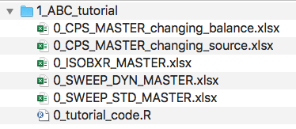
```

6. Open the R code file (0_tutorial_code.R) with Rstudio. 

7. Update the correct working directory path to the 1_ABC_tutorial folder

This could for instance look like: 
```{r eval=FALSE}
workdir_ABC <- "/Users/username/Documents/1_ABC_tutorial"
```

----

# Ex. 1: System {ABC}, closed, balanced


## System definition

We consider here the case a balanced and closed system of 3 finite boxes A, B and C. 
This system is defined in the **0_IOSOBXR_MASTER.xlsx** file as follows: 

```{r echo=FALSE, out.width='100%'}
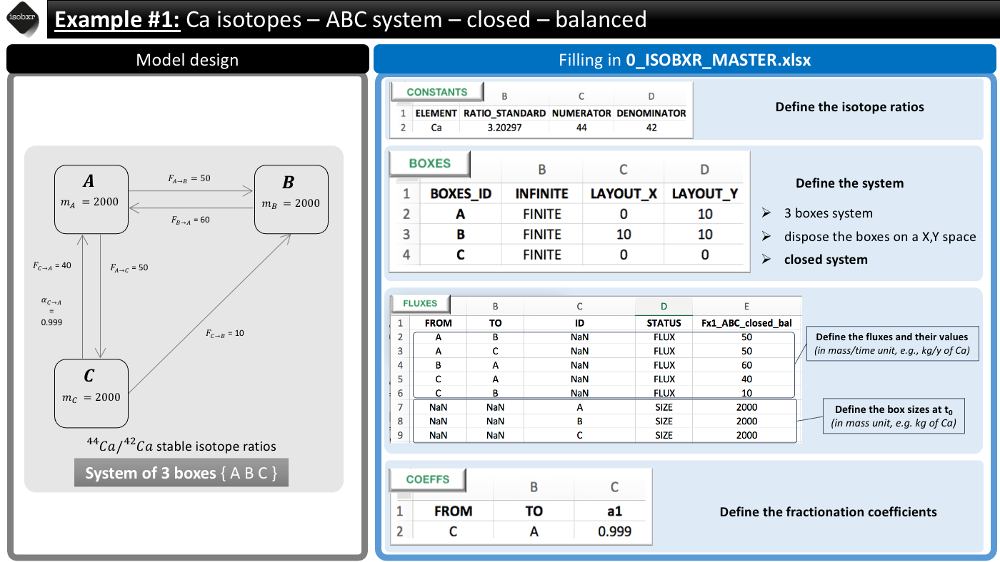
```

We consider the list of balanced fluxes **Fx1_ABC_closed_bal**
:    No box loses nor gains Ca, the system is balanced

For this run we use the *a1* fractionation coefficients list
:     We only define a -1‰ fractionation during transport from box C to A ($\alpha_{C \to A} = 0.999$)

Units
:    
* We consider a system where the fluxes are expressed in **mg/d**
* The masses of Ca in each box (box sizes) are expressed in **mg**
* The run will thus be performed with **d** as time units

## Run the model

Run duration and resolution
:    
* We run this model for total duration of **2500 days** 
* With a resolution of 1 calculation every 10 days, corresponding to **250 steps**

Initial state
: 
* We don't force any initial isotope compositions to the system: the **initial delta values will be 0‰** by default in all boxes.

Run SERIES ID
:    
* We can define the name of the SERIES of run this run will belong to. 
* We chose a short description (with no special characters): "ABC_closed_balanced"

We can run the model as follows
:    

```{r eval=FALSE}
run_isobxr(workdir = workdir_ABC, # work. directory
           SERIES_ID = "ABC_closed_balanced", # name of the series of runs
           flux_list_name = "Fx1_ABC_closed_bal", # use this list of fluxes/sizes
           coeff_list_name = "a1", # use list a1 of fractionation coeffs.
           t_lim = 2500, # run the model over 2500 days
           nb_steps = 250, # calculate system state in 250 steps
           time_units = c("d", "yr"), # run time units (days), plot time units (years)
           to_DIGEST_evD_PLOT = TRUE, # export plot as pdf
           to_DIGEST_CSV_XLS = TRUE, # export all data as csv and xlsx
           to_DIGEST_DIAGRAMS = TRUE) # export system diagrams as pdf
```

R console messages
:    
The first default outputs are messages printed on the R console.
The messages returned by `run_isobxr` are the following: 

```{r echo=FALSE, eval=TRUE}
rlang::inform(message = "All boxes are FINITE")

rlang::inform(message = "Running ana_slvr (balanced finite boxes)")    
```

This is expected because:

1. **The {ABC} system being closed**, the `run_isobxr` function identified that all boxes are finite. 

2. **The {ABC} system being balanced**, the `run_isobxr` function identified that the analytical solving 
of the model can be performed (using the analytical solver `ana_slvr`).

## Run outputs

The outputs of this run are found in the working directory declared as workdir to the `run_isobxr` function.
These outputs should be structured as follows:

```{r echo=FALSE, out.width='100%'}
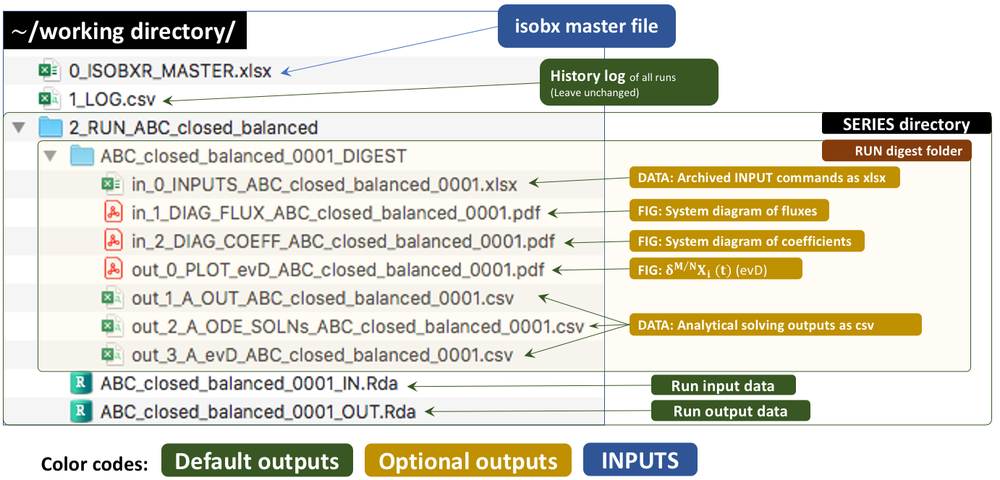
```

### System diagrams

The `run_isobxr` function produced an overview of the system as diagrams (pdf) for fluxes (left) and isotope fractionation expressed ‰ (right) shown below: 

```{r echo=FALSE, out.width='47%'}
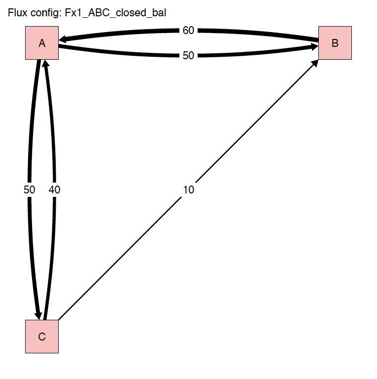
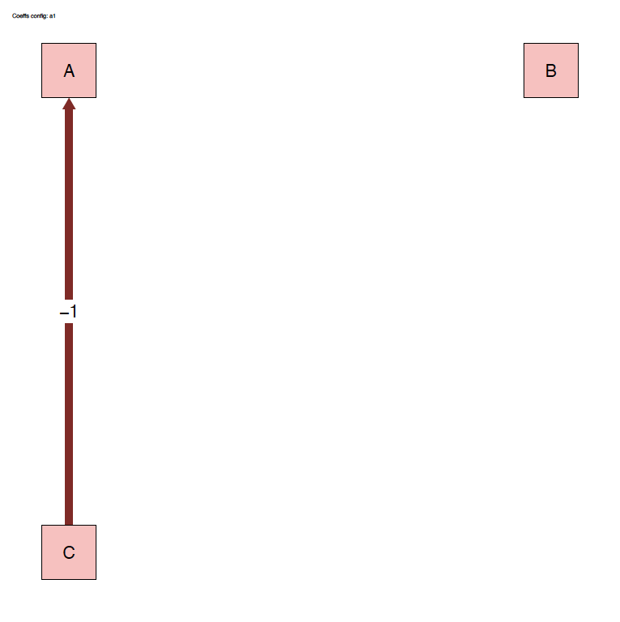
```

### evD plot of isotope compositions with time

The `run_isobxr` outputs include the evolution of isotope compositions over the run duration (edited as pdf), shown in years for this run.

```{r echo=FALSE, out.width='100%'}
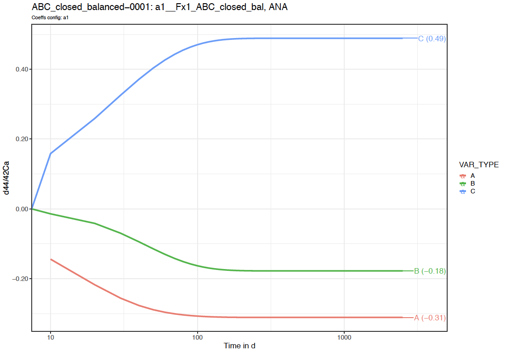
```

Note that the time axis is displayed with a log scale.

We thus observe here a **relaxation** of the system to a steady-state where box A tends to -0.31‰, B to -0.18‰ and C to 0.49‰. 

### Optional data outputs

As `run_isobxr` was run with export of csv and xlsx datasets (to_DIGEST_CSV_XLS = TRUE), 
this run provides user with the following datasets. 

1. **in_0_INPUTS_ABC_closed_balanced_0001.xlsx**: An archive of all the commands and system definitions used for the run.

1. **out_1_A_OUT_ABC_closed_balanced_0001.csv**: A csv summary initial and final state of the system (box sizes, delta values).

1. **out_2_A_ODE_SOLNs_ABC_closed_balanced_0001.csv**: The solutions of the differential equations matrix inversion (analytical solving). 
This includes eigen-values, -vectors, relaxation times.

1. **out_3_A_evD_ABC_closed_balanced_0001.csv**: The dataset of stable isotope compositions (delta values in ‰) in all boxes over run duration.


----

# Ex. 2: System {ABC}, closed, **unbalanced**

## System definition

We consider here the case a closed system of 3 finite boxes A, B and C. 

The **fluxes are however unbalanced**: boxes A and C have unbalanced inward and outward fluxes.

This system is defined in the **0_IOSOBXR_MASTER.xlsx** file as follows: 

```{r echo=FALSE, out.width='100%'}
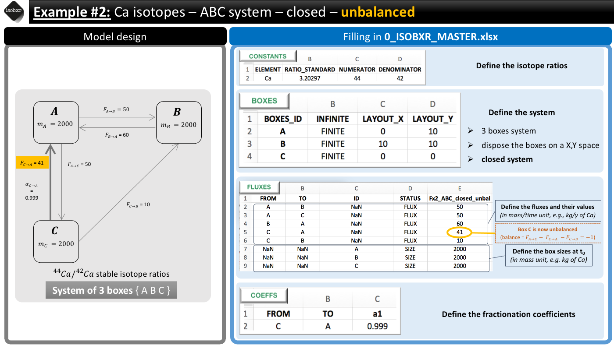
```

We consider the list of unbalanced fluxes **Fx2_ABC_closed_unbal**
:    
* Box C has a negative balance: it loses 1 mg/d of Ca
* Box A has a positive balance: it gains 1 mg/d of Ca

For this run we keep the *a1* fractionation coefficients list
:     We only define a -1‰ fractionation during transport from box C to A ($\alpha_{C \to A} = 0.999$)

## Run the model

Run duration and resolution
:    
* We run this model for total duration of **2500 days** 
* With a resolution of 1 calculation every 10 days, corresponding to **250 steps**

Initial state
: 
* We don't force any initial isotope compositions to the system: the **initial delta values will be 0‰** by default in all boxes.

Run SERIES ID
:    
* We can define the name of the SERIES of run this run will belong to. 
* We chose a short description (with no special characters): "ABC_closed_unbalanced"

We can run the model as follows
:    

```{r eval=FALSE}
run_isobxr(workdir = workdir_ABC, # work. directory
           SERIES_ID = "ABC_closed_unbalanced", # name of the series of runs
           flux_list_name = "Fx2_ABC_closed_unbal", # use this list of fluxes/sizes
           coeff_list_name = "a1", # use list a1 of fractionation coeffs.
           t_lim = 2500, # run the model over 2500 days
           nb_steps = 250, # calculate system state in 250 steps
           time_units = c("d", "yr"), # run time units (days), plot time units (years)
           to_DIGEST_evD_PLOT = TRUE, # export plot as pdf
           to_DIGEST_CSV_XLS = TRUE, # export all data as csv and xlsx
           to_DIGEST_DIAGRAMS = TRUE) # export system diagrams as pdf
```


R console messages
:    
The first default outputs are messages printed on the R console.
The messages returned by `run_isobxr` are the following:

```{r echo=FALSE, eval=TRUE}
rlang::inform(message = "All boxes are FINITE")
```

This is expected because **the {ABC} system being closed**, the `run_isobxr` function identified that all boxes are finite.

However as the system is unbalanced. The `run_isobxr` function prints the following additional messages:

```{r echo=FALSE, eval=TRUE}
rlang::inform(message = "A IN-OUT BALANCE is positive")    
rlang::inform(message = "C IN-OUT BALANCE is negative (max run: 2000 t units)")    
rlang::inform(message = "Running num_slvr (unbalanced finite boxes)")    
rlang::warn(message = "Updated total run duration. Total run time has been changed from 2500 to 2000 (limiting box: C) ")
```

The function warns the user that: 

1. Box A has a positive balance
1. Box C has a negative balance and would be totally emptied in 2000 days
1. Run duration (2500 days) exceeds duration of box C total emptying. 
    + As a consequence the function has updated the run duration to the maximum run duration defined by box C emptying. 

## Run outputs

The outputs of this run are found in the working directory declared as workdir to the `run_isobxr` function.
These outputs should be structured as follows:

```{r echo=FALSE, out.width='100%'}
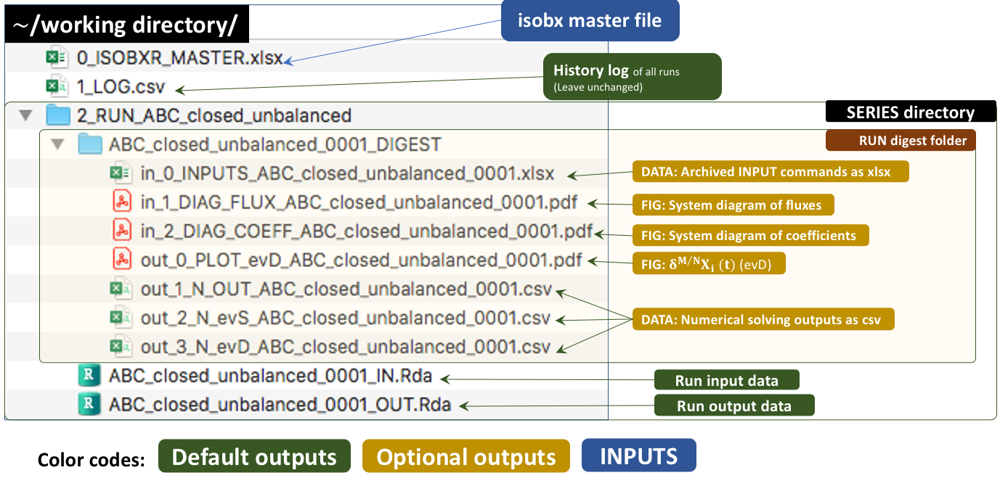
```

### System diagrams

The `run_isobxr` function produced an overview of the system as diagrams (pdf) for fluxes (left) and isotope fractionation expressed ‰ (right) shown below:

```{r echo=FALSE, out.width='47%'}
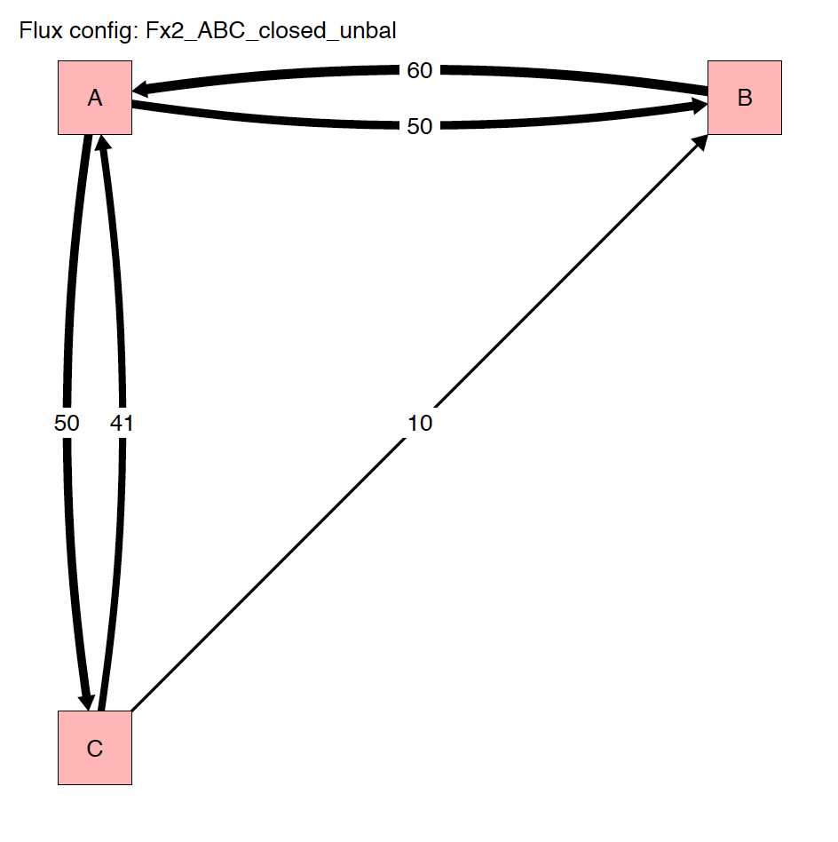

```

### evD plot of isotope compositions with time

The `run_isobxr` outputs include the evolution of isotope compositions over the run duration (edited as pdf), shown in years for this run.

```{r echo=FALSE, out.width='100%'}
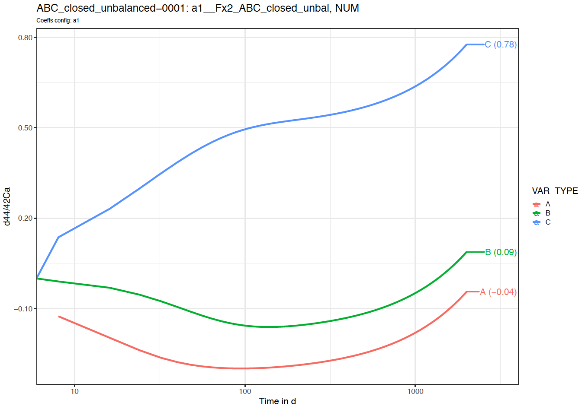
```

Note that in this case, we observe here **no relaxation** to a steady-state.

### Optional data outputs

As `run_isobxr` was run with export of csv and xlsx datasets (to_DIGEST_CSV_XLS = TRUE),
this run provides user with the following datasets.

1. **in_0_INPUTS_ABC_closed_unbalanced_0001.xlsx**: An archive of all the commands and system definitions used for the run.

1. **out_1_N_OUT_ABC_closed_unbalanced_0001.csv**: A csv summary initial and final state of the system (box sizes, delta values).

1. **out_2_N_evS_ABC_closed_unbalanced_0001.csv**: The dataset of box sizes (masses of Ca in mg) in all boxes over run duration.

1. **out_3_N_evD_ABC_closed_unbalanced_0001.csv**: The dataset of stable isotope compositions (delta values in ‰) in all boxes over run duration.


----

# Ex. 3: System {ABC}, **open**, balanced


## System definition

We consider here the case a balanced system of 3 finite boxes A, B and C. 

This system is however **open** and exchanges Ca with the environment.

This system is defined in the **0_IOSOBXR_MASTER.xlsx** file as follows: 

```{r echo=FALSE, out.width='100%'}
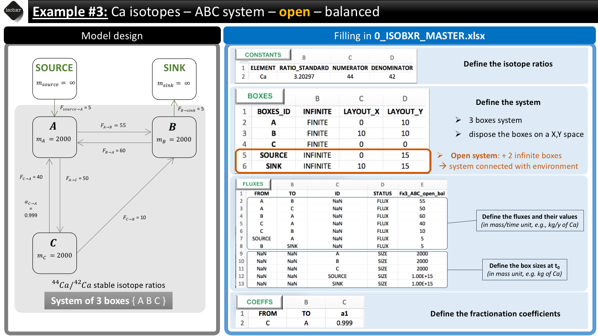
```

We consider the list of balanced fluxes **Fx3_ABC_open_bal**
:    No box loses nor gains Ca, the system is balanced

For this run we use the *a1* fractionation coefficients list
:     We only define a -1‰ fractionation during transport from box C to A ($\alpha_{C \to A} = 0.999$)

## Run the model

Run duration and resolution
:    
* We run this model for total duration of **25000 days** (longer than previously in examples 1 and 2)
* With a resolution of 1 calculation every 10 days, corresponding to **2500 steps** 

Initial state
: 
* We don't force any initial isotope compositions to the system: the **initial delta values will be 0‰** by default in all boxes.

Run SERIES ID
:    
* We can define the name of the SERIES of run this run will belong to. 
* We chose a short description (with no special characters): "ABC_open_balanced"

We can run the model as follows
:    

```{r eval=FALSE}
run_isobxr(workdir = workdir_ABC, # work. directory
           SERIES_ID = "ABC_open_balanced", # name of the series of runs
           flux_list_name = "Fx3_ABC_open_bal", # use this list of fluxes/sizes
           coeff_list_name = "a1", # use list a1 of fractionation coeffs.
           t_lim = 25000, # run the model over 2500 days
           nb_steps = 2500, # calculate system state in 250 steps
           time_units = c("d", "yr"), # run time units (days), plot time units (years)
           to_DIGEST_evD_PLOT = TRUE, # export plot as pdf
           to_DIGEST_CSV_XLS = TRUE, # export all data as csv and xlsx
           to_DIGEST_DIAGRAMS = TRUE) # export system diagrams as pdf
```

R console messages
:    
The first default outputs are messages printed on the R console.
The messages returned by `run_isobxr` are the following: 

```{r echo=FALSE, eval=TRUE}
rlang::inform(message = "The INFINITE boxes are: SOURCE, SINK  ")
                                                                                                                      
rlang::inform(message = "Running ana_slvr (balanced finite boxes)")    
```

This is expected because:

1. **The {ABC} system being open**, the `run_isobxr` function identified that SOURCE and SINK are infinite boxes. 

2. **The {ABC} system being balanced**, the `run_isobxr` function identified that the analytical solving 
of the model can be performed (using the analytical solver `ana_slvr`).

## Run outputs

### System diagrams

The `run_isobxr` function produced an overview of the system as diagrams (pdf) for fluxes (left) and isotope fractionation expressed ‰ (right) shown below: 

```{r echo=FALSE, out.width='47%'}
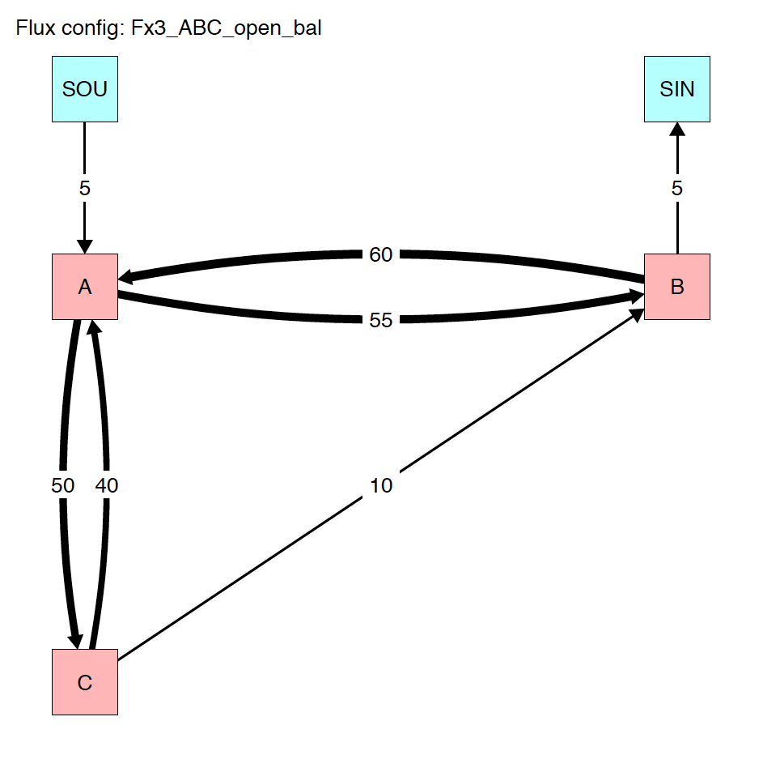
knitr::include_graphics('./04_runisobxr_tuto_04_ex3_diag_alpha.png')
```

### evD plot of isotope compositions with time

The `run_isobxr` outputs include the evolution of isotope compositions over the run duration (edited as pdf), shown in years for this run.

```{r echo=FALSE, out.width='100%'}
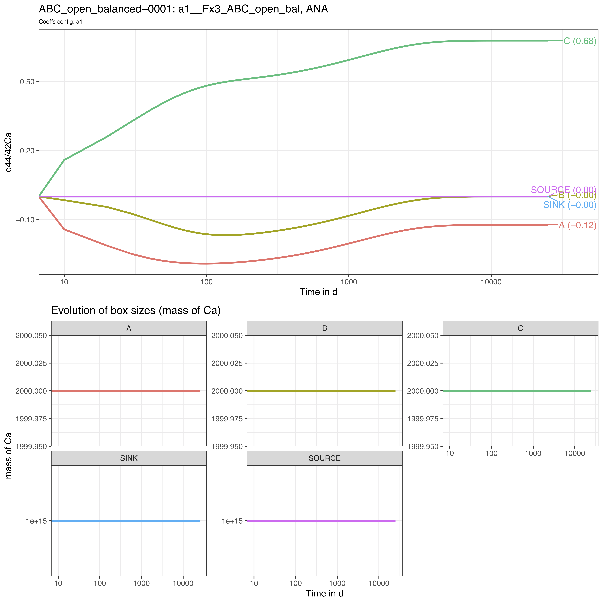
```

We thus observe here a **relaxation** of the system to a steady-state (different from example 1) where box A tends to -0.12‰, B to 0‰ and C to +0.68‰. 

Note that as we didn't define the initial isotope compositions of the boxes including the SOURCE and SINK infinite boxes, 
the later therefore remain at 0‰ throughout the run.

----

# Ex. 4: Additional **forcing parameters**

Additionally to the default definition of the system, 
it is possible to force other parameters. 

Here, we walk you through 2 of the 4 parameters that can be forced with `run_isobxr`: **initial isotope compositions** and **initial box sizes**.

We consider the system of example 3: System {ABC}, open and balanced.

## i. Forcing the initial isotope compositions of the reservoirs

Instead of starting by default with delta values set at 0‰ for all boxes, 
we want to set: 
* an initial isotope composition of the SOURCE to -3‰
* an initial isotope composition of the box C to +5‰. 

To do so we need to define a forcing paramter (**FORCING_DELTA**) as follows: 

```{r eval=TRUE}
FORCING_DELTA <- 
  data.frame(BOXES_ID = c("SOURCE", "C"),
             DELTA_INIT = c(-3, +5))

FORCING_DELTA
```

We then can run the function and specify the forcing parameter values: 

```{r eval=FALSE}
run_isobxr(workdir = workdir_ABC, # work. directory
           SERIES_ID = "ABC_open_balanced_w_forcing_delta",
           flux_list_name = "Fx3_ABC_open_bal",
           coeff_list_name = "a1", 
           t_lim = 25000, 
           nb_steps = 2500, 
           time_units = c("d", "yr"), 
           to_DIGEST_evD_PLOT = TRUE, 
           to_DIGEST_CSV_XLS = TRUE,
           to_DIGEST_DIAGRAMS = TRUE, 
           FORCING_DELTA = FORCING_DELTA) # FORCE INITIAL DELTA VALUES
```

We observe the following evolution of isotope compositions with time: 

```{r echo=FALSE, out.width='100%'}
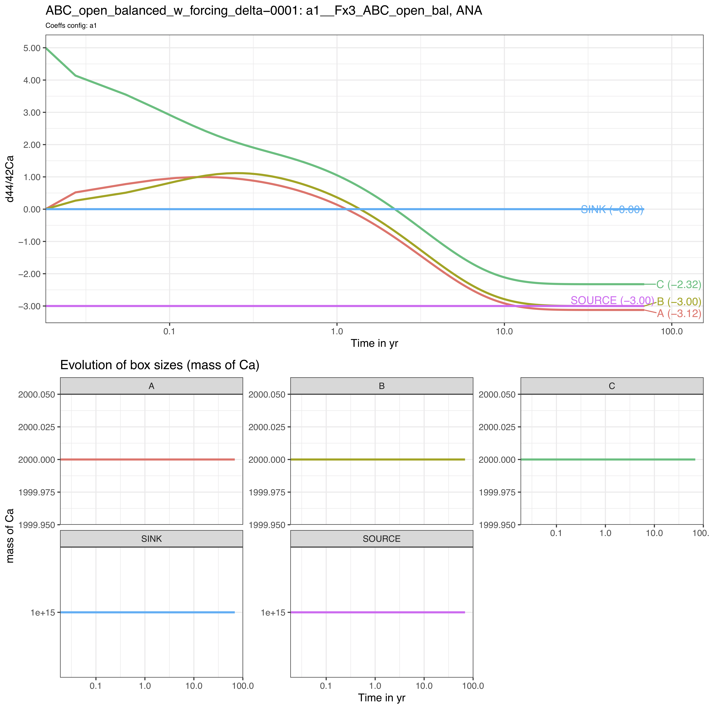
```

We observe that the box C starts as expected from +5‰ while the steady-state is shifted to lower values by -3‰ since the SOURCE has been set to -3‰.


## ii. Forcing the initial sizes of the reservoirs

Instead of starting by default with box sizes defined in the **Fx3_ABC_open_bal** flux list of the 0_ISOBXR_MASTER.xlsx file, 
we modify here the initial sizes of boxes B and C: 

* B is changed from a size of 2000 to 50
* C is changed from a size of 2000 to 1 000 000

To do so we need to define a forcing paramter (**FORCING_SIZE**) as follows: 

```{r eval=TRUE}
FORCING_SIZE <-
  data.frame(BOXES_ID = c("B", "C"),
             SIZE_INIT = c(50, 1e6))

FORCING_SIZE
```

We then can run the function and specify the forcing parameter values: 

```{r eval=FALSE}
run_isobxr(workdir = workdir_ABC, # work. directory
           SERIES_ID = "ABC_open_balanced_w_forcing_size",
           flux_list_name = "Fx3_ABC_open_bal",
           coeff_list_name = "a1", 
           t_lim = 25000, 
           nb_steps = 2500, 
           time_units = c("d", "yr"), 
           to_DIGEST_evD_PLOT = TRUE, 
           to_DIGEST_CSV_XLS = TRUE,
           to_DIGEST_DIAGRAMS = TRUE, 
           FORCING_SIZE = FORCING_SIZE) # FORCE INITIAL SIZE  VALUES
```

We observe the following evolution of isotope compositions with time: 

```{r echo=FALSE, out.width='100%'}
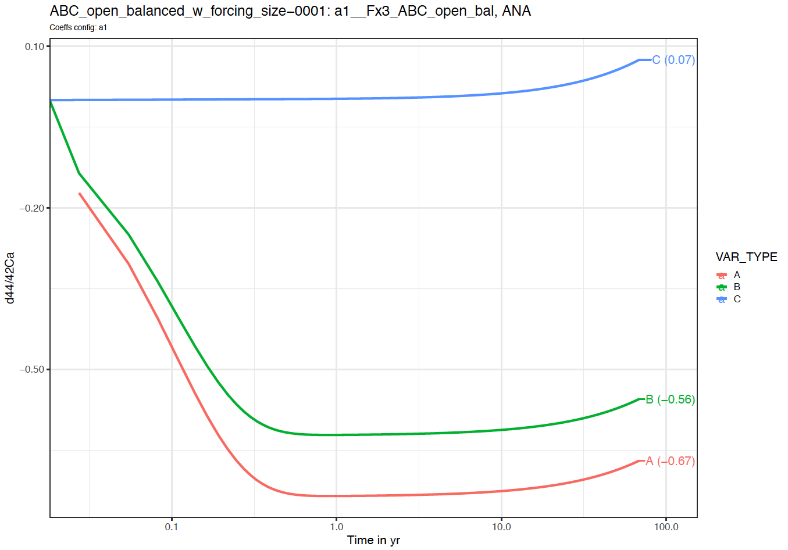
```

We observe that the system behaves very differently. 

The steady-state is not reached over the run duration (25000 days). 

The box C reacts very slowly in comparison to boxes A and C, as its size is several order of magnitudes higher than boxes A and C (1 000 000 against 2000 and 50). 

The box C drives the dynamics of the system on the long-term. 

<!-- We consider the demonstration *isobxr master file* (0_ISOBXR_MASTER.xlsx) stored in the working directory. -->

<!-- In this demonstration example, the *isobxr master file* describes a fiction model,  -->
<!-- designed for the calcium $^{44}Ca/^{42}Ca$ isotope ratios.  -->

<!-- ```{r echo=FALSE, out.width='100%'} -->
<!-- knitr::include_graphics('./EXAMPLE_1_ABC_clo_bal.png') -->
<!-- ``` -->

<!-- ```{r echo=FALSE, out.width='100%'} -->
<!-- knitr::include_graphics('./EXAMPLE_2_ABC_clo_unbal.png') -->
<!-- ``` -->


<!-- ```{r echo=FALSE, out.width='100%'} -->
<!-- knitr::include_graphics('./EXAMPLE_3_ABC_open_bal.png') -->
<!-- ``` -->

<!-- The **BOXES** sheet describes 3 finite boxes (A, B, C).  -->

<!-- The layout of the boxes in the diagram rendering aims at placing the finite boxes on the four corners of 10x10 units square, and the two infinite boxes on the higher end of the layout (y = 15), with SOURCE on the far left and SINK on the far right. -->

<!-- ```{r echo=FALSE, out.width='50%'} -->
<!-- knitr::include_graphics('./40_ABCD_BOXES.png') -->
<!-- ``` -->

<!-- We assume that fluxes are expressed in mg of Ca per day, sizes in mg of Ca and run time units will be days.   -->

<!-- The **FLUXES** sheet describes 5 flux lists   -->

<!-- 1. *Fx1_ABC_bal* describes a balanced closed system composed of 3 finite boxes A, B and C.    -->
<!-- 1. *Fx2_ABC_unbal* describes an unbalanced closed system composed of 3 finite boxes A, B and C.   -->
<!-- 1. *Fx3_ABC_unbal* describes an unbalanced closed system composed of 3 finite boxes A, B and C.    -->
<!-- 1. *Fx4_ABCD_bal* describes a balanced closed system composed of 4 finite boxes A, B, C and D.      -->
<!-- 1. *Fx5_ABCD_unbal*  describes an unbalanced closed system composed of 4 finite boxes A, B, C and D.   -->
<!-- 1. *Fx6_ABC_open_bal*  describes a balanced open system composed of 4 finite boxes A, B, C and D and two infinite boxes SOURCE and SINK. -->
<!-- 1. *Fx7_ABC_open_unbal*  describes an unbalanced open system composed of 4 finite boxes A, B, C and D and two infinite boxes SOURCE and SINK. -->

<!-- Sizes of all finite boxes are here set at 2000 mg, infinite boxes are set a 1e15 mg.   -->

<!-- ```{r echo=FALSE, out.width='100%'} -->
<!-- knitr::include_graphics('./41_ABCD_FLUXES.png') -->
<!-- ``` -->

<!-- The **COEFFS** sheet describes 5 lists of fractionation coefficients:   -->

<!-- * *a0* describes no isotope fractionation (all $\alpha_{i \to j}$ being equal to one)   -->
<!-- * *a1* describes a system with 1 fractionation coefficient being different from 1:    -->
<!--     $\alpha_{A \to B} = 0.999$   -->
<!-- * *a2* describes a system with 2 fractionation coefficients being different from 1:   -->
<!--     $\alpha_{A \to B} = 0.999$, $\alpha_{B \to A} = 1.001$   -->
<!-- * *a3* describes a system with 3 fractionation coefficients being different from 1:   -->
<!--     $\alpha_{A \to B} = 0.999$, $\alpha_{B \to A} = 1.001$, $\alpha_{C \to A} = 0.9997$   -->
<!-- * *a4* describes a system with 1 fractionation coefficient being different from 1:   -->
<!--     $\alpha_{C \to D} = 0.99$   -->

<!-- ```{r echo=FALSE, out.width='100%'} -->
<!-- knitr::include_graphics('./13_ABCD_COEFFS.png') -->
<!-- ``` -->

<!-- ---- -->

<!-- # Run single box models -->

<!-- ## Balanced 3-boxes closed system model -->

<!-- We consider here the case a balanced closed system of 3 finite boxes (flux list *Fx1_ABC_bal*).   -->
<!-- For this run we use the *a1* fractionation coefficients list.   -->
<!-- We will run this model for total time of 2500 days with a resolution of 1 calculation every 10 days (250 steps).   -->

<!-- ```{r eval=FALSE} -->
<!-- run_isobxr(workdir = "/Users/username/Documents/1_ABC_tutorial", # isobxr master file work. dir. -->
<!--            SERIES_ID = "ABC_closed_balanced", # series ID of the set of runs -->
<!--            flux_list_name = "Fx1_ABC_closed_bal", # which flux list from FLUXES sheet -->
<!--            coeff_list_name = "a1", # which coefficients list from COEFFS sheet -->
<!--            t_lim = 2500, # how long do I want to run -->
<!--            nb_steps = 250, # how many steps over this run duration -->
<!--            time_units = c("d", "yr"), # run time units (days), plot time units (years) -->
<!--            to_DIGEST_evD_PLOT = TRUE, -->
<!--            to_DIGEST_CSV_XLS = TRUE, -->
<!--            to_DIGEST_DIAGRAMS = TRUE) # export plot as pdf -->
<!-- ``` -->

<!-- The first default outputs of the run are the messages sent by the function on the R console (all of these pieces of information being besides stored in the LOG file). -->

<!-- The `run_isobxr` function therefore choses to run the analytical solver (`ana_slvr`). -->

<!-- In the case of this run we can see the following messages: -->

<!-- ```{r echo=FALSE} -->
<!-- "< All boxes are FINITE >" -->
<!-- "< Running ana_slvr (BALANCED FINITE BOXES) > " -->
<!-- ``` -->

<!-- This is expected because: -->

<!-- 1. no INFINITE box has been declared as connected to the A, B and C boxes -->

<!-- 2. all inward and outward fluxes for each box are expected to be balanced -->

<!-- The associated pre-run outputs (optional) are the model diagrams of fluxes (left) and of fractionation coefficients (right, expressed as amplitude of isotope fractionation, in ‰).  -->

<!-- ```{r echo=FALSE, out.width='47%'} -->
<!-- knitr::include_graphics('./15_ABC_balanced_closed_0001_DIAGf_Fx1_ABC_bal.png') -->
<!-- knitr::include_graphics('./14_ABC_balanced_closed_0001_DIAGa_a1.png') -->
<!-- ``` -->

<!-- Finally, the post-run output includes the evolution of $\delta$ values over the run duration, shown in years for this run. -->

<!-- ```{r echo=FALSE, out.width='100%'} -->
<!-- knitr::include_graphics('./16_ABC_balanced_closed_0001_plot_evD.png') -->
<!-- ``` -->

<!-- Note that the run resolution can be seen by the discrete behavior of the evolution of $\delta$ values on the left handside of the logarithmic time scale.  -->
<!-- This display effect would be smoothed out by a higher run resolution (nb_steps = 2500 or 25000 for instance). -->


<!-- ## Unbalanced 3-boxes closed system model -->

<!-- We consider here the case of an unbalanced closed system of 3 finite boxes (flux list *Fx2_ABC_unbal*).   -->
<!-- For this run we use the *a1* fractionation coefficients list.   -->
<!-- We will run this model for a total time of 2500 days with a resolution of 1 calculation every 10 days (250 steps).   -->

<!-- ```{r eval=FALSE} -->
<!-- run_isobxr(workdir = "/Users/username/Documents/1_ABC_tutorial", # isobxr master file work. dir. -->
<!--            SERIES_ID = "ABC_closed_unbalanced", # series ID of the set of runs -->
<!--            flux_list_name = "Fx2_ABC_closed_unbal", # which flux list from FLUXES sheet -->
<!--            coeff_list_name = "a1", # which coefficients list from COEFFS sheet -->
<!--            t_lim = 2500, # how long do I want to run -->
<!--            nb_steps = 250, # how many steps over this run duration -->
<!--            time_units = c("d", "yr"), # run time units (days), plot time units (years) -->
<!--            to_DIGEST_evD_PLOT = TRUE, -->
<!--            to_DIGEST_CSV_XLS = TRUE, -->
<!--            to_DIGEST_DIAGRAMS = TRUE) # export plot as pdf -->
<!-- ``` -->


<!-- The first default outputs of the run are the messages sent by the function on the R console (all of these pieces of information being besides stored in the LOG file). -->

<!-- In the case of this run we can see the following messages: -->

<!-- ```{r echo=FALSE} -->
<!-- "< All boxes are FINITE >" -->
<!-- "< A IN-OUT BALANCE is pos >"  -->
<!-- "< C IN-OUT BALANCE is neg (max run: 2000 t units) >"  -->
<!-- "< Running num_slvr (UNBALANCED FINITE BOXES) >"  -->
<!-- "*** UPDATED TOTAL RUN TIME *** < Total run time has been changed from 2500 to 2000 (limiting box: C) > " -->
<!-- ``` -->

<!-- The first message is expected since no INFINITE box has been declared as connected to the finite boxes defining the closed system. -->

<!-- The second and third lines point out the fact that boxes A and C are out of balance: A accumulates calcium while C loses calcium.  -->

<!-- The function also tells us that it will take in total 2000 days for the box C to be totally emptied. This is expected since C has a size of 2000 mg and, as can be seen on the flux diagram below, C loses 1 mg of Ca per day. -->

<!-- The `run_isobxr` function therefore choses to run the numerical solver (`num_slvr`). -->

<!-- Finally, the `run_isobxr` function warns the user: it automatically updated the total run time, changing it from 2500 days to 2000 days because the box C would have lost all of its calcium by 2000 days. -->

<!-- This is due to the fact that the user defined run duration was too long and would lead to the total emptying of box C. -->

<!-- The associated pre-run outputs (optional) are the model diagrams of fluxes (left) and of fractionation coefficients (right, expressed as amplitude of isotope fractionation, in ‰).  -->

<!-- ```{r echo=FALSE, out.width='47%'} -->
<!-- knitr::include_graphics('./17_ABC_unbalanced_closed_0001_DIAGf_Fx2_ABC_unbal.png') -->
<!-- knitr::include_graphics('./18_ABC_unbalanced_closed_0001_DIAGa_a1.png') -->
<!-- ``` -->

<!-- Finally, the post-run output includes the evolution of $\delta$ values over the run duration, shown in years for this run. -->

<!-- ```{r echo=FALSE, out.width='100%'} -->
<!-- knitr::include_graphics('./19_ABC_unbalanced_closed_0001_plot_evD.png') -->
<!-- ``` -->

<!-- Note that in this example, the slight imbalance does not affect the overall bevaviour of the system at time scale when compared to the balanced system. -->


<!-- ## Dealing with an open system -->

<!-- The user should define a source box and a sink box and declare them in the **BOXES** sheet as INFINITE.  -->
<!-- We give below an example of a run of for an open system. -->

<!-- ```{r echo=FALSE, out.width='50%'} -->
<!-- knitr::include_graphics('./21a_ABC_balanced_open_BOXES.png') -->
<!-- ``` -->

<!-- These boxes should have infinite sizes defined in relation to the system scale  -->
<!-- (important for runs with unbalanced finite boxes, which will use the numerical solver).  -->
<!-- In this example, both source and sink box sizes were set at $10^{15}$. -->

<!-- The source box should only be used with outward fluxes to the open system and should not receive any flux from it. -->

<!-- The sink box should only be used with inward fluxes from the open system and should not send any flux to it. -->

<!-- The function call would be the following for a run of 25000 days, with one calculation every 10 days (nb_steps = 2500).   -->

<!-- We use the *Fx6_ABC_open_bal* flux list and the *a1* coefficient list. -->

<!-- ```{r eval=FALSE} -->
<!-- run_isobxr(workdir = "/Users/username/Documents/1_ABC_tutorial", # isobxr master file work. dir. -->
<!--            SERIES_ID = "ABC_open_balanced", # series ID of the set of runs -->
<!--            flux_list_name = "Fx3_ABC_open_bal", # which flux list from FLUXES sheet -->
<!--            coeff_list_name = "a1", # which coefficients list from COEFFS sheet -->
<!--            t_lim = 25000, # how long do I want to run -->
<!--            nb_steps = 2500, # how many steps over this run duration -->
<!--            time_units = c("d", "yr"), # run time units (days), plot time units (years) -->
<!--            to_DIGEST_evD_PLOT = TRUE, -->
<!--            to_DIGEST_CSV_XLS = TRUE, -->
<!--            to_DIGEST_DIAGRAMS = TRUE) # export plot as pdf -->
<!-- ``` -->

<!-- We obtain the following diagrams, where the infinite boxes display a different color.  -->

<!-- ```{r echo=FALSE, out.width='47%'} -->
<!-- knitr::include_graphics('./22_ABC_balanced_open_0001_DIAGf_Fx6_ABC_open_bal.png') -->
<!-- knitr::include_graphics('./21_ABC_balanced_open_0001_DIAGa_a1.png') -->
<!-- ``` -->

<!-- And we finally obtain the following plot of the evolution of $\delta$ values in all finite boxes over time,  -->
<!-- where we observe the relaxation of the system to it's steady state.  -->

<!-- ```{r echo=FALSE, out.width='100%'} -->
<!-- knitr::include_graphics('./23_ABC_balanced_open_0001_plot_evD.png') -->
<!-- ``` -->

<!-- Note that both infinite boxes are hidden from this graphic representation but the isotope compositions of all boxes - including source and sink - are stored in the output data files.   -->

<!-- While the sink (or waste) box is not informative as such, -->
<!-- the source could have varying/non-zero initial $\delta$ values, -->
<!-- depending on the run parameters,  -->
<!-- used to force the open system. It will be notably of importance for the use of the `compose_isobxr` function, described thereafter. -->

<!-- ---- -->
<!-- # Play time -->

<!-- The user is invited to explore the use of the **run_isobxr** function by running box models with various settings and input values, from the function arguments but also by adding new entries to the **input master file**.  -->
