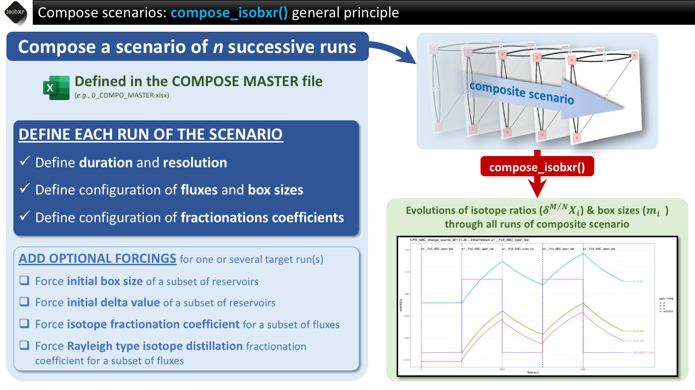
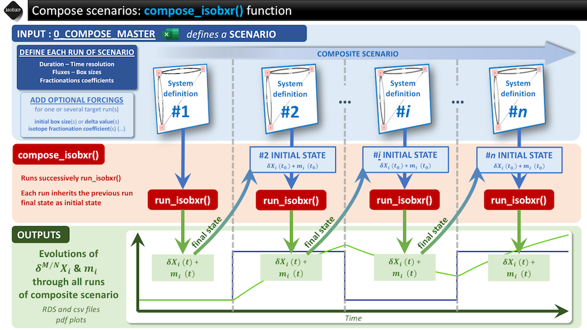
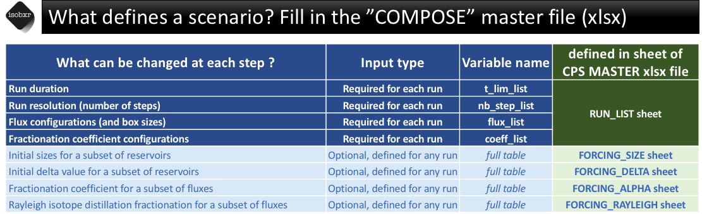
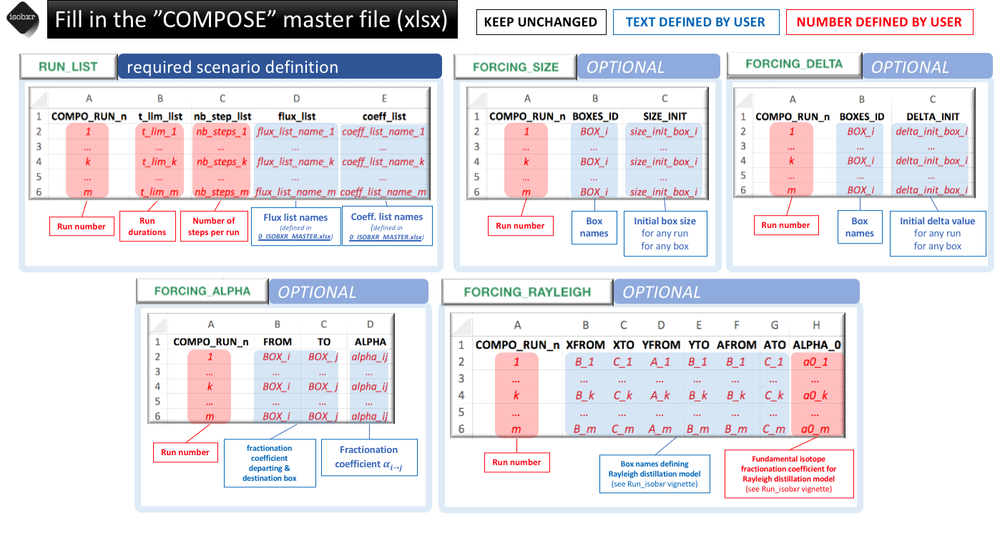
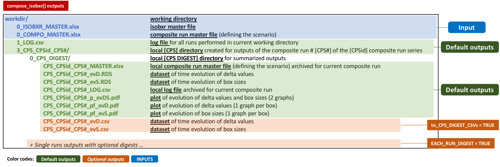

```{r, include = FALSE}
knitr::opts_chunk$set(
  collapse = TRUE,
  comment = "#>"
)
options(rmarkdown.html_vignette.check_title = FALSE)
```

----

In this vignette, the user will be introduced to the `compose_isobxr` function of [isobxr](https://ttacail.github.io/isobxr/).

Here, we shortly present the principles and general usage of the `compose_isobxr` function. 

The user is then invited to follow and run a step-by-step tutorial presenting several typical runs
<!-- [(6 - compose_isobxr: tutorial)](https://ttacail.github.io/isobxr/articles/vgn_06_compose_isobxr_tutorial.html). -->

----


# How does `compose_isobxr` work?

The `compose_isobxr` function is used to build complex scenarios of the evolution of a system going through a series of runs.

The `compose_isobxr` function calls a scenario defined in a compose master file (.xlsx file) and also requires the definition of the system from the 0_ISOXBR_MASTER.xlsx file.

The `compose_isobxr` works by successively calling the `run_isobxr`function and performing runs each inheriting from the final state of the system as its own initial state.

## General principle
The general principle of the `compose_isobxr` function is summarised in the cheatsheet below. 

```{r echo=FALSE, out.width='100%'}

```

## General workflow
The general workflow of the `compose_isobxr` function is summarised in the cheatsheet below. 

```{r echo=FALSE, out.width='100%'}

```


## How is the scenario defined ?
The scenario is defined in the **compose master file** (xlsx file) which stores the following required and optional information.

```{r echo=FALSE, out.width='100%'}

```

# Filling in compose master file (xlsx)

The **compose master file** is the excel document containing all data 
defining the scenario.

It provides the `compose_isobxr` function with the 
**successive runs** to constitute the whole **scenario**.

**Note**
:    The `compose_isobxr` function also requires the **isobxr master file** 
     where the system states are defined. 
     All the [isobxr](https://ttacail.github.io/isobxr/) functions 
     are meant to be run in relation with an **isobxr master file**. 
     All instruction for the filling in of the **isobxr master file** 
     are given in the [3 - Run_isobxr: presentation](https://ttacail.github.io/isobxr/articles/vgn_03_Run_isobxr_presentation.html) 
     vignette.

## Name and location 

* The **compose master file** is an xlsx file
* The **compose master file** name needs not to be formated as the user calls the compose master file name in the function parameters.
* The **compose master file** has to be stored in the working directory (*workdir*), where the **isobxr master file** is also stored.

## Structure and format

The **compose master file** contains the 5 following sheet strictly named as follows: 

1. **RUN_LIST**: Sheet defining scenario structure (filling required)
1. **FORCING_SIZE**: Sheet defining optional forcings on a subset of box initial sizes for subset of runs (filling optional)
1. **FORCING_DELTA**: Sheet defining optional forcings on a subset of box initial delta values for subset of runs (filling optional)
1. **FORCING_ALPHA**: Sheet defining optional forcings on a subset of fractionation coefficients for subset of runs (filling optional)
1. **FORCING_RAYLEIGH**: Sheet defining optional forcings on a subset of fractionation coefficients following a Rayleigh distillation model for subset of runs (filling optional)

The general rules for the filling in of the **compose master file** are shown in cheatsheet below:

```{r echo=FALSE, out.width='100%'}

```

# Main arguments and outputs

The `compose_isobxr` function takes required and optional arguments that are described in this section.
 
All arguments definitions of the `compose_isobxr` function are accessible in its documentation called as follows

```{r eval=FALSE}
?compose_isobxr
```

## `compose_isobxr` required arguments

The arguments required to run the `compose_isobxr` function are examplified and described here:

```{r eval=FALSE}
compose_isobxr(workdir = "/Users/username/1_isobxr_working_directory/",
               SERIES_ID = "ABC_change_balance", # series ID of composite family
               time_units = c("d", "yr"), # plot results in years as time units
               COMPO_MASTER = "0_CPS_MASTER_changing_balance.xlsx") # composite master
```

**workdir** 
:     Working directory of 0_ISOBXR_MASTER.xlsx master file and **compose master file**. 

**SERIES_ID**	
:     Name of the model series the run belongs to. 
It determines the folder in which the output files will be stored.

**time_units**	
:     
* Vector defining the initial time unit (identical to unit used in fluxes), 
followed by the time unit used for the graphical output
* to be selected amongst the following: *micros, ms, s, min, h, d, wk, mo, yr, kyr, Myr, Gyr*
* e.g., c("d", "yr") to convert days into years

**COMPO_MASTER**
:   Full name of the composite master file (finishing with ".xlsx") 

## `compose_isobxr` default and optional outputs

The `compose_isobxr` outputs are stored in the working directory. 

The `compose_isobxr` outputs are structured as follows:

```{r echo=FALSE, out.width='100%'}

```

In addition to the default outputs,
the `compose_isobxr` function allows to: 

* get each run's digest for all scenario steps (using the **EACH_RUN_DIGEST = TRUE** argument)
* get whole composite run data as csv files (using the **to_CPS_DIGEST_CSVs = TRUE** argument)
* hide boxes in the plots of evolution of delta values (**plot_HIDE_BOXES_delta** = c("BOX_TO_HID_1", "BOX_TO_HID_2"))
* hide boxes in the plots of evolution of box sizes (**plot_HIDE_BOXES_size** = c("BOX_TO_HID_1", "BOX_TO_HID_2"))

These arguments are called as follows: 

```{r eval=FALSE}
compose_isobxr(workdir = "/Users/username/1_isobxr_working_directory/",
               SERIES_ID = "ABC_change_balance", # series ID of composite family
               time_units = c("d", "yr"), # plot results in years as time units
               COMPO_MASTER = "0_CPS_MASTER_changing_balance.xlsx", # composite master
               plot_HIDE_BOXES_delta = c("SINK"), # Hide SINK in evD plots
               plot_HIDE_BOXES_size = c("SINK", "SOURCE"), # Hide SINK and SOURCE in evS plots
               EACH_RUN_DIGEST = TRUE,
               to_CPS_DIGEST_CSVs = TRUE)
```


<!-- SHOW PLOT AND OUTPUTS -->
<!-- INTRODUCE THE RunShinyPlots -->
